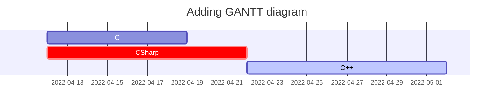
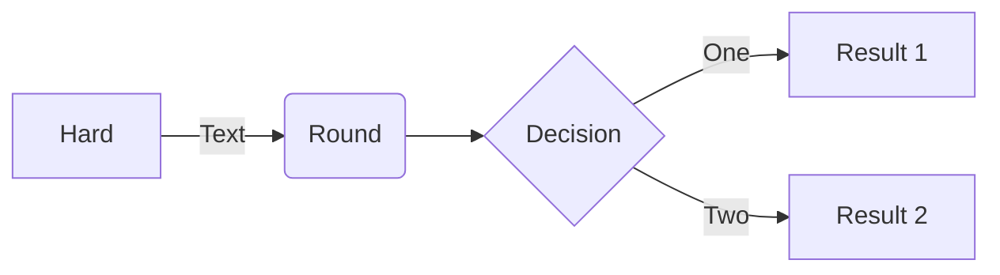
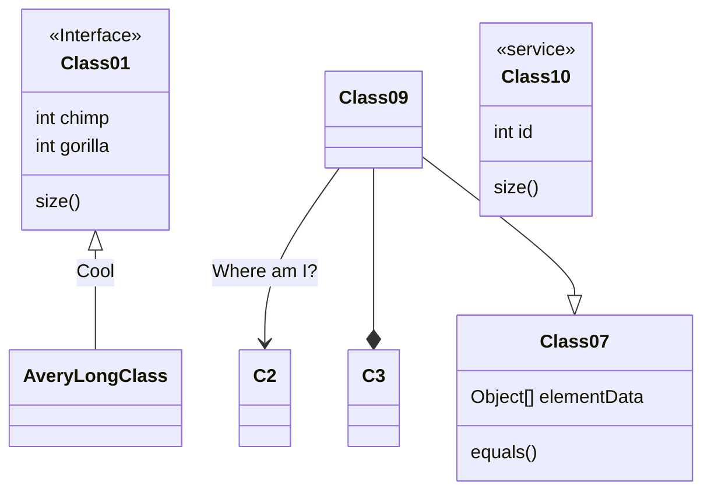

[](https://github.com/tis-starlight/tis-starlight.github.io/blob/main/_posts/2023-09-09-creating-github-pages.md?plain=1)

This post serves the purpose of demonstrating how **Markdown** syntax is rendered on *Chirpy*. It can also be utilized as an illustrative example for crafting content to enhance the aesthetics of our *GitHub Pages* website. 
This includes creating beautifully designed documentation, blog posts, and more, with an emphasis on writing in-depth and comprehensive pieces.

<!-- directly use emoji ⬇️  or with markdown syntax (shortcodes) :arrow_down: -->
<!-- Markdown Emoji Cheatsheet https://github.com/ikatyang/emoji-cheat-sheet -->
<!-- [comment]: A Markdown comment  (https://stackoverflow.com/questions/4823468/comments-in-markdown) --> 

## Markdown

[**Markdown**](https://en.wikipedia.org/wiki/Markdown){: target="_blank" rel="noopener noreferrer"} is a lightweight markup language that is used for formatting and structuring plain text documents. 

It is often used for creating documents that will be converted to HTML, but it can also be used for other purposes such as documentation, README files, blogging and note-taking.

## Headings

# H1 — heading
{: data-toc-skip='' .mt-4 .mb-0 }

## H2 — heading
{: data-toc-skip='' .mt-4 .mb-0 }

### H3 — heading
{: data-toc-skip='' .mt-4 .mb-0 }

#### H4 — heading
{: data-toc-skip='' .mt-4 }

## Paragraph

Detective Sarah Mitchell stood in the dimly lit room, her keen eyes scanning the scene for any trace of evidence. The air was thick with tension as she surveyed the opulent but now macabre setting of the crime. The victim, a prominent art collector named Victor Sinclair, lay sprawled on the Persian rug, his lifeless eyes fixed on an eerie painting that adorned the wall. A single gunshot had silenced him forever. Sarah's mind raced as she considered the suspects gathered in the adjacent room, each with a motive that seemed as dark as the night outside. The clock was ticking, and she knew that solving this murder would require unraveling secrets buried deep in the world of high society and the art underworld. With a sense of determination, she vowed to uncover the truth, no matter how many layers of deception she had to peel back.

## Lists

### Ordered list

1. Item 1
2. Item 2
3. Item 3

### Unordered list

- Chapter 1
  + Section 1.1
    * Paragraph 1.1.1
    * Paragraph 1.1.2
  + Section 1.2
    * Paragraph 1.2.1

### ToDo list

- [ ] Job
  + [x] Step 1
  + [x] Step 2
  + [ ] Step 3

### Description list

Smartphone
: A mobile device that combines a phone with various features such as internet access, camera, and apps.

Eiffel Tower
: A famous Parisian landmark and wrought-iron structure, designed by Gustave Eiffel, and completed in 1889.

## Emphasis

*This is an italic text.*              <!-- or  _italic_ , <i> italic </i>, <em> italic </em> -->

**This is a bold text.**              <!-- or  __bold__ , <b> bold </b> -->

## Tool-tip

Most inline <abbr title="Hypertext Markup Language">HTML</abbr> tags are supported.

```html
Most inline <abbr title="Hypertext Markup Language">HTML</abbr> tags are supported.
```

## Improving Visibility/Readability

Sometimes, Markdown content requires adding [HTML elements and CSS attributes](https://stackoverflow.com/questions/35465557/how-to-apply-color-on-text-in-markdown){: target="_blank" rel="noopener noreferrer"} like color and font sizes, and weight attributes. However, Natively Markdown or any Markdown parser/flavor does not support CSS styles.
There are multiple ways to achieve this:

- Using HTML and CSS: <span style="color:green;font-weight:400;font-size:20px">Hello World!</span>

```html
<span style="color:green;font-weight:400;font-size:20px"> Hello World! </span>
```
{: .nolineno }

- Using [Kramdown](https://kramdown.gettalong.org/index.html){: target="_blank" rel="noopener noreferrer"} - a Ruby-based Markdown parser that extends the functionality of standard Markdown: This is *green*{: style="color: green"}

```markdown
This is *green*{: style="color: green"}
```

- Using Emojis:
When you want to use pure Markdown (without nested HTML & CSS), you can use Emojis to draw attention to some fragment of the file, i.e. ⚠️WARNING⚠️, 🔴DANGER🔴 or 🔥NEW🔥.

## Typography

[Typography](https://en.wikipedia.org/wiki/Typography){: target="_blank" rel="noopener noreferrer"} plays a crucial role in design, influencing readability, tone, and visual impact. It’s more than just choosing a typeface; it’s about crafting a visual experience that enhances communication and resonates with the audience. Effective typography guides the reader’s eye, sets the mood of the content, and reinforces the brand’s identity.

- **Hitmarker Text**: Hitmarker Text is ideal for *small-scale and long-copy text*, offering excellent readability and a refined appearance for detailed content.

<p style="font-family:'Hitmarker Text'; font-weight:300; font-size:24px; text-align: center;">1. Hitmarker Text Light</p>

```html
<p style="font-family:'Hitmarker Text'; font-weight:300; font-size:24px;">1. Hitmarker Text Light</p>
```
{: .nolineno }

<p style="font-family:'Hitmarker Text'; font-weight:400; font-size:24px; text-align: center;">2. Hitmarker Text Regular</p>

```html
<p style="font-family:'Hitmarker Text'; font-weight:400; font-size:24px;">2. Hitmarker Text Regular</p>
```
{: .nolineno }

<p style="font-family:'Hitmarker Text'; font-weight:500; font-size:24px; text-align: center;">3. Hitmarker Text Medium</p>

```html
<p style="font-family:'Hitmarker Text'; font-weight:500; font-size:24px;">3. Hitmarker Text Medium</p>
```
{: .nolineno }

<p style="font-family:'Hitmarker Text'; font-weight:700; font-size:24px; text-align: center;">4. Hitmarker Text Bold</p>

```html
<p style="font-family:'Hitmarker Text'; font-weight:700; font-size:24px;">4. Hitmarker Text Bold</p>
```
{: .nolineno }

<p style="font-family:'Hitmarker Text'; font-weight:900; font-size:24px; text-align: center;">5. Hitmarker Text Black</p>

```html
<p style="font-family:'Hitmarker Text'; font-weight:900; font-size:24px;">5. Hitmarker Text Black</p>
```
{: .nolineno }

<p style="font-family:'Hitmarker Text'; font-weight:400; font-style: normal; letter-spacing: 1px; font-size: 1rem; line-height: 1.5rem; text-align: center;">6. Hitmarker Text Regular with proper style.</p>

```html
<p style="font-family:'Hitmarker Text'; font-weight:400; font-style: normal; letter-spacing: 1px; font-size: 1rem; line-height: 1.5rem;">6. Hitmarker Text Regular with proper style.</p>
```
{: .nolineno }

<p style="font-family:'Hitmarker Text'; font-weight:400; font-style: normal; color: white; letter-spacing: 1px; font-size: 1rem; line-height: 1.5rem; text-align: center;">6.1 Hitmarker Text Regular with proper style.</p>

```html
<p style="font-family:'Hitmarker Text'; font-weight:400; font-style: normal; color: white; letter-spacing: 1px; font-size: 1rem; line-height: 1.5rem;">6.1 Hitmarker Text Regular with proper style.</p>
```
{: .nolineno }

<br>

- **Hitmarker Condensed**: Hitmarker Condensed is perfect for *headlines (headings), display text, and other large typographic elements*, providing a bold and condensed look that ensures strong visual impact.

<p style="font-family:'Hitmarker Condensed'; font-weight:300; font-size:24px; text-align: center;">1. Hitmarker Condensed Light</p>

```html
<p style="font-family:'Hitmarker Condensed'; font-weight:300; font-size:24px;">1. Hitmarker Condensed Light</p>
```
{: .nolineno }

<p style="font-family:'Hitmarker Condensed'; font-weight:400; font-size:24px; text-align: center;">2. Hitmarker Condensed Regular</p>

```html
<p style="font-family:'Hitmarker Condensed'; font-weight:400; font-size:24px;">2. Hitmarker Condensed Regular</p>
```
{: .nolineno }

<p style="font-family:'Hitmarker Condensed'; font-weight:500; font-size:24px; text-align: center;">3. Hitmarker Condensed Medium</p>

```html
<p style="font-family:'Hitmarker Condensed'; font-weight:500; font-size:24px;">3. Hitmarker Condensed Medium</p>
```
{: .nolineno }

<p style="font-family:'Hitmarker Condensed'; font-weight:700; font-size:24px; text-align: center;">4. Hitmarker Condensed Bold</p>

```html
<p style="font-family:'Hitmarker Condensed'; font-weight:700; font-size:24px;">4. Hitmarker Condensed Bold</p>
```
{: .nolineno }

<p style="font-family:'Hitmarker Condensed'; font-weight:900; font-size:24px; text-align: center;">5. Hitmarker Condensed Black</p>

```html
<p style="font-family:'Hitmarker Condensed'; font-weight:900; font-size:24px;">5. Hitmarker Condensed Black</p>
```
{: .nolineno }

<p style="font-family:'Hitmarker Condensed'; font-weight:900; font-style: normal; font-size: 1.75rem; text-transform: uppercase; letter-spacing: 1px; line-height: 1.75rem; text-align: center;">6. Hitmarker Condensed Black with proper style.</p>

```html
<p style="font-family:'Hitmarker Condensed'; font-weight:900; font-style: normal; font-size: 1.75rem; text-transform: uppercase; letter-spacing: 1px; line-height: 1.75rem;">6. Hitmarker Condensed Black with proper style.</p>
```
{: .nolineno }

<p style="font-family:'Hitmarker Condensed'; font-weight:900; font-style: normal; font-size: 1.75rem; text-transform: uppercase; letter-spacing: 1px; line-height: 1.75rem; color: white; text-align: center;">6.1 Hitmarker Condensed Black with proper style.</p>

```html
<p style="font-family:'Hitmarker Condensed'; font-weight:900; font-style: normal; font-size: 1.75rem; text-transform: uppercase; letter-spacing: 1px; line-height: 1.75rem; color: white;">6.1 Hitmarker Condensed Black with proper style.</p>
```
{: .nolineno }

<p style="font-family:'Hitmarker Condensed'; font-weight:900; font-style: normal; font-size: 2.25rem; text-transform: uppercase; letter-spacing: 1px; line-height: 2.25rem; text-align: center;">6.2 Hitmarker Condensed Black with proper style.</p>

```html
<p style="font-family:'Hitmarker Condensed'; font-weight:900; font-style: normal; font-size: 2.25rem; text-transform: uppercase; letter-spacing: 1px; line-height: 2.25rem;">6.2 Hitmarker Condensed Black with proper style.</p>
```
{: .nolineno }

<br>

For further exploration and details on these fonts, visit the following resources:
- Call of Duty - Typography [↗](https://brand.callofduty.com/typography/typeface/){: target="_blank" rel="noopener noreferrer"}
- NaN - Custom Call of Duty Fonts [↗](https://www.nan.xyz/custom/call-of-duty/){: target="_blank" rel="noopener noreferrer"}
- Global Fonts - Hitmarker [↗](https://globalfonts.pro/font/hitmarker/){: target="_blank" rel="noopener noreferrer"}

In addition to *Hitmarker*, there are several other popular fonts that are widely used in programming and design. These fonts offer distinct styles and features that cater to various needs, whether you're coding, creating technical documents, or designing modern interfaces. Below are some notable fonts to consider for your projects:

| Font             | Description                                                                                                           | Link                                                                 |
|------------------|-----------------------------------------------------------------------------------------------------------------------|----------------------------------------------------------------------|
| **`Fira Code`**    | A monospaced font designed for coding, with support for programming ligatures.                                         | [Fira Code ↗](https://github.com/tonsky/FiraCode){: target="_blank" rel="noopener noreferrer"}            |
| **`Cascadia Mono`**| A modern monospaced font from Microsoft, often used in command-line interfaces and code editors.                        | [Cascadia Code ↗](https://github.com/microsoft/cascadia-code){: target="_blank" rel="noopener noreferrer"}|
| **`JetBrains Mono`**| A monospaced typeface for developers, designed by JetBrains, featuring increased letter-spacing for readability.      | [JetBrains Mono ↗](https://www.jetbrains.com/lp/mono/){: target="_blank" rel="noopener noreferrer"}                 |
| **`Orbitron`**     | A geometric sans-serif typeface, ideal for futuristic and sci-fi projects, often used in headlines and display text.  | [Orbitron ↗](https://fonts.google.com/specimen/Orbitron){: target="_blank" rel="noopener noreferrer"}|
| **`Hitmarker`**    | A custom typeface associated with the Call of Duty brand, versatile for body text and headlines in regular and condensed versions. | [Hitmarker ↗](https://globalfonts.pro/font/hitmarker){: target="_blank" rel="noopener noreferrer"}  |

<!-- 
## Image Comparison Slider

// img-comparison-slider | https://github.com/sneas/img-comparison-slider/

  <figure slot="first" class="before" style="pointer-events: none;">
    
    <figcaption>Before</figcaption>
  </figure>
  <figure slot="second" class="after" style="pointer-events: none;">
    
    <figcaption>After</figcaption>
  </figure>
</img-comparison-slider>

<style>
  .before,
  .after {
    margin: 0;
  }
  .before figcaption,
  .after figcaption {
    background: #fff;
    background-color: rgba(0, 0, 0, 0.4);
    border: 1px solid #c0c0c0;
    border-radius: 8px;
    color: #DDD;
    opacity: 0.8;
    padding: 8px 10px 8px 10px;
    position: absolute;
    top: 90%;
    transform: translateY(-50%);
    line-height: 60%;
  }
  .before figcaption {
    left: 20px;
  }
  .after figcaption {
    right: 20px;
  }
  .slider-focus {
    transition: box-shadow 200ms ease-in-out;
  }
  .slider-focus:focus {
    outline: none;
    box-shadow: 0px 0px 15px 5px #0c5d10;
    border-radius: 8px;
  }
  .slider-split-line {
    --divider-width: 1px;
    /* --divider-color: #ffa658; */
    --default-handle-opacity: 1;
    --default-handle-width: 50px;
  }
</style>
-->

## Block Quote

### Single-line

> *To be or not to be, that is the question*.

### Multi-line

> To be, or not to be, that is the question: Whether 'tis nobler in the mind to suffer The slings and arrows of outrageous fortune, Or to take arms against a sea of troubles And, by opposing, end them.

<sub> **--- William Shakespeare's** play "Hamlet" <sub>       <!-- HTML subscript(sub), superscript(sup) -->

## Collapsible Content

<details class="details-block" markdown="1">
  <summary>Click to toggle content</summary>
  <p>Who Was Mr. Chips?</p>
  <p>Mr. Chipping, affectionately known as "Mr. Chips", was a beloved English teacher at the fictional boarding school of Brookfield. He had spent over fifty years at the school, shaping the minds of countless students with his gentle, humorous, and old-fashioned manner. Known for his characteristic tweed jacket and thick glasses, he became a fixture of the school's traditions, loved by generations of boys.</p>
  <p>Throughout his long tenure, Mr. Chips led a quiet, unassuming life, until one day he fell in love with a young woman named Katherine Bridges. She was the daughter of one of the school's former headmasters, and their brief but poignant romance changed him in ways he never anticipated. Tragically, Katherine passed away not long after their engagement, and Mr. Chips never married. Yet, her memory remained a deep part of his heart, influencing the way he viewed life and his students.</p>
</details>

<details class="details-inline" markdown="1">
  <summary>Click to toggle content</summary>
  <p><b>Time dilation</b> is a concept from Einstein's theory of relativity, where time passes at different rates for observers in different conditions. There are two main types:</p>
  <ol>
    <li><b>Gravitational Time Dilation:</b> Time runs slower in stronger gravitational fields. For example, a clock on the surface of the Earth ticks slower than one far from Earth.</li>
    <li><b>Velocity Time Dilation:</b> Time runs slower for objects moving at speeds close to the speed of light. For example, a clock on a spaceship traveling near light speed would tick slower than one on Earth.</li>
    $$ \text{Time Dilation: } \Delta t' = \frac{\Delta t}{\sqrt{1 - \frac{v^2}{c^2}}} $$
  </ol>
</details>

## Prompts

> An example showing the `tip` type prompt.
{: .prompt-tip }

> An example showing the `info` type prompt.
{: .prompt-info }

> An example showing the `warning` type prompt.
{: .prompt-warning }

> An example showing the `danger` type prompt.
{: .prompt-danger }

<div class="box-tip" markdown="1">
<div class="title"> Tip </div>
This is a tip.
</div>

<div class="box-info" markdown="1">
<div class="title"> Info </div>
This is an info.
</div>

<div class="box-warning" markdown="1">
<div class="title"> Warning </div>
This is a warning.
</div>

<div class="box-danger" markdown="1">
<div class="title"> Danger </div>
This is a danger.
</div>

> Tip: Keep your software up to date for better performance.
{: .box-tip}

> Info: Make sure to back up your files regularly to avoid data loss.
{: .box-info }

> Warning: High temperatures can damage your device. Keep it cool.
{: .box-warning}

> Danger: Do not touch electrical wires while they are live.
{: .box-danger}

> This is a tip.
{: .gh-alert.tip }

> This is a note.
{: .gh-alert.note }

> This is an important note.
{: .gh-alert.important }

> This is a warning.
{: .gh-alert.warning }

> This is a caution.
{: .gh-alert.caution }

## Tables

| Company          | Contact       | Country |
|:---------------- |:------------- | -------:|
| ABC Electronics  | John Smith    | USA     |
| Global Imports   | Emily Johnson | Canada  |
| La Maison du Vin | Pierre Dupont | France  |

<!--  (:---- Left-justified) (----: Right-justified) (:----: Centered)  -->

| File(s) | In Directory | from %TEMP% |
| ------- |:------------:|:-----------:|
| `*.PNG` | ✓            | ✗           |
| `*.ICO` | ✓            | ✗           |

>  ✓ means keep, ✗ means delete.
{: .prompt-info }

## Insert & preview content

To embed files in your blog, you can use `<iframe>` elements like this:

```html
<iframe src="file path" width="100%" height="800"></iframe>
```
{: .nolineno }

This approach allows you to preview HTML, PDF, and other documents directly within your post.

<div class="box-danger" markdown="1">
<div class="title"> Note </div>
While this method works well in Google Chrome, other browsers may not fully support it. Additionally, adding overflow won't generate scroll bars on mobile devices, so use this technique with caution.
</div>

## Links

- [**Starlight**](https://github.com/tis-starlight){: target="_blank" rel="noopener noreferrer"}

```markdown
[Starlight](https://github.com/tis-starlight){: target="_blank" rel="noopener noreferrer"}

// rel="noopener noreferrer" means that the link is set to 
// open in a new tab (target="_blank") 
// while taking precautions to improve security by restricting access 
// to the originating page and not sending the Referer header. 
// This is commonly used with links that involve external websites.
```
{: .nolineno }

- [**Starlight**][link]

[link]: https://github.com/tis-starlight

```markdown
[**Starlight**][link]

[link]: https://github.com/tis-starlight
```
{: .nolineno }

## Footnote

Click the hook will locate the footnote[^footnote-1], and here is another footnote[^footnote-2].

## Keyboard Input

Press <kbd>Ctrl</kbd>+<kbd>Alt</kbd>+<kbd>Delete</kbd> to restart the computer.

Press <kbd>Shift</kbd>+<kbd>D</kbd> to duplicate objects in blender.

## Inline code

This is an example of `Inline Code`.

## Filepath

Here is the `/path/to/the/file.extension`{: .filepath}.

## Code blocks

### Common

<!-- ~~~  or  ``` -->

```
This is a common code snippet, without syntax highlight and line number.
```

### Specific Language

<!-- asp|aspx, c, c++|cpp|cplusplus, cs|csharp, clj|cljc|cljx|clojure, css|less|sass|scss|styl|stylus, curl, d, dart, diff, dockerfile, erl|erlang, go, gql|graphql, gradle|groovy, handlebars|hbs, html|xhtml|xml, http, java, coffeescript|ecmascript|javascript|js|node, jsx, json, jl|julia, kotlin|kt, liquid, lua, markdown, objc|objectivec, objc++|objcpp|objectivecpp|objectivecplusplus, ocaml|ml, perl|pl, php, powershell|ps1, py|python, r, jsx, jruby|macruby|rake|rb|rbx|ruby, rs|rust, scala, bash|sh|shell|zsh, sol|solidity, cql|mssql|mysql|plsql|postgres|postgresql|pgsql|sql|sqlite, swift, ts|typescript, yaml|yml  -->

```cpp
#include <iostream>
int main() {
    // Display a simple message
    std::cout << "Hello, World!" << std::endl;
    return 0;
}
```

### Specific filename

```sass
@import
  "colors/light-typography",
  "colors/dark-typography";
```
{: file='_sass/jekyll-theme-chirpy.scss'}

## Mathematics

The mathematics powered by [**MathJax**](https://www.mathjax.org/){: target="_blank" rel="noopener noreferrer"} :

A cubic Bezier curve is often used for smooth paths or animations. The equation is:

$$
\begin{equation}
  B(t) = (1 - t)^3 \cdot P_0 + 3(1 - t)^2 \cdot t \cdot P_1 + 3(1 - t) \cdot t^2 \cdot P_2 + t^3 \cdot P_3
  \label{eq:bezier_curve}
\end{equation}
$$

$$
\text{where } P_0, P_1, P_2, \text{ and } P_3 \text{ are control points and } t \text{ ranges from } 0 \text{ to } 1.
$$

We can reference the equation as \eqref{eq:bezier_curve}.

When $a \ne 0$, there are two solutions to $ax^2 + bx + c = 0$ and they are

$$ x = {-b \pm \sqrt{b^2-4ac} \over 2a} $$

## Mermaid SVG







## Images

### Default (with caption)

{: width="972" height="589" lqip="data:image/png;base64,
iVBORw0KGgoAAAANSUhEUgAAAAwAAAAHCAMAAAALbFwWAAAAIGNIUk0AAHomAACAhAAA+gAAAIDoAAB1MAAA6mAAADqYAAAXcJy6UTwAAACxUExURaGhoaampq2trbq6ur+/v7u7u9/f38nJyaqqqrKysrCwsK+vr6CgoKWlpaurq7GxsbOzs7y8vMzMzLe3t6ysrK6urqinqKuqq6enp5mZmZSTlIGBgYaGho+Pj4qKim9vb3Nzc1xcXFdXV1FRUXZ2dnp6emNjY1ZWVlJSUk9PT0dHR0JCQjc3NzY2Nj09PT8/Pzs7Ozo6OjU1NTIyMhwcHB4eHhsbGxoaGhkZGRgYGP///0LpJfUAAAABYktHRDpOCcT6AAAAB3RJTUUH5wkIFR8Yy+o8VwAAAGFJREFUCNdjYGBkYmZhZWPn4OTiZmDg4eHh5eMXEBRiEWYQEeXmEGNk5OUVZ+JjkJCUYmKSlpGRlZNXYFBUUlZRVVNX19DU0mbQ0dXT1zcwNNDRNTJmMDE1MzM3A2ILS0sACHYJGO1mhrMAAAAldEVYdGRhdGU6Y3JlYXRlADIwMjMtMDktMDhUMjE6MzE6MjQrMDA6MDBkBvpZAAAAJXRFWHRkYXRlOm1vZGlmeQAyMDIzLTA5LTA4VDIxOjMxOjI0KzAwOjAwFVtC5QAAACh0RVh0ZGF0ZTp0aW1lc3RhbXAAMjAyMy0wOS0wOFQyMTozMToyNCswMDowMEJOYzoAAAAASUVORK5CYII=" .shadow style="border-radius: 10px;"}
_Full screen width and center alignment_

### Left aligned

{: width="972" height="589" .w-75 .normal lqip="data:image/png;base64,iVBORw0KGgoAAAANSUhEUgAAAAwAAAAHCAMAAAALbFwWAAAAIGNIUk0AAHomAACAhAAA+gAAAIDoAAB1MAAA6mAAADqYAAAXcJy6UTwAAACxUExURaGhoaampq2trbq6ur+/v7u7u9/f38nJyaqqqrKysrCwsK+vr6CgoKWlpaurq7GxsbOzs7y8vMzMzLe3t6ysrK6urqinqKuqq6enp5mZmZSTlIGBgYaGho+Pj4qKim9vb3Nzc1xcXFdXV1FRUXZ2dnp6emNjY1ZWVlJSUk9PT0dHR0JCQjc3NzY2Nj09PT8/Pzs7Ozo6OjU1NTIyMhwcHB4eHhsbGxoaGhkZGRgYGP///0LpJfUAAAABYktHRDpOCcT6AAAAB3RJTUUH5wkIFR8Yy+o8VwAAAGFJREFUCNdjYGBkYmZhZWPn4OTiZmDg4eHh5eMXEBRiEWYQEeXmEGNk5OUVZ+JjkJCUYmKSlpGRlZNXYFBUUlZRVVNX19DU0mbQ0dXT1zcwNNDRNTJmMDE1MzM3A2ILS0sACHYJGO1mhrMAAAAldEVYdGRhdGU6Y3JlYXRlADIwMjMtMDktMDhUMjE6MzE6MjQrMDA6MDBkBvpZAAAAJXRFWHRkYXRlOm1vZGlmeQAyMDIzLTA5LTA4VDIxOjMxOjI0KzAwOjAwFVtC5QAAACh0RVh0ZGF0ZTp0aW1lc3RhbXAAMjAyMy0wOS0wOFQyMTozMToyNCswMDowMEJOYzoAAAAASUVORK5CYII=" .shadow style="border-radius: 10px;"}

### Float to left

{: width="972" height="589" .w-50 .left lqip="data:image/png;base64,iVBORw0KGgoAAAANSUhEUgAAAAwAAAAHCAMAAAALbFwWAAAAIGNIUk0AAHomAACAhAAA+gAAAIDoAAB1MAAA6mAAADqYAAAXcJy6UTwAAACxUExURaGhoaampq2trbq6ur+/v7u7u9/f38nJyaqqqrKysrCwsK+vr6CgoKWlpaurq7GxsbOzs7y8vMzMzLe3t6ysrK6urqinqKuqq6enp5mZmZSTlIGBgYaGho+Pj4qKim9vb3Nzc1xcXFdXV1FRUXZ2dnp6emNjY1ZWVlJSUk9PT0dHR0JCQjc3NzY2Nj09PT8/Pzs7Ozo6OjU1NTIyMhwcHB4eHhsbGxoaGhkZGRgYGP///0LpJfUAAAABYktHRDpOCcT6AAAAB3RJTUUH5wkIFR8Yy+o8VwAAAGFJREFUCNdjYGBkYmZhZWPn4OTiZmDg4eHh5eMXEBRiEWYQEeXmEGNk5OUVZ+JjkJCUYmKSlpGRlZNXYFBUUlZRVVNX19DU0mbQ0dXT1zcwNNDRNTJmMDE1MzM3A2ILS0sACHYJGO1mhrMAAAAldEVYdGRhdGU6Y3JlYXRlADIwMjMtMDktMDhUMjE6MzE6MjQrMDA6MDBkBvpZAAAAJXRFWHRkYXRlOm1vZGlmeQAyMDIzLTA5LTA4VDIxOjMxOjI0KzAwOjAwFVtC5QAAACh0RVh0ZGF0ZTp0aW1lc3RhbXAAMjAyMy0wOS0wOFQyMTozMToyNCswMDowMEJOYzoAAAAASUVORK5CYII=" .shadow style="border-radius: 10px;"}
In the heart of this desolate no man's land, the very essence of nature seemed to have withered away, leaving behind a haunting, barren expanse. The landscape, once vibrant with life, had succumbed to the relentless forces of time and neglect. A relentless wind whispered through skeletal remains of long-forgotten trees, their twisted branches reaching towards a colorless sky.The ground beneath was cracked and parched, resembling a shattered mosaic of forgotten dreams. The earth, choked by an endless sea of gray dust, bore the scars of a world that had turned its back on it. Here, no creature stirred, and no songbird dared to sing. The silence was profound, as if the land itself held its breath, waiting for some long-lost spark of vitality to ignite its soul.

### Float to right

{: width="972" height="589" .w-50 .right lqip="data:image/png;base64,iVBORw0KGgoAAAANSUhEUgAAAAwAAAAHCAMAAAALbFwWAAAAIGNIUk0AAHomAACAhAAA+gAAAIDoAAB1MAAA6mAAADqYAAAXcJy6UTwAAACxUExURaGhoaampq2trbq6ur+/v7u7u9/f38nJyaqqqrKysrCwsK+vr6CgoKWlpaurq7GxsbOzs7y8vMzMzLe3t6ysrK6urqinqKuqq6enp5mZmZSTlIGBgYaGho+Pj4qKim9vb3Nzc1xcXFdXV1FRUXZ2dnp6emNjY1ZWVlJSUk9PT0dHR0JCQjc3NzY2Nj09PT8/Pzs7Ozo6OjU1NTIyMhwcHB4eHhsbGxoaGhkZGRgYGP///0LpJfUAAAABYktHRDpOCcT6AAAAB3RJTUUH5wkIFR8Yy+o8VwAAAGFJREFUCNdjYGBkYmZhZWPn4OTiZmDg4eHh5eMXEBRiEWYQEeXmEGNk5OUVZ+JjkJCUYmKSlpGRlZNXYFBUUlZRVVNX19DU0mbQ0dXT1zcwNNDRNTJmMDE1MzM3A2ILS0sACHYJGO1mhrMAAAAldEVYdGRhdGU6Y3JlYXRlADIwMjMtMDktMDhUMjE6MzE6MjQrMDA6MDBkBvpZAAAAJXRFWHRkYXRlOm1vZGlmeQAyMDIzLTA5LTA4VDIxOjMxOjI0KzAwOjAwFVtC5QAAACh0RVh0ZGF0ZTp0aW1lc3RhbXAAMjAyMy0wOS0wOFQyMTozMToyNCswMDowMEJOYzoAAAAASUVORK5CYII=" .shadow style="border-radius: 10px;"}
In the heart of a desolate, colorless gray field, there stands a lone tree, its gnarled branches reaching out like skeletal fingers towards the overcast sky. The land stretches out in all directions, barren and lifeless, devoid of any signs of habitation or growth. The silence here is oppressive, broken only by the occasional whisper of the wind as it mournfully dances through the withered grass. In this desolation, one can't help but feel utterly alone, a solitary figure in a world drained of vibrancy and vitality, where even time itself seems to have come to a standstill.

### Dark/Light mode & Shadow

The image below will toggle dark/light mode based on theme preference, notice it has shadows.

{: .light .w-75 .shadow .rounded-10 w='1212' h='668' }
{: .dark .w-75 .shadow .rounded-10 w='1212' h='668' }

<!-- 

## Video



-->

## Naming and Path

Create a new file named `YYYY-MM-DD-TITLE.EXTENSION`{: .filepath} and put it in the `_posts`{: .filepath} of the root directory. Please note that the `EXTENSION`{: .filepath} must be one of `md`{: .filepath} and `markdown`{: .filepath}. If you want to save time of creating files, please consider using the plugin [`Jekyll-Compose`](https://github.com/jekyll/jekyll-compose) to accomplish this.

## Front Matter

Basically, you need to fill the [Front Matter](https://jekyllrb.com/docs/front-matter/){: target="_blank" rel="noopener noreferrer"} as below at the top of the post:

```yaml
---
title: TITLE
date: YYYY-MM-DD HH:MM:SS +/-TTTT
categories: [TOP_CATEGORY, SUB_CATEGORY]
tags: [TAG]     # TAG names should always be lowercase
---
```

> The posts' _layout_ has been set to `post` by default, so there is no need to add the variable _layout_ in the Front Matter block.
{: .prompt-tip }

### Timezone of Date

To accurately record the release date of a post, you should not only set up the `timezone` of `_config.yml`{: .filepath} but also provide the post's timezone in variable `date` of its Front Matter block. Format: `+/-TTTT`, e.g. `+0500`.

### Categories and Tags

The `categories` of each post are designed to contain up to two elements, and the number of elements in `tags` can be zero to infinity. For instance:

```yaml
---
categories: [Animal, Insect]
tags: [bee]
---
```

### Author Information

The author information of the post usually does not need to be filled in the _Front Matter_ , they will be obtained from variables `social.name` and the first entry of `social.links` of the configuration file by default. But you can also override it as follows:

Adding author information in `_data/authors.yml` (If your website doesn't have this file, don't hesitate to create one).

```yaml
<author_id>:
  name: <full name>
  twitter: <twitter_of_author>
  url: <homepage_of_author>
```
{: file="_data/authors.yml" }


And then use `author` to specify a single entry or `authors` to specify multiple entries:

```yaml
---
author: <author_id>                     # for single entry
# or
authors: [<author1_id>, <author2_id>]   # for multiple entries
---
```

Having said that, the key `author` can also identify multiple entries.

> The benefit of reading the author information from the file `_data/authors.yml`{: .filepath } is that the page will have the meta tag `twitter:creator`, which enriches the [Twitter Cards](https://developer.twitter.com/en/docs/twitter-for-websites/cards/guides/getting-started#card-and-content-attribution) and is good for SEO.
{: .prompt-info }

### Post Description

By default, the first words of the post are used to display on the home page for a list of posts, in the _Further Reading_ section, and in the XML of the RSS feed. If you don't want to display the auto-generated description for the post, you can customize it using the `description` field in the _Front Matter_ as follows:

```yaml
---
description: Short summary of the post.
---
```

Additionally, the `description` text will also be displayed under the post title on the post's page.


## Table of Contents

By default, the **T**able **o**f **C**ontents (TOC) is displayed on the right panel of the post. If you want to turn it off globally, go to `_config.yml`{: .filepath} and set the value of variable `toc` to `false`. If you want to turn off TOC for a specific post, add the following to the post's [Front Matter](https://jekyllrb.com/docs/front-matter/){: target="_blank" rel="noopener noreferrer"} :

```yaml
---
toc: false
---
```

## Comments

The global switch of comments is defined by variable `comments.active` in the file `_config.yml`{: .filepath}. After selecting a comment system for this variable, comments will be turned on for all posts.

If you want to close the comment for a specific post, add the following to the **Front Matter** of the post:

```yaml
---
comments: false
---
```

## Media

Images, Audio and Video are refered to as media resource.

### URL Prefix

From time to time we have to define duplicate URL prefixes for multiple resources in a post, which is a boring task that you can avoid by setting two parameters.

- If you are using a CDN to host media files, you can specify the `cdn` in `_config.yml`{: .filepath }. The URLs of media resources for site avatar and posts are then prefixed with the CDN domain name.

  ```yaml
  cdn: https://cdn.com
  ```
  {: file='_config.yml' .nolineno }

- To specify the resource path prefix for the current post/page range, set `media_subpath` in the _front matter_ of the post:

  ```yaml
  ---
  media_subpath: /path/to/media/
  ---
  ```
  {: .nolineno }

The option `site.cdn` and `page.media_subpath` can be used individually or in combination to flexibly compose the final resource URL: `[site.cdn/][page.media_subpath/]file.ext`

### Images

#### Caption

Add italics to the next line of an image, then it will become the caption and appear at the bottom of the image:

```markdown

_Image Caption_
```
{: .nolineno}

#### Size

To prevent the page content layout from shifting when the image is loaded, we should set the width and height for each image.

```markdown
{: width="700" height="400" }
```
{: .nolineno}

> For an SVG, you have to at least specify its _width_, otherwise it won't be rendered.
{: .prompt-info }

Starting from _Chirpy v5.0.0_, `height` and `width` support abbreviations (`height` → `h`, `width` → `w`). The following example has the same effect as the above:

```markdown
{: w="700" h="400" }
```
{: .nolineno}

#### Position

By default, the image is centered, but you can specify the position by using one of the classes `normal`, `left`, and `right`.

> Once the position is specified, the image caption should not be added.
{: .prompt-warning }

- **Normal position**

  Image will be left aligned in below sample:

  ```markdown
  {: .normal }
  ```
  {: .nolineno}

- **Float to the left**

  ```markdown
  {: .left }
  ```
  {: .nolineno}

- **Float to the right**

  ```markdown
  {: .right }
  ```
  {: .nolineno}

#### Dark/Light mode

You can make images follow theme preferences in dark/light mode. This requires you to prepare two images, one for dark mode and one for light mode, and then assign them a specific class (`dark` or `light`):

```markdown
{: .light }
{: .dark }
```

#### Shadow

The screenshots of the program window can be considered to show the shadow effect:

```markdown
{: .shadow }
```
{: .nolineno}

#### Preview Image

If you want to add an image at the top of the post, please provide an image with a resolution of `1200 x 630`. Please note that if the image aspect ratio does not meet `1.91 : 1`, the image will be scaled and cropped.

Knowing these prerequisites, you can start setting the image's attribute:

```yaml
---
image:
  path: /path/to/image
  alt: image alternative text
---
```

Note that the [`media_subpath`](#url-prefix) can also be passed to the preview image, that is, when it has been set, the attribute `path` only needs the image file name.

For simple use, you can also just use `image` to define the path.

```yml
---
image: /path/to/image
---
```

#### LQIP

Low Quality Image Placeholder
: A technique displaying a small, highly compressed, low-resolution image initially to users while the high-quality image loads in the background. It is lightweight and give the impression of faster website loading. As the high-quality image loads, it gradually replaces the LQIP for a seamless transition.

For preview images:

```yaml
---
image:
  lqip: /path/to/lqip-file # or base64 URI
---
```

> You can observe LQIP in the preview image of this post .

For normal images:

```markdown
{: lqip="/path/to/lqip-file" }
```
{: .nolineno }

### Video

#### Social Media Platform

You can embed videos from social media platforms with the following syntax:

```liquid

```

Where `Platform` is the lowercase of the platform name, and `ID` is the video ID.

The following table shows how to get the two parameters we need in a given video URL, and you can also know the currently supported video platforms.

| **Video URL**                                                                                      	| **Platform** 	| **ID**        	|
|----------------------------------------------------------------------------------------------------	|--------------	|---------------	|
| [https://www.**youtube**.com/watch?v=**mrNX55CWuZA**](https://www.youtube.com/watch?v=mrNX55CWuZA) 	| `youtube`    	| `mrNX55CWuZA` 	|
| [https://www.**twitch**.tv/videos/**2221198216**](https://www.twitch.tv/videos/2221198216)         	| `twitch`     	| `2221198216`  	|                                     

#### Video Files

If you want to embed a video file directly, use the following syntax:

```liquid

```

Where `URL` is a URL to a video file e.g. `/path/to/sample/video.mp4`.

You can also specify additional attributes for the embedded video file. Here is a full list of attributes allowed.

- `poster='/path/to/poster.png'` — poster image for a video that is shown while video is downloading
- `title='Text'` — title for a video that appears below the video and looks same as for images
- `autoplay=true` — video automatically begins to play back as soon as it can
- `loop=true` — automatically seek back to the start upon reaching the end of the video
- `muted=true` — audio will be initially silenced
- `types` — specify the extensions of additional video formats separated by `|`. Ensure these files exist in the same directory as your primary video file.

Consider an example using all of the above:

```liquid

```

### Audios

If you want to embed an audio file directly, use the following syntax:

```liquid

```

Where `URL` is a URL to an audio file e.g. `/path/to/audio.mp3`.

You can also specify additional attributes for the embedded audio file. Here is a full list of attributes allowed.

- `title='Text'` — title for an audio that appears below the audio and looks same as for images
- `types` — specify the extensions of additional audio formats separated by `|`. Ensure these files exist in the same directory as your primary audio file.

Consider an example using all of the above:

```liquid

```

## Pinned Posts

You can pin one or more posts to the top of the home page, and the fixed posts are sorted in reverse order according to their release date. Enable by:

```yaml
---
pin: true
---
```

## Prompts

There are several types of prompts: `tip`, `info`, `warning`, and `danger`. They can be generated by adding the class `prompt-{type}` to the blockquote. For example, define a prompt of type `info` as follows:

```md
> Example line for prompt.
{: .prompt-info }
```
{: .nolineno }

## Syntax

### Inline Code

```md
`inline code part`
```
{: .nolineno }

### Filepath Hightlight

```md
`/path/to/a/file.extension`{: .filepath}
```
{: .nolineno }

### Code Block

Markdown symbols ```` ``` ```` can easily create a code block as follows:

````md
```
This is a plaintext code snippet.
```
````

#### Specifying Language

Using ```` ```{language} ```` you will get a code block with syntax highlight:

````markdown
```yaml
key: value
```
````

> The Jekyll tag `` is not compatible with this theme.
{: .prompt-danger }   

#### Line Number

By default, all languages except `plaintext`, `console`, and `terminal` will display line numbers. When you want to hide the line number of a code block, add the class `nolineno` to it:

````markdown
```shell
echo 'No more line numbers!'
```
{: .nolineno }
````

#### Specifying the Filename

You may have noticed that the code language will be displayed at the top of the code block. If you want to replace it with the file name, you can add the attribute `file` to achieve this:

````markdown
```shell
# content
```
{: file="path/to/file" }
````

#### Liquid Codes

If you want to display the **Liquid** snippet, surround the liquid code with `` and ``:

````markdown

```liquid

  This product's title contains the word Pack.

```

````

Or adding `render_with_liquid: false` (Requires Jekyll 4.0 or higher) to the post's YAML block.

## Mathematics

We use [**MathJax**](https://www.mathjax.org/) to generate mathematics. For website performance reasons, the mathematical feature won't be loaded by default. But it can be enabled by:

```yaml
---
math: true
---
```

After enabling the mathematical feature, you can add math equations with the following syntax:

- **Block math** should be added with `$$ math $$` with **mandatory** blank lines before and after `$$`
  - **Inserting equation numbering** should be added with `$$\begin{equation} math \end{equation}$$`
  - **Referencing equation numbering** should be done with `\label{eq:label_name}` in the equation block and `\eqref{eq:label_name}` inline with text (see example below)
- **Inline math** (in lines) should be added with `$$ math $$` without any blank line before or after `$$`
- **Inline math** (in lists) should be added with `\$$ math $$`

```markdown
<!-- Block math, keep all blank lines -->

$$
LaTeX_math_expression
$$

<!-- Equation numbering, keep all blank lines  -->

$$
\begin{equation}
  LaTeX_math_expression
  \label{eq:label_name}
\end{equation}
$$

Can be referenced as \eqref{eq:label_name}.

<!-- Inline math in lines, NO blank lines -->

"Lorem ipsum dolor sit amet, $$ LaTeX_math_expression $$ consectetur adipiscing elit."

<!-- Inline math in lists, escape the first `$` -->

1. \$$ LaTeX_math_expression $$
2. \$$ LaTeX_math_expression $$
3. \$$ LaTeX_math_expression $$
```

> Starting with `v7.0.0`, configuration options for **MathJax** have been moved to file `assets/js/data/mathjax.js`{: .filepath }, and you can change the options as needed, such as adding [extensions](https://docs.mathjax.org/en/latest/input/tex/extensions/index.html).  
> If you are building the site via `chirpy-starter`, copy that file from the gem installation directory (check with command `bundle info --path jekyll-theme-chirpy`) to the same directory in your repository.
{: .prompt-tip }

```css
<style>
.MathJax { font-size: 1.3em !important; }
</style>
```
{: .nolineno}

## Mermaid

[**Mermaid**](https://github.com/mermaid-js/mermaid){: target="_blank" rel="noopener noreferrer"} is a great diagrams generation tool. To enable it on your post, add the following to the YAML block:

```yaml
---
mermaid: true
---
```

Then you can use it like other markdown languages: surround the graph code with ```` ```mermaid ```` and ```` ``` ````.

## Setting up the Environment

Once your repository is created, it’s time to set up your development environment. There are two primary methods:

### 1. Setting up Natively

- Install [Git](https://git-scm.com/download/win){: target="_blank" rel="noopener noreferrer"}
- Install [Ruby](https://rubyinstaller.org/){: target="_blank" rel="noopener noreferrer"}
  + Add Environment Variable (<kbd>Advanced System Settings</kbd>><kbd>Environment Variables</kbd>><kbd>System Variables</kbd>): Variable Name = `ruby` Value = `C:\Path\to\Ruby\bin`
  + [rubygem](https://rubygems.org/pages/download){: target="_blank" rel="noopener noreferrer"} is installed. (If you use [rubyinstaller](https://rubyinstaller.org/){: target="_blank" rel="noopener noreferrer"} , ignore this step)
  + If you had VS Code open when Ruby was installed and configured, please restart VS Code to ensure it recognizes the new configuration and updates to your system’s PATH.

> These steps must be followed in order to avoid errors such as `bundle: command not found`
{: .prompt-warning }

- Clone your repository to your local machine.
- If you **forked the theme**, install [Node.js](https://nodejs.org/){: target="_blank" rel="noopener noreferrer"} and run `bash tools/init.sh` in the root directory to initialize the repository. If you used the **chirpy-starter template**, you can skip this step.
- Before running the local server for the first time, go to the root directory of your site and run `bundle` to install the dependencies.

```console
$ bundle
```

### 2. Using Dev Containers

Dev Containers offer an isolated environment using Docker, which prevents conflicts with your system and ensures all dependencies are managed within the container.

1. Install Docker:
   - On Windows/macOS, install [Docker Desktop][docker-desktop].
   - On Linux, install [Docker Engine][docker-engine].
2. Install [VS Code][vscode] and the [Dev Containers extension][dev-containers].
3. Clone your repository:
   - For Docker Desktop: Start VS Code and [clone your repo in a container volume][dc-clone-in-vol].
   - For Docker Engine: Clone your repo locally, then [open it in a container][dc-open-in-container] via VS Code.
4. Wait for the Dev Containers setup to complete.

[docker-desktop]: https://www.docker.com/products/docker-desktop/
[docker-engine]: https://docs.docker.com/engine/install/
[vscode]: https://code.visualstudio.com/
[dev-containers]: https://marketplace.visualstudio.com/items?itemName=ms-vscode-remote.remote-containers
[dc-clone-in-vol]: https://code.visualstudio.com/docs/devcontainers/containers#_quick-start-open-a-git-repository-or-github-pr-in-an-isolated-container-volume
[dc-open-in-container]: https://code.visualstudio.com/docs/devcontainers/containers#_quick-start-open-an-existing-folder-in-a-container

## Running Local Server

You may want to preview the site contents before publishing, so just run it by:

```console
$ bundle exec jekyll serve
```

> If you are using Dev Containers, you must run that command in the **VS Code** Terminal.
{: .prompt-info }

> Pass the `--livereload` option to `serve` to automatically refresh the page with each change you make to the source files: `bundle exec jekyll serve --livereload`
{: .prompt-tip }

After a few seconds, the local service will be published at _<http://127.0.0.1:4000>_.

Press <kbd>Ctrl</kbd>+<kbd>C</kbd> to stop the server.

## Installing & Updating Chirpy

- For installation, visit the [Getting Started](https://chirpy.cotes.page/posts/getting-started/){: target="_blank" rel="noopener noreferrer"} .
- For updating chirpy, visit the [Upgrade Guide](https://github.com/cotes2020/jekyll-theme-chirpy/wiki/Upgrade-Guide){: target="_blank" rel="noopener noreferrer"} .

## Learn More

- If you want to enhance your knowledge of Markdown, visit the [Markdown](https://www.markdownguide.org/){: target="_blank" rel="noopener noreferrer"} .
- If you're interested in the Chirpy theme, you can check out the [Chirpy](https://chirpy.cotes.page/){: target="_blank" rel="noopener noreferrer"} .
- For more knowledge about Jekyll, visit the [Jekyll](https://jekyllrb.com/){: target="_blank" rel="noopener noreferrer"} .
- To learn about HTML tags, explore the [HTML](https://www.w3schools.com/html/){: target="_blank" rel="noopener noreferrer"} .
- For information on CSS properties, refer to the [CSS](https://www.w3schools.com/css/default.asp){: target="_blank" rel="noopener noreferrer"} .
- Master the art of responsive web design with [Bootstrap](https://getbootstrap.com){: target="_blank" rel="noopener noreferrer"} .
- For resizing, compressing, and converting images, you can use the [Simple Image Resizer](https://www.simpleimageresizer.com/){: target="_blank" rel="noopener noreferrer"} .
- To convert images to base64 encoding, visit [Code Beauty](https://codebeautify.org/image-to-base64-converter){: target="_blank" rel="noopener noreferrer"} .
- For GitHub shields, visit [Shields.io](https://shields.io/){: target="_blank" rel="noopener noreferrer"} .
- For emojis, check out the [Emoji Cheatsheet](https://github.com/ikatyang/emoji-cheat-sheet){: target="_blank" rel="noopener noreferrer"} .
- For a Markdown editor, explore [MarkText](https://www.marktext.cc/){: target="_blank" rel="noopener noreferrer"} .
- For an all-in-one (AIO) editor, delve into [VS Code](https://code.visualstudio.com/){: target="_blank" rel="noopener noreferrer"} .
- For a workflow-based editor, consider [Visual Studio](https://visualstudio.microsoft.com/){: target="_blank" rel="noopener noreferrer"} .
- To enhance your Markdown experience in Visual Studio Code, install the [Markdown AIO](https://marketplace.visualstudio.com/items?itemName=yzhang.markdown-all-in-one){: target="_blank" rel="noopener noreferrer"} .
- For enhanced Markdown preview capabilities in VS Code, try the [Markdown Preview Enhanced](https://marketplace.visualstudio.com/items?itemName=shd101wyy.markdown-preview-enhanced){: target="_blank" rel="noopener noreferrer"} .
- For image hosting, visit [Imgur](https://imgur.com/){: target="_blank" rel="noopener noreferrer"} .
- For high-quality, royalty-free CC0 images, visit [Unsplash](https://unsplash.com/){: target="_blank" rel="noopener noreferrer"} .
- To add complex math equations in documentation, visit [MathJax](https://www.mathjax.org/){: target="_blank" rel="noopener noreferrer"} .
- To add various diagrams, visit [Mermaid](https://github.com/mermaid-js/mermaid){: target="_blank" rel="noopener noreferrer"} .

> These are not the only valuable resources available; there is a wealth of amazing work, content, and more to be found on the internet. Feel free to `search for additional sources` to deepen your knowledge.
{: .prompt-tip }

## Reverse Footnote

[^footnote-1]: The footnote source
[^footnote-2]: The 2nd footnote source
