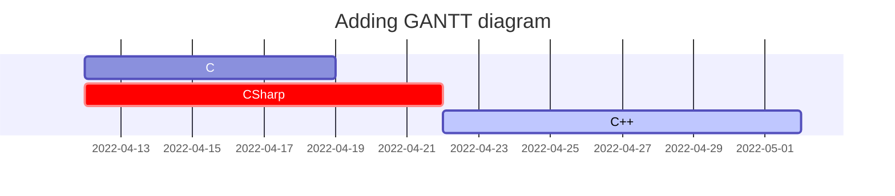
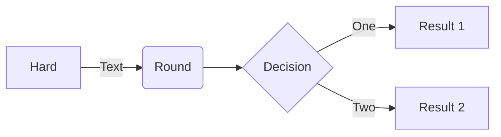
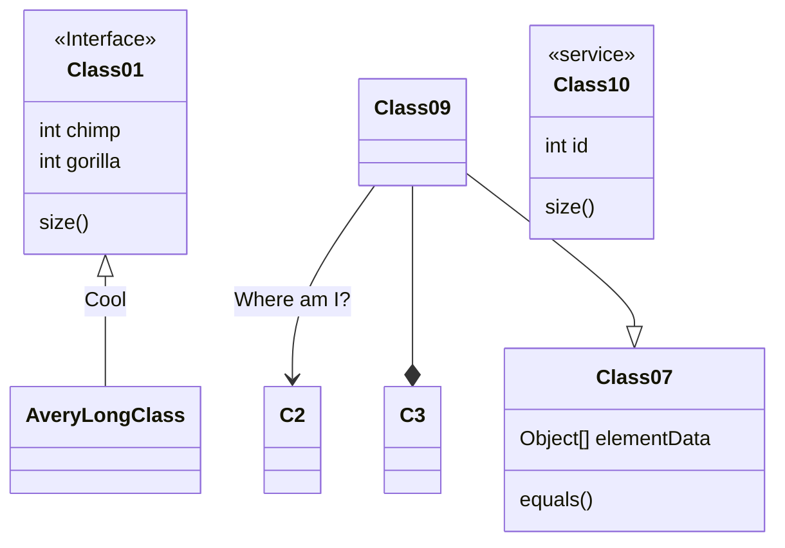

<!-- 

{: .w-75 .normal}
{: .w-75 .normal}

-->

[](https://github.com/tis-starlight/tis-starlight.github.io/blob/main/_posts/2023-09-09-creating-github-pages.md?plain=1)

This post serves the purpose of demonstrating how **Markdown** syntax is rendered on *Chirpy*. It can also be utilized as an illustrative example for crafting content to enhance the aesthetics of our *GitHub Pages* website. 
This includes creating beautifully designed documentation, blog posts, and more, with an emphasis on writing in-depth and comprehensive pieces.

<!-- directly use emoji ⬇️  or with markdown syntax (shortcodes) :arrow_down: -->

<!-- Markdown Emoji Cheatsheet https://github.com/ikatyang/emoji-cheat-sheet -->

## Markdown

Markdown is a lightweight markup language that is used for formatting and structuring plain text documents. 

It is often used for creating documents that will be converted to HTML, but it can also be used for other purposes such as documentation, README files, blogging and note-taking.

## Headings

<h1 class="mt-5"> H1 - heading</h1>  <!-- margin-top: 5px -->

<h2 data-toc-skip> H2 - heading</h2> <!-- Skip heading in Table of contents -->

<h3 data-toc-skip> H3 - heading</h3>

<h4 data-toc-skip> H4 - heading</h4>

## Paragraph

Detective Sarah Mitchell stood in the dimly lit room, her keen eyes scanning the scene for any trace of evidence. The air was thick with tension as she surveyed the opulent but now macabre setting of the crime. The victim, a prominent art collector named Victor Sinclair, lay sprawled on the Persian rug, his lifeless eyes fixed on an eerie painting that adorned the wall. A single gunshot had silenced him forever. Sarah's mind raced as she considered the suspects gathered in the adjacent room, each with a motive that seemed as dark as the night outside. The clock was ticking, and she knew that solving this murder would require unraveling secrets buried deep in the world of high society and the art underworld. With a sense of determination, she vowed to uncover the truth, no matter how many layers of deception she had to peel back.

## Lists

### Ordered list

1. Item 1
2. Item 2
3. Item 3

### Unordered list

- Chapter 1
  + Section 1.1
    * Paragraph 1.1.1
    * Paragraph 1.1.2
  + Section 1.2
    * Paragraph 1.2.1

### ToDo list

- [ ] Job
  + [x] Step 1
  + [x] Step 2
  + [ ] Step 3

### Description list

Smartphone
: A mobile device that combines a phone with various features such as internet access, camera, and apps.

Eiffel Tower
: A famous Parisian landmark and wrought-iron structure, designed by Gustave Eiffel, and completed in 1889.

## Emphasis

*italic*              <!-- or  _italic_ , <i> italic </i>, <em> italic </em> -->

**bold**              <!-- or  __bold__ , <b> bold </b> -->

## Block Quote

### Single-line quote

> *To be or not to be, that is the question*.

### Multi-line quote

> To be, or not to be, that is the question:
> Whether 'tis nobler in the mind to suffer
> The slings and arrows of outrageous fortune,
> Or to take arms against a sea of troubles
> And, by opposing, end them.
> 
> > *William Shakespeare's* play "Hamlet".

## Prompts

> An example showing the `tip` type prompt.
{: .prompt-tip }

> An example showing the `info` type prompt.
{: .prompt-info }

> An example showing the `warning` type prompt.
{: .prompt-warning }

> An example showing the `danger` type prompt.
{: .prompt-danger }

## Tables

| Company          | Contact       | Country |
|:---------------- |:------------- | -------:|
| ABC Electronics  | John Smith    | USA     |
| Global Imports   | Emily Johnson | Canada  |
| La Maison du Vin | Pierre Dupont | France  |

| File(s) | In Directory | from %TEMP% |
| ------- |:------------:|:-----------:|
| `*.PNG` | ✓            | ✗           |
| `*.ICO` | ✓            | ✗           |

>  ✓ means keep, ✗ means delete.
{: .prompt-info }

## Links

[**Starlight**](https://github.com/tis-starlight)

## Footnote

Click the hook will locate the footnote[^footnote-1], and here is another footnote[^footnote-2].

## Keyboard Input

Press <kbd>Ctrl</kbd>+<kbd>Alt</kbd>+<kbd>Delete</kbd> to restart the computer.

Press <kbd>Shift</kbd>+<kbd>D</kbd> to duplicate objects in blender.

## Inline code

This is an example of `Inline Code`.

## Filepath

Here is the `/path/to/the/file.extend`{: .filepath}.

## Code blocks

### Common

<!-- ~~~  or  ``` -->

```
This is a common code snippet, without syntax highlight and line number.
```

### Specific Language

<!-- asp|aspx, c, c++|cpp|cplusplus, cs|csharp, clj|cljc|cljx|clojure, css|less|sass|scss|styl|stylus, curl, d, dart, diff, dockerfile, erl|erlang, go, gql|graphql, gradle|groovy, handlebars|hbs, html|xhtml|xml, http, java, coffeescript|ecmascript|javascript|js|node, jsx, json, jl|julia, kotlin|kt, liquid, lua, markdown, objc|objectivec, objc++|objcpp|objectivecpp|objectivecplusplus, ocaml|ml, perl|pl, php, powershell|ps1, py|python, r, jsx, jruby|macruby|rake|rb|rbx|ruby, rs|rust, scala, bash|sh|shell|zsh, sol|solidity, cql|mssql|mysql|plsql|postgres|postgresql|pgsql|sql|sqlite, swift, ts|typescript, yaml|yml  -->

```cpp
#include <iostream>
int main() {
    // Display a simple message
    std::cout << "Hello, World!" << std::endl;
    return 0;
}
```

### Specific filename

```sass
@import
  "colors/light-typography",
  "colors/dark-typography";
```
{: file='_sass/jekyll-theme-chirpy.scss'}

## Mathematics

The mathematics powered by [**MathJax**](https://www.mathjax.org/):

$$ \sum_{n=1}^\infty 1/n^2 = \frac{\pi^2}{6} $$

When $a \ne 0$, there are two solutions to $ax^2 + bx + c = 0$ and they are

$$ x = {-b \pm \sqrt{b^2-4ac} \over 2a} $$

## Mermaid SVG


```mermaid
gantt
  title  Adding GANTT diagram
  C :a, 2022-04-12, 1w
  CSharp :crit, b, 2022-04-12, 10d
  C++ :active, c, after b a, 10d
```


```mermaid
flowchart LR
  A[Hard] -->|Text| B(Round)
  B --> C{Decision}
  C -->|One| D[Result 1]
  C -->|Two| E[Result 2]
```


```mermaid
classDiagram
Class01 <|-- AveryLongClass : Cool
<<Interface>> Class01
Class09 --> C2 : Where am I?
Class09 --* C3
Class09 --|> Class07
Class07 : equals()
Class07 : Object[] elementData
Class01 : size()
Class01 : int chimp
Class01 : int gorilla
class Class10 {
  <<service>>
  int id
  size()
}
```

## Images

### Default (with caption)

{: width="972" height="589" lqip="data:image/png;base64,
iVBORw0KGgoAAAANSUhEUgAAAAwAAAAHCAMAAAALbFwWAAAAIGNIUk0AAHomAACAhAAA+gAAAIDoAAB1MAAA6mAAADqYAAAXcJy6UTwAAACxUExURaGhoaampq2trbq6ur+/v7u7u9/f38nJyaqqqrKysrCwsK+vr6CgoKWlpaurq7GxsbOzs7y8vMzMzLe3t6ysrK6urqinqKuqq6enp5mZmZSTlIGBgYaGho+Pj4qKim9vb3Nzc1xcXFdXV1FRUXZ2dnp6emNjY1ZWVlJSUk9PT0dHR0JCQjc3NzY2Nj09PT8/Pzs7Ozo6OjU1NTIyMhwcHB4eHhsbGxoaGhkZGRgYGP///0LpJfUAAAABYktHRDpOCcT6AAAAB3RJTUUH5wkIFR8Yy+o8VwAAAGFJREFUCNdjYGBkYmZhZWPn4OTiZmDg4eHh5eMXEBRiEWYQEeXmEGNk5OUVZ+JjkJCUYmKSlpGRlZNXYFBUUlZRVVNX19DU0mbQ0dXT1zcwNNDRNTJmMDE1MzM3A2ILS0sACHYJGO1mhrMAAAAldEVYdGRhdGU6Y3JlYXRlADIwMjMtMDktMDhUMjE6MzE6MjQrMDA6MDBkBvpZAAAAJXRFWHRkYXRlOm1vZGlmeQAyMDIzLTA5LTA4VDIxOjMxOjI0KzAwOjAwFVtC5QAAACh0RVh0ZGF0ZTp0aW1lc3RhbXAAMjAyMy0wOS0wOFQyMTozMToyNCswMDowMEJOYzoAAAAASUVORK5CYII=" }
_Full screen width and center alignment_

### Left aligned

{: width="972" height="589" .w-75 .normal lqip="" }

### Float to left

{: width="972" height="589" .w-50 .left lqip="" }
In the heart of this desolate no man's land, the very essence of nature seemed to have withered away, leaving behind a haunting, barren expanse. The landscape, once vibrant with life, had succumbed to the relentless forces of time and neglect. A relentless wind whispered through skeletal remains of long-forgotten trees, their twisted branches reaching towards a colorless sky.The ground beneath was cracked and parched, resembling a shattered mosaic of forgotten dreams. The earth, choked by an endless sea of gray dust, bore the scars of a world that had turned its back on it. Here, no creature stirred, and no songbird dared to sing. The silence was profound, as if the land itself held its breath, waiting for some long-lost spark of vitality to ignite its soul.

### Float to right

{: width="972" height="589" .w-50 .right lqip="" }
In the heart of a desolate, colorless gray field, there stands a lone tree, its gnarled branches reaching out like skeletal fingers towards the overcast sky. The land stretches out in all directions, barren and lifeless, devoid of any signs of habitation or growth. The silence here is oppressive, broken only by the occasional whisper of the wind as it mournfully dances through the withered grass. In this desolation, one can't help but feel utterly alone, a solitary figure in a world drained of vibrancy and vitality, where even time itself seems to have come to a standstill.

### Dark/Light mode & Shadow

The image below will toggle dark/light mode based on theme preference, notice it has shadows.

{: .light .w-75 .shadow .rounded-10 w='1212' h='668' }
{: .dark .w-75 .shadow .rounded-10 w='1212' h='668' }

<!-- 

## Video



-->

## Naming and Path

Create a new file named `YYYY-MM-DD-TITLE.EXTENSION`{: .filepath} and put it in the `_posts`{: .filepath} of the root directory. Please note that the `EXTENSION`{: .filepath} must be one of `md`{: .filepath} and `markdown`{: .filepath}.

## Front Matter

Basically, you need to fill the [Front Matter](https://jekyllrb.com/docs/front-matter/) as below at the top of the post:

```yaml
---
title: TITLE
date: YYYY-MM-DD HH:MM:SS +/-TTTT
categories: [TOP_CATEGORY, SUB_CATEGORY]
tags: [TAG]     # TAG names should always be lowercase
---
```

> The posts' _layout_ has been set to `post` by default, so there is no need to add the variable _layout_ in the Front Matter block.
{: .prompt-tip }

### Timezone of Date

In order to accurately record the release date of a post, you should not only set up the `timezone` of `_config.yml`{: .filepath} but also provide the post's timezone in variable `date` of its Front Matter block. Format: `+/-TTTT`, e.g. `+0800`.

### Categories and Tags

The `categories` of each post are designed to contain up to two elements, and the number of elements in `tags` can be zero to infinity. For instance:

```yaml
---
categories: [Animal, Insect]
tags: [bee]
---
```

### Author Information

The author information of the post usually does not need to be filled in the _Front Matter_ , they will be obtained from variables `social.name` and the first entry of `social.links` of the configuration file by default. But you can also override it as follows:

Adding author information in `_data/authors.yml` (If your website doesn't have this file, don't hesitate to create one).

```yaml
<author_id>:
  name: <full name>
  twitter: <twitter_of_author>
  url: <homepage_of_author>
```
{: file="_data/authors.yml" }


And then use `author` to specify a single entry or `authors` to specify multiple entries:

```yaml
---
author: <author_id>                     # for single entry
# or
authors: [<author1_id>, <author2_id>]   # for multiple entries
---
```

Having said that, the key `author` can also identify multiple entries.

> The benefit of reading the author information from the file `_data/authors.yml`{: .filepath } is that the page will have the meta tag `twitter:creator`, which enriches the [Twitter Cards](https://developer.twitter.com/en/docs/twitter-for-websites/cards/guides/getting-started#card-and-content-attribution) and is good for SEO.
{: .prompt-info }

## Table of Contents

By default, the **T**able **o**f **C**ontents (TOC) is displayed on the right panel of the post. If you want to turn it off globally, go to `_config.yml`{: .filepath} and set the value of variable `toc` to `false`. If you want to turn off TOC for a specific post, add the following to the post's [Front Matter](https://jekyllrb.com/docs/front-matter/):

```yaml
---
toc: false
---
```

## Comments

The global switch of comments is defined by variable `comments.active` in the file `_config.yml`{: .filepath}. After selecting a comment system for this variable, comments will be turned on for all posts.

If you want to close the comment for a specific post, add the following to the **Front Matter** of the post:

```yaml
---
comments: false
---
```

## Mathematics

For website performance reasons, the mathematical feature won't be loaded by default. But it can be enabled by:

```yaml
---
math: true
---
```

## Mermaid

[**Mermaid**](https://github.com/mermaid-js/mermaid) is a great diagrams generation tool. To enable it on your post, add the following to the YAML block:

```yaml
---
mermaid: true
---
```

Then you can use it like other markdown languages: surround the graph code with ```` ```mermaid ```` and ```` ``` ````.

## Images

### Caption

Add italics to the next line of an image，then it will become the caption and appear at the bottom of the image:

```markdown

_Image Caption_
```
{: .nolineno }

### Size

In order to prevent the page content layout from shifting when the image is loaded, we should set the width and height for each image.

```markdown
{: width="700" height="400" }
```
{: .nolineno }

> For an SVG, you have to at least specify its _width_, otherwise it won't be rendered.
{: .prompt-info }

Starting from _Chirpy v5.0.0_, `height` and `width` support abbreviations (`height` → `h`, `width` → `w`). The following example has the same effect as the above:

```markdown
{: w="700" h="400" }
```
{: .nolineno }

### Position

By default, the image is centered, but you can specify the position by using one of the classes `normal`, `left`, and `right`.

> Once the position is specified, the image caption should not be added.
{: .prompt-warning }

- **Normal position**
  
  Image will be left aligned in below sample:
  
  ```markdown
  {: .normal }
  ```
  {: .nolineno }

- **Float to the left**
  
  ```markdown
  {: .left }
  ```
  {: .nolineno }

- **Float to the right**
  
  ```markdown
  {: .right }
  ```
  {: .nolineno }

### Dark/Light mode

You can make images follow theme preferences in dark/light mode. This requires you to prepare two images, one for dark mode and one for light mode, and then assign them a specific class (`dark` or `light`):

```markdown
{: .light }
{: .dark }
```

### Shadow

The screenshots of the program window can be considered to show the shadow effect:

```markdown
{: .shadow }
```
{: .nolineno }

### CDN URL

If you host the images on the CDN, you can save the time of repeatedly writing the CDN URL by assigning the variable `img_cdn` of `_config.yml`{: .filepath} file:

```yaml
img_cdn: https://cdn.com
```
{: file='_config.yml' .nolineno }

Once `img_cdn` is assigned, the CDN URL will be added to the path of all images (images of site avatar and posts) starting with `/`.

For instance, when using images:

```markdown

```
{: .nolineno }

The parsing result will automatically add the CDN prefix `https://cdn.com` before the image path:

```html

```
{: .nolineno }

### Image Path

When a post contains many images, it will be a time-consuming task to repeatedly define the path of the images. To solve this, we can define this path in the YAML block of the post:

```yml
---
img_path: /img/path/
---
```

And then, the image source of Markdown can write the file name directly:

```md

```
{: .nolineno }

The output will be:

```html

```
{: .nolineno }

### Preview Image

If you want to add an image at the top of the post, please provide an image with a resolution of `1200 x 630`. Please note that if the image aspect ratio does not meet `1.91 : 1`, the image will be scaled and cropped.

Knowing these prerequisites, you can start setting the image's attribute:

```yaml
---
image:
  path: /path/to/image
  alt: image alternative text
---
```

Note that the [`img_path`](#image-path) can also be passed to the preview image, that is, when it has been set, the  attribute `path` only needs the image file name.

For simple use, you can also just use `image` to define the path.

```yml
---
image: /path/to/image
---
```

### LQIP

Low Quality Image Placeholder
: A technique displaying a small, highly compressed, low-resolution image initially to users while the high-quality image loads in the background. It is lightweight and give the impression of faster website loading. As the high-quality image loads, it gradually replaces the LQIP for a seamless transition.

For preview images:

```yaml
---
image:
  lqip: /path/to/lqip-file # or base64 URI
---
```

> You can observe LQIP in the preview image of this post .

For normal images:

```markdown
{: lqip="/path/to/lqip-file" }
```
{: .nolineno }

## Pinned Posts

You can pin one or more posts to the top of the home page, and the fixed posts are sorted in reverse order according to their release date. Enable by:

```yaml
---
pin: true
---
```

## Prompts

There are several types of prompts: `tip`, `info`, `warning`, and `danger`. They can be generated by adding the class `prompt-{type}` to the blockquote. For example, define a prompt of type `info` as follows:

```md
> Example line for prompt.
{: .prompt-info }
```
{: .nolineno }

## Syntax

### Inline Code

```md
`inline code part`
```
{: .nolineno }

### Filepath Hightlight

```md
`/path/to/a/file.extend`{: .filepath}
```
{: .nolineno }

### Code Block

Markdown symbols ```` ``` ```` can easily create a code block as follows:

````md
```
This is a plaintext code snippet.
```
````

#### Specifying Language

Using ```` ```{language} ```` you will get a code block with syntax highlight:

````markdown
```yaml
key: value
```
````

> The Jekyll tag `` is not compatible with this theme.
{: .prompt-danger }   

#### Line Number

By default, all languages except `plaintext`, `console`, and `terminal` will display line numbers. When you want to hide the line number of a code block, add the class `nolineno` to it:

````markdown
```shell
echo 'No more line numbers!'
```
{: .nolineno }
````

#### Specifying the Filename

You may have noticed that the code language will be displayed at the top of the code block. If you want to replace it with the file name, you can add the attribute `file` to achieve this:

````markdown
```shell
# content
```
{: file="path/to/file" }
````

#### Liquid Codes

If you want to display the **Liquid** snippet, surround the liquid code with `` and ``:

````markdown

```liquid

  This product's title contains the word Pack.

```

````

Or adding `render_with_liquid: false` (Requires Jekyll 4.0 or higher) to the post's YAML block.

## Videos

You can embed a video with the following syntax:

```liquid

```

Where `Platform` is the lowercase of the platform name, and `ID` is the video ID.

The following table shows how to get the two parameters we need in a given video URL, and you can also know the currently supported video platforms.

| Video URL                                                                                          | Platform  | ID            |
| -------------------------------------------------------------------------------------------------- | --------- |:------------- |
| [https://www.**youtube**.com/watch?v=**mrNX55CWuZA**](https://www.youtube.com/watch?v=mrNX55CWuZA) | `youtube` | `mrNX55CWuZA` |
| [https://www.**twitch**.tv/videos/**1889357157**](https://www.twitch.tv/videos/1889357157)         | `twitch`  | `1889357157`  |

## Reverse Footnote

[^footnote-1]: The footnote source
[^footnote-2]: The 2nd footnote source

## Learn More

- If you want to enhance your knowledge of Markdown, visit the [Markdown](https://www.markdownguide.org/).
- If you're interested in the Chirpy theme, you can check out the [Chirpy](https://chirpy.cotes.page/).
- For more knowledge about Jekyll, visit the [Jekyll](https://jekyllrb.com/).
- To learn about HTML tags, explore the [HTML](https://www.w3schools.com/html/).
- For information on CSS properties, refer to the [CSS](https://www.w3schools.com/css/default.asp).
- For resizing, compressing, and converting images, you can use the [Simple Image Resizer](https://www.simpleimageresizer.com/).
- To convert images to base64 encoding, visit [Code Beauty](https://codebeautify.org/image-to-base64-converter).
- For GitHub shields, visit [Shields.io](https://shields.io/).
- For emojis, check out the [Emoji Cheatsheet](https://github.com/ikatyang/emoji-cheat-sheet).
- For a Markdown editor, explore [MarkText](https://www.marktext.cc/).
- For an all-in-one (AIO) editor, delve into [VS Code](https://code.visualstudio.com/).
- For a workflow-based editor, consider [Visual Studio](https://visualstudio.microsoft.com/).
- To enhance your Markdown experience in Visual Studio Code, install the [Markdown AIO](https://marketplace.visualstudio.com/items?itemName=yzhang.markdown-all-in-one).
- For enhanced Markdown preview capabilities in VS Code, try the [Markdown Preview Enhanced](https://marketplace.visualstudio.com/items?itemName=shd101wyy.markdown-preview-enhanced).
- For image hosting, visit [Imgur](https://imgur.com/).
- For high-quality, royalty-free CC0 images, visit [Unsplash](https://unsplash.com/).
- To add complex math equations in documentation, visit [MathJax](https://www.mathjax.org/).
- To add various diagrams, visit [Mermaid](https://github.com/mermaid-js/mermaid).

> These are not the only valuable resources available; there is a wealth of amazing work, content, and more to be found on the internet. Feel free to `search for additional sources` to deepen your knowledge.
{: .prompt-tip }