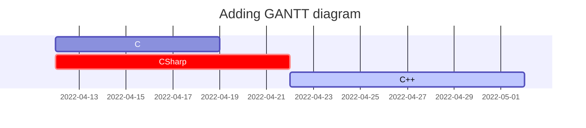
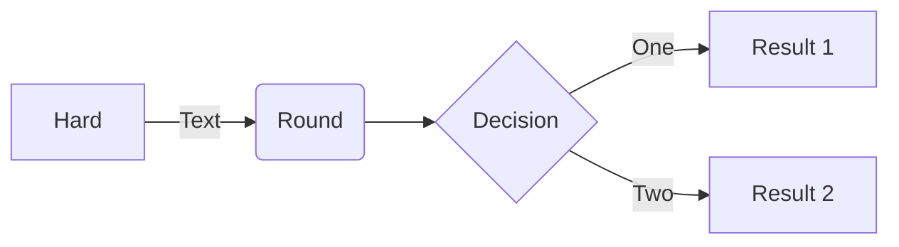
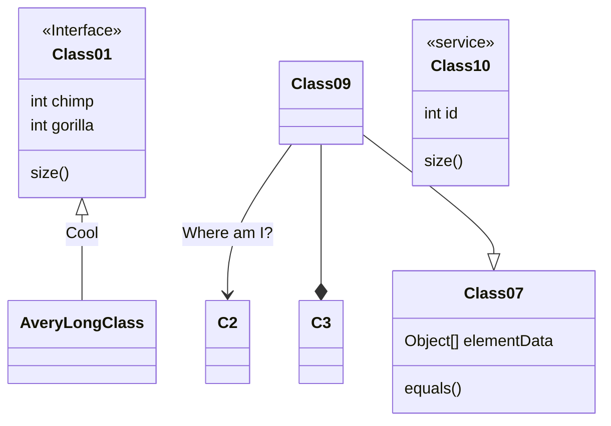

<!-- 

{: .w-75 .normal}
{: .w-75 .normal}

-->

[](https://github.com/tis-starlight/tis-starlight.github.io/blob/main/_posts/2023-09-09-creating-github-pages.md?plain=1)

This post serves the purpose of demonstrating how **Markdown** syntax is rendered on *Chirpy*. It can also be utilized as an illustrative example for crafting content to enhance the aesthetics of our *GitHub Pages* website. 
This includes creating beautifully designed documentation, blog posts, and more, with an emphasis on writing in-depth and comprehensive pieces.

<!-- directly use emoji ⬇️  or with markdown syntax (shortcodes) :arrow_down: -->

<!-- Markdown Emoji Cheatsheet https://github.com/ikatyang/emoji-cheat-sheet -->

<!-- [comment]: A Markdown comment  (https://stackoverflow.com/questions/4823468/comments-in-markdown) --> 

## Markdown

[**Markdown**](https://en.wikipedia.org/wiki/Markdown){: target="_blank" rel="noopener noreferrer"} is a lightweight markup language that is used for formatting and structuring plain text documents. 

It is often used for creating documents that will be converted to HTML, but it can also be used for other purposes such as documentation, README files, blogging and note-taking.

## Headings

<h1 class="mt-5"> H1 - heading</h1>  <!-- margin-top: 5px -->

<h2 data-toc-skip> H2 - heading</h2> <!-- Skip heading in Table of contents -->

<h3 data-toc-skip> H3 - heading</h3>

<h4 data-toc-skip> H4 - heading</h4>

## Paragraph

Detective Sarah Mitchell stood in the dimly lit room, her keen eyes scanning the scene for any trace of evidence. The air was thick with tension as she surveyed the opulent but now macabre setting of the crime. The victim, a prominent art collector named Victor Sinclair, lay sprawled on the Persian rug, his lifeless eyes fixed on an eerie painting that adorned the wall. A single gunshot had silenced him forever. Sarah's mind raced as she considered the suspects gathered in the adjacent room, each with a motive that seemed as dark as the night outside. The clock was ticking, and she knew that solving this murder would require unraveling secrets buried deep in the world of high society and the art underworld. With a sense of determination, she vowed to uncover the truth, no matter how many layers of deception she had to peel back.

## Lists

### Ordered list

1. Item 1
2. Item 2
3. Item 3

### Unordered list

- Chapter 1
  + Section 1.1
    * Paragraph 1.1.1
    * Paragraph 1.1.2
  + Section 1.2
    * Paragraph 1.2.1

### ToDo list

- [ ] Job
  + [x] Step 1
  + [x] Step 2
  + [ ] Step 3

### Description list

Smartphone
: A mobile device that combines a phone with various features such as internet access, camera, and apps.

Eiffel Tower
: A famous Parisian landmark and wrought-iron structure, designed by Gustave Eiffel, and completed in 1889.

## Emphasis

*italic*              <!-- or  _italic_ , <i> italic </i>, <em> italic </em> -->

**bold**              <!-- or  __bold__ , <b> bold </b> -->

## Tool-tip

Most inline <abbr title="Hypertext Markup Language">HTML</abbr> tags are supported.

```html
Most inline <abbr title="Hypertext Markup Language">HTML</abbr> tags are supported.
```

## Improving Visibility/Readability

Sometimes, Markdown content requires adding [HTML elements and CSS attributes](https://stackoverflow.com/questions/35465557/how-to-apply-color-on-text-in-markdown){: target="_blank" rel="noopener noreferrer"} like color and font sizes, and weight attributes. However, Natively Markdown or any Markdown parser/flavor does not support CSS styles.
There are multiple ways to achieve this:

- Using HTML and CSS: <span style="color:green;font-weight:400;font-size:20px">Hello World!</span>

```html
<span style="color:green;font-weight:400;font-size:20px"> Hello World! </span>
```
{: .nolineno }

- Using [Kramdown](https://kramdown.gettalong.org/index.html){: target="_blank" rel="noopener noreferrer"} - a Ruby-based Markdown parser that extends the functionality of standard Markdown: This is *green*{: style="color: green"}

```markdown
This is *green*{: style="color: green"}
```

- Using Emojis:
When you want to use pure Markdown (without nested HTML & CSS), you can use Emojis to draw attention to some fragment of the file, i.e. ⚠️WARNING⚠️, 🔴DANGER🔴 or 🔥NEW🔥.

## Bootstrap [+](https://getbootstrap.com/docs/5.3/examples/cheatsheet/){: target="_blank" rel="noopener noreferrer"}

### Accordion

An [Accordion](https://getbootstrap.com/docs/5.3/components/accordion/){: target="_blank" rel="noopener noreferrer"} is a user interface element enabling users to expand or collapse content sections, ideal for organizing large amounts of information efficiently.

<div class="accordion" id="accordionExample" data-bs-theme="dark">
  <div class="accordion-item">
    <div>
      <button class="accordion-button" type="button" data-bs-toggle="collapse" data-bs-target="#cppCollapse" aria-expanded="true" aria-controls="cppCollapse" style="background-color: rgb(44, 45, 45); color: #cccccc;">
        C++
      </button>
    </div>
    <div id="cppCollapse" class="accordion-collapse collapse show" aria-labelledby="cppHeading" data-bs-parent="#accordionExample">
      <div class="accordion-body" style="background-color: rgba(27, 27, 30, 0.8); color: rgb(175, 176, 177);">
          <b>C++</b> was developed by Bjarne Stroustrup at Bell Labs in 1979 as an extension of the C programming language. It is widely used in the development of system/application software, game development, drivers, client-server applications, and embedded firmware.
      </div>
    </div>
  </div>
  <div class="accordion-item">
    <div>
      <button class="accordion-button collapsed" type="button" data-bs-toggle="collapse" data-bs-target="#gameEngineCollapse" aria-expanded="false" aria-controls="gameEngineCollapse" style="background-color: rgb(44, 45, 45); color: #cccccc;">
        Game Engines
      </button>
    </div>
    <div id="gameEngineCollapse" class="accordion-collapse collapse" aria-labelledby="gameEngineHeading" data-bs-parent="#accordionExample">
      <div class="accordion-body" style="background-color: rgba(27, 27, 30, 0.8); color: rgb(175, 176, 177);">
        <ul>
          <li>Unity</li>
          <li>Unreal Engine</li>
          <li>Godot Engine</li>
        </ul>
      </div>
    </div>
  </div>
</div>

### Badges

A [Badge](https://getbootstrap.com/docs/5.3/components/badge/){: target="_blank" rel="noopener noreferrer"} is a small UI element showing counts, labels, or statuses within content. It's handy for notifications, alerts, or item quantities, enhancing UX by visually highlighting key information.

<div class="container mt-2 d-flex justify-content-center">
  <button type="button" class="btn btn-primary position-relative">
    Notifications 
    <span class="badge rounded-pill text-bg-dark" style="margin-left: 5px;">4</span>
  </button>

  <button type="button" class="btn btn-primary position-relative" style="margin-left: 15px;">
    Inbox
    <span class="position-absolute top-0 start-100 translate-middle badge rounded-pill bg-danger">
      99+
      <span class="visually-hidden">unread messages</span>
    </span>
  </button>

  <button type="button" class="btn btn-success position-relative" style="margin-left: 15px;">
    Profile
    <span class="position-absolute top-0 start-100 translate-middle p-2 bg-danger border border-light rounded-circle">
      <span class="visually-hidden">New alerts</span>
    </span>
  </button>

  <button type="button" class="btn btn-warning position-relative" style="margin-left: 15px;">
    Warning
    <span class="position-absolute top-0 start-100 translate-middle p-2 bg-info border border-light rounded-circle">
      <span class="visually-hidden">New alerts</span>
    </span>
  </button>
</div>

### Buttons

A [Button](https://getbootstrap.com/docs/5.3/components/buttons/){: target="_blank" rel="noopener noreferrer"} is a core UI component used for user interaction, enabling actions or navigation.

<div class="container mt-2 d-flex justify-content-center">
  <a href="#" class="btn btn-success" style="--bs-btn-padding-y: .25rem; --bs-btn-padding-x: .5rem; margin-right: 10px;" role="button">Visit #</a>
  <a href="https://tis-starlight.github.io" class="btn btn-outline-primary" style="--bs-btn-padding-y: .25rem; --bs-btn-padding-x: .5rem; border: 1px solid; margin-left: 10px; --bs-btn-font-size: 1rem;" role="button">Visit Starlight</a>
</div>

### Button Group

A [Button Group](https://getbootstrap.com/docs/5.3/components/button-group/){: target="_blank" rel="noopener noreferrer"} is a component that organizes multiple buttons together, typically for related actions or options, providing a cohesive appearance and better user experience.

<div class="btn-group" role="group" aria-label="Socials">
  <button type="button" class="btn btn-primary active" aria-current="page" style="font-size: 16px; font-style: normal; font-family: 'Orbitron', Cascadia Mono, sans-serif; padding-right: 20px;"><b>Starlight</b></button>
  <a href="https://www.youtube.com/channel/UClM7SQbs4f77roJSLOAYqiA" class="btn btn-danger">Youtube</a>
  <a href="https://www.artstation.com/tis-starlight" class="btn btn-warning">Artstation</a>
  <a href="https://github.com/tis-starlight" class="btn btn-success">Github</a>
</div>

<br>

<div class="btn-group" role="group" aria-label="Button group with nested dropdown">
  <button type="button" class="btn btn-primary">1</button>
  <button type="button" class="btn btn-primary">2</button>

  <div class="btn-group" role="group">
    <button type="button" class="btn btn-primary dropdown-toggle" data-bs-toggle="dropdown" aria-expanded="false">
      Dropdown
    </button>
    <ul class="dropdown-menu">
      <li><a class="dropdown-item" href="#">Post1 link</a></li>
      <li><a class="dropdown-item" href="#">Post2 link</a></li>
    </ul>
  </div>
</div>

<div class="btn-group" style="margin-left: 20px;" role="group" aria-label="Button group with nested dropdown">
  <button type="button" class="btn btn-primary">1</button>
  <button type="button" class="btn btn-primary">2</button>
  <button type="button" class="btn btn-primary">3</button>

  <div class="btn-group" role="group">
    <button type="button" class="btn btn-outline-warning dropdown-toggle" data-bs-toggle="dropdown" aria-expanded="false">
      Dropdown
    </button>
    <ul class="dropdown-menu">
      <li><a class="dropdown-item" style="color: #ff0000;" href="#">Post1 link</a></li>
      <li><a class="dropdown-item" style="color: #ff0000;" href="#">Post2 link</a></li>
      <li><a class="dropdown-item" style="color: #ff0000;" href="#">Post3 link</a></li>
    </ul>
  </div>
</div>

### Cards

[Cards](https://getbootstrap.com/docs/5.3/components/card/){: target="_blank" rel="noopener noreferrer"} are versatile content containers used to display various types of information. They offer a consistent and responsive layout, making it easy to present content such as text, images, and buttons in an organized and visually appealing manner.

<div class="row justify-content-center">
  <div class="col-md-5 mb-3">
    <div class="card" style="background-color: rgb(44, 45, 45); color: white; width: 18rem;">
      <div class="card-body">
        <h5 class="card-title pt-0 mt-0" data-toc-skip>Card title</h5>
        <p class="card-text pt-2">Some quick example text to build on the card title and make up the bulk of the card's content.</p>
        <a href="#" class="btn btn-primary">Button</a>
      </div>
    </div>
  </div>  
  <div class="col-md-5 mb-3">
    <div class="card" style="background-color: rgb(44, 45, 45); color: white; width: 18rem;">
      <div class="card-body">
        <h5 class="card-title pt-0 mt-0" data-toc-skip>Card title</h5>
        <p class="card-text pt-2">Some quick example text to build on the card title and make up the bulk of the card's content.</p>
        <a href="#" class="btn btn-primary">Button</a>
      </div>
    </div>
  </div>  
</div>

<br>

<div class="row justify-content-center">
  <div class="col-sm-5 mb-3">
    <div class="card" style="background-color: rgb(44, 45, 45); color: white; width: 18rem; border-radius: 10px; overflow: hidden;">
      
      <div class="card-body p-2">
        <h5 class="card-title m-0" data-toc-skip>Card title</h5>
        <p class="card-text mt-2">Some quick example text to build on the card title and make up the bulk of the card's content.</p>
        <a href="#" class="btn btn-primary mt-1">Button</a>
      </div>
    </div>
  </div>
  <div class="col-sm-5 mb-3">
    <div class="card" style="background-color: rgb(44, 45, 45); color: white; width: 18rem; border-radius: 10px; overflow: hidden;">
      
      <div class="card-body p-2">
        <h5 class="card-title m-0" data-toc-skip>Card title</h5>
        <p class="card-text mt-2">Some quick example text to build on the card title and make up the bulk of the card's content.</p>
        <a href="#" class="btn btn-primary mt-1">Button</a>
      </div>
    </div>
  </div>
</div>
 

<br>

<div class="card p-0 m-0 bg-dark text-white" style="border-radius: 10px; overflow: hidden;">
  
  <div class="card-img-overlay">
    <h5 class="card-title mt-4" data-toc-skip>Card title</h5>
    <p class="card-text mt-3">
      This is a wider card with supporting text below as a natural lead-in to additional
      content. This content is a little bit longer.
    </p>
    <p class="card-text">Last updated 3 mins ago</p>
  </div>
</div>

<br>

<div class="card bg-dark text-white">
  <div class="card-body">This is some text within a card body.</div>
</div>

<br>

<div class="card text-center text-white" style="background-color: rgb(44, 45, 45); border-radius: 10px; overflow: hidden;">
  <div class="card-header">Featured</div>
  <div class="card-body mt-0 pt-0">
    <h5 class="card-title" data-toc-skip>Discover Our New Product</h5>
    <p class="card-text" style="text-align: justify;">Introducing our latest innovation, the XYZ Pro Series. Designed to revolutionize your workflow with cutting-edge features and unparalleled performance. Whether you're a professional or a hobbyist, the XYZ Pro Series is engineered to meet your needs and exceed your expectations.</p>
    <a href="#" class="btn btn-primary" data-mdb-ripple-init>Learn More</a>
  </div>
  <div class="card-footer text-muted mt-4">2 days ago</div>
</div>

<div class="container mt-5 mb-3">
    <div class="row">
        <div class="col-md-4">
            <div class="card p-3 mb-2 bg-dark text-white" style="border: none; border-radius: 10px;">
                <div class="d-flex justify-content-between">
                    <div class="d-flex flex-row align-items-center">
                        <div class="icon bg-dark" style="width: 50px; height: 50px; background-color: #eee; border-radius: 15px; display: flex; align-items: center; justify-content: center; font-size: 39px; border: 1px solid #fff;">
                        <i class="fa-solid fa-shield-halved"></i>
                        </div>
                        <div class="ms-2 c-details">
                            <h6 class="mb-0" data-toc-skip>Shield.inc</h6>
                            <span style="font-weight: 300; font-size: 13px;">3 days ago</span>
                        </div>
                    </div>
                    <div class="badge">
                        <span style="background-color: dark; width: 60px; height: 25px; padding-bottom: 3px; border-radius: 5px; display: flex; color: #fed85d; justify-content: center; align-items: center; border: 1px solid #fed85d;">Security</span>
                    </div>
                </div>
                <div class="mt-5">
                    <h3 class="heading text-white" data-toc-skip>Senior Security<br>Analyst - UK</h3>
                    <div class="mt-5">
                        <div class="progress" style="height: 10px; border-radius: 10px;">
                            <div class="progress-bar" role="progressbar" style="width: 40%; background-color: green;" aria-valuenow="40" aria-valuemin="0" aria-valuemax="100"></div>
                        </div>
                        <div class="mt-3">
                            <span class="text1" style="font-size: 14px; font-weight: 600;">4 Applied <span class="text2" style="color: #a5aec0;">of 10 capacity</span></span>
                        </div>
                    </div>
                </div>
            </div>
        </div>
        <div class="col-md-4">
            <div class="card p-3 mb-2 bg-dark text-white" style="border: none; border-radius: 10px;">
                <div class="d-flex justify-content-between">
                    <div class="d-flex flex-row align-items-center">
                        <div class="icon bg-dark" style="width: 50px; height: 50px; background-color: #eee; border-radius: 15px; display: flex; align-items: center; justify-content: center; font-size: 39px; border: 1px solid #fff;">
                            <i class="fa-solid fa-palette"></i>
                        </div>
                        <div class="ms-2 c-details">
                            <h6 class="mb-0">Art.inc</h6>
                            <span style="font-weight: 300; font-size: 13px;">4 days ago</span>
                        </div>
                    </div>
                    <div class="badge">
                        <span style="background-color: dark; width: 60px; height: 25px; padding-bottom: 3px; border-radius: 5px; display: flex; color: #fed85d; justify-content: center; align-items: center; border: 1px solid #fed85d;">Artist</span>
                    </div>
                </div>
                <div class="mt-5">
                    <h3 class="heading text-white" data-toc-skip>Senior Character<br>Artist - USA</h3>
                    <div class="mt-5">
                        <div class="progress" style="height: 10px; border-radius: 10px;">
                            <div class="progress-bar" role="progressbar" style="width: 80%; background-color: blue;" aria-valuenow="80" aria-valuemin="0" aria-valuemax="100"></div>
                        </div>
                        <div class="mt-3">
                            <span class="text1" style="font-size: 14px; font-weight: 600;">6 Applied <span class="text2" style="color: #a5aec0;">of 10 capacity</span></span>
                        </div>
                    </div>
                </div>
            </div>
        </div>
        <div class="col-md-4">
            <div class="card p-3 mb-2 bg-dark text-white" style="border: none; border-radius: 10px;">
                <div class="d-flex justify-content-between">
                    <div class="d-flex flex-row align-items-center">
                        <div class="icon bg-dark" style="width: 50px; height: 50px; background-color: #eee; border-radius: 15px; display: flex; align-items: center; justify-content: center; font-size: 39px; border: 1px solid #fff;">
                            <i class="fa-solid fa-chess-pawn"></i>
                        </div>
                        <div class="ms-2 c-details">
                            <h6 class="mb-0">Game.inc</h6>
                            <span style="font-weight: 300; font-size: 13px;">1 days ago</span>
                        </div>
                    </div>
                    <div class="badge">
                        <span style="background-color: dark; width: 60px; height: 25px; padding-bottom: 3px; border-radius: 5px; display: flex; color: #fed85d; justify-content: center; align-items: center; border: 1px solid #fed85d;">Design</span>
                    </div>
                </div>
                <div class="mt-5">
                    <h3 class="heading" data-toc-skip>Senior Level<br>Designer - France</h3>
                    <div class="mt-5">
                        <div class="progress" style="height: 10px; border-radius: 10px;">
                            <div class="progress-bar" role="progressbar" style="width: 80%; background-color: red;" aria-valuenow="80" aria-valuemin="0" aria-valuemax="100"></div>
                        </div>
                        <div class="mt-3">
                            <span class="text1" style="font-size: 14px; font-weight: 600;">26 Applied <span class="text2" style="color: #a5aec0;">of 30 capacity</span></span>
                        </div>
                    </div>
                </div>
            </div>
        </div>
    </div>
</div>

### Carousel

A [Carousel](https://getbootstrap.com/docs/5.3/components/carousel/){: target="_blank" rel="noopener noreferrer"} is a component that allows you to cycle through a set of images or slides in a visually appealing way. It's commonly used for showcasing content such as images or products on a website.

<div id="carouselExampleCaptions" class="carousel slide">
  <div class="carousel-indicators">
    <button type="button" data-bs-target="#carouselExampleCaptions" data-bs-slide-to="0" class="active" aria-current="true" aria-label="Slide 1"></button>
    <button type="button" data-bs-target="#carouselExampleCaptions" data-bs-slide-to="1" aria-label="Slide 2"></button>
    <button type="button" data-bs-target="#carouselExampleCaptions" data-bs-slide-to="2" aria-label="Slide 3"></button>
  </div>
  <div class="carousel-inner">
    <div class="carousel-item active">
      
      <div class="carousel-caption d-none d-md-block">
        <h5>First slide label</h5>
        <p>Some representative placeholder content for the first slide.</p>
      </div>
    </div>
    <div class="carousel-item">
      
      <div class="carousel-caption d-none d-md-block">
        <h5>Second slide label</h5>
        <p>Some representative placeholder content for the second slide.</p>
      </div>
    </div>
    <div class="carousel-item">
      
      <div class="carousel-caption d-none d-md-block">
        <h5>Third slide label</h5>
        <p>Some representative placeholder content for the third slide.</p>
      </div>
    </div>
  </div>
  <button class="carousel-control-prev" type="button" data-bs-target="#carouselExampleCaptions" data-bs-slide="prev">
    <span class="carousel-control-prev-icon" aria-hidden="true"></span>
    <span class="visually-hidden">Previous</span>
  </button>
  <button class="carousel-control-next" type="button" data-bs-target="#carouselExampleCaptions" data-bs-slide="next">
    <span class="carousel-control-next-icon" aria-hidden="true"></span>
    <span class="visually-hidden">Next</span>
  </button>
</div>

### Dropdowns

A [Dropdown](https://getbootstrap.com/docs/5.3/components/dropdowns/){: target="_blank" rel="noopener noreferrer"} is a UI element that allows users to select an option from a list. It typically consists of a button or link that reveals a list of options when clicked.

<div class="btn-group">
  <button type="button" class="btn btn-danger dropdown-toggle" data-bs-toggle="dropdown" aria-expanded="false">
    Action
  </button>
  <ul class="dropdown-menu bg-dark">
    <li><a class="dropdown-item text-light" href="#">Action</a></li>
    <li><a class="dropdown-item text-light" href="#">Another action</a></li>
    <li><a class="dropdown-item text-light" href="#">Action List</a></li>
    <li><hr class="dropdown-divider"></li>
    <li><a class="dropdown-item text-light" href="#">Docs</a></li>
  </ul>
</div>

### Modal

A [Modal](https://getbootstrap.com/docs/5.3/components/modal/){: target="_blank" rel="noopener noreferrer"} is a popup dialog box that appears on top of the main content, commonly used to display important information, forms, or confirmations.

<div class="modal fade text-white" id="myModal" tabindex="-1" aria-labelledby="exampleModalLabel" aria-hidden="true" data-bs-theme="dark">
  <div class="modal-dialog modal-dialog-centered modal-dialog-scrollable">
    <div class="modal-content bg-dark">
      <div class="modal-header mt-0 pt-0">
        <h5 class="modal-title" id="exampleModalLabel">Shadows in the Manor</h5>
        <button type="button" class="btn-close" data-bs-dismiss="modal" aria-label="Close"></button>
      </div>
      <div class="modal-body">
        <p><b style="color:yellow;">Chapter 1:</b> The Invitation</p>
        <p>The wind howled outside the old Victorian manor as the rain battered against the windows. Inside, the atmosphere was equally chilling. A group of strangers had gathered at the behest of an enigmatic host, their motives shrouded in mystery. Each had received an invitation, cryptic in its wording, promising an evening of intrigue and excitement. Little did they know, their fates were about to be intertwined in a deadly game.</p>
        <p>Among the guests were a renowned detective, a reclusive novelist, a wealthy heiress, a disgraced politician, and a mysterious stranger whose past was veiled in secrecy. As they exchanged wary glances in the dimly lit parlor, tension hung thick in the air like a suffocating fog.</p>
        <p><b style="color:yellow;">Chapter 2:</b> The Murder</p>
        <p>As the clock struck midnight, a bloodcurdling scream shattered the silence of the manor. Rushing to the source, the guests found themselves in the grand library, where a gruesome sight awaited them. The host, Mr. Archibald Blackwood, lay sprawled on the floor, a dagger plunged into his chest. His lifeless eyes stared up at the ceiling, a silent accusation hanging in the air.</p>
        <p>Panic ensued as accusations flew and suspicions ran rampant. Each guest had a motive, each harbored secrets they would rather keep hidden. But amidst the chaos, one thing became abundantly clear – a killer lurked among them, and they would stop at nothing to keep their identity concealed.</p>
        <p><b style="color:yellow;">Chapter 3:</b> The Investigation Begins</p>
        <p>With the police unable to reach the manor due to the storm, the guests realized they were on their own. Turning to the one person among them with experience in solving crimes, they implored the detective to take charge of the investigation. Reluctantly, the detective agreed, his keen eyes scanning the room for clues.</p>
        <p>As they combed through the evidence, tensions continued to rise. Alibis were scrutinized, motives were questioned, and alliances formed and fractured in the blink of an eye. Each guest had their own agenda, their own reasons for wanting Mr. Blackwood dead. But as the hours stretched on, one truth became increasingly evident – the killer was still among them, waiting to strike again.</p>
        <p><b style="color:yellow;">Chapter 4:</b> Betrayal and Revelation</p>
        <p>As the storm raged on outside, tempers flared within the confines of the manor. Accusations turned to recriminations, and trust became a scarce commodity. But just as it seemed all hope was lost, a breakthrough occurred.</p>
        <p>A hidden diary, concealed within the pages of a dusty tome, revealed shocking revelations about Mr. Blackwood's past. Dark secrets emerged, painting a portrait of a man consumed by greed and deceit. But amidst the revelations, one name stood out – a name that sent shivers down the spines of the guests gathered in the parlor.</p>
        <p><b style="color:yellow;">Chapter 5:</b> The Final Showdown</p>
        <p>Armed with newfound knowledge, the guests confronted the prime suspect, their accusations ringing out in the candlelit room. But as tensions reached a fever pitch, a startling revelation brought the truth to light. The killer, it seemed, was not who they had suspected all along.</p>
        <p>In a dramatic twist of fate, the true culprit was unmasked, their carefully constructed facade crumbling under the weight of their guilt. As the storm outside finally began to abate, the guests breathed a collective sigh of relief, knowing that justice had been served – but at what cost?</p>
        <p>As dawn broke over the horizon, casting long shadows across the deserted manor, the guests departed, their lives forever changed by the events of that fateful night. And though the echoes of the past would haunt them for years to come, they emerged stronger, united by a bond forged in the crucible of tragedy.</p>
        <p>For in the end, amidst the darkness and deceit, the light of truth prevailed – a beacon of hope in a world consumed by shadows.</p>
      </div>
      <div class="modal-footer">
        <button type="button" class="btn btn-secondary" data-bs-dismiss="modal">Close</button>
        <button type="button" class="btn btn-primary">Save changes</button>
      </div>
    </div>
  </div>
</div>
<button type="button" class="btn btn-primary" data-bs-toggle="modal" data-bs-target="#myModal">
  Shadows in the Manor
</button>

<br>

### Progress

The [Progress](https://getbootstrap.com/docs/5.3/components/progress/){: target="_blank" rel="noopener noreferrer"} class is used to create progress bars, which visually represent the progress of a task or process.

<div class="progress bg-dark" role="progressbar" aria-label="Success example" aria-valuenow="25" aria-valuemin="0" aria-valuemax="100" style="margin-bottom: 20px;">
  <div class="progress-bar bg-success progress-bar-striped progress-bar-animated" style="width: 25%; transition: width 1s; border-radius: 10px;">25%</div>
</div>
<div class="progress bg-dark" role="progressbar" aria-label="Info example" aria-valuenow="50" aria-valuemin="0" aria-valuemax="100" style="margin-bottom: 20px;">
  <div class="progress-bar bg-info text-dark progress-bar-striped progress-bar-animated" style="width: 50%; transition: width 1s; border-radius: 10px;">50%</div>
</div>
<div class="progress bg-dark" role="progressbar" aria-label="Warning example" aria-valuenow="75" aria-valuemin="0" aria-valuemax="100" style="margin-bottom: 20px;">
  <div class="progress-bar bg-warning text-dark progress-bar-striped progress-bar-animated" style="width: 75%; transition: width 1s; border-radius: 10px;">75%</div>
</div>
<div class="progress bg-dark" role="progressbar" aria-label="Danger example" aria-valuenow="100" aria-valuemin="0" aria-valuemax="100" style="margin-bottom: 20px;">
  <div class="progress-bar bg-danger progress-bar-striped progress-bar-animated" style="width: 100%; transition: width 1s; border-radius: 10px;">100%</div>
</div>

<br>

<div class="container">
    <div class="row justify-content-center">
        <div class="col-md-6 mx-auto" style="border:2px solid; border-radius: 15px; border-color: red green blue yellow;">
            <h3 class="progress-title" style="font-size: 18px; font-weight: 700; color: #fff; text-transform: uppercase;" data-toc-skip>HTML5</h3>
            <div class="progress orange" style="height: 10px; background: #e9e9ea; border-radius: 15px; margin-bottom: 30px; overflow: visible; position: relative;">
                <div class="progress-bar" style="width: 60%; background: #fe3b3b; box-shadow: none; border: none; border-radius: 15px; position: relative; -webkit-animation: animate-positive 1s; animation: animate-positive 1s;">
                    <div class="progress-value" style="width: 70px; height: 35px; line-height: 27px; border-radius: 20px; background: #fff; font-size: 17px; font-weight: 600; position: absolute; top: -12px; right: 0; z-index: 2;">60%</div>
                </div>
            </div>
            <h3 class="progress-title" style="font-size: 18px; font-weight: 700; color: #fff; text-transform: uppercase;" data-toc-skip>CSS3</h3>
            <div class="progress blue" style="height: 10px; background: #e9e9ea; border-radius: 15px; margin-bottom: 30px; overflow: visible; position: relative;">
                <div class="progress-bar" style="width: 90%; background: #1a4966; box-shadow: none; border: none; border-radius: 15px; position: relative; -webkit-animation: animate-positive 1s; animation: animate-positive 1s;">
                    <div class="progress-value" style="width: 70px; height: 35px; line-height: 27px; border-radius: 20px; background: #fff; font-size: 17px; font-weight: 600; position: absolute; top: -12px; right: 0; z-index: 2;">90%</div>
                </div>
            </div>
        </div>
    </div>
</div>

### Spinners

A [Spinner](https://getbootstrap.com/docs/5.3/components/spinners/){: target="_blank" rel="noopener noreferrer"} is a visual element used to indicate loading or processing. It typically consists of a rotating icon or animated graphic.

<div class="spinner-border text-primary" role="status">
  <span class="visually-hidden">Loading...</span>
</div>
<div class="spinner-border text-secondary" role="status">
  <span class="visually-hidden">Loading...</span>
</div>
<div class="spinner-border text-success" role="status">
  <span class="visually-hidden">Loading...</span>
</div>
<div class="spinner-border text-danger" role="status">
  <span class="visually-hidden">Loading...</span>
</div>
<div class="spinner-border text-warning" role="status">
  <span class="visually-hidden">Loading...</span>
</div>
<div class="spinner-border text-info" role="status">
  <span class="visually-hidden">Loading...</span>
</div>
<div class="spinner-border text-light" role="status">
  <span class="visually-hidden">Loading...</span>
</div>
<div class="spinner-border text-dark" role="status">
  <span class="visually-hidden">Loading...</span>
</div>

<br>

<div class="spinner-grow text-primary" role="status">
  <span class="visually-hidden">Loading...</span>
</div>
<div class="spinner-grow text-secondary" role="status">
  <span class="visually-hidden">Loading...</span>
</div>
<div class="spinner-grow text-success" role="status">
  <span class="visually-hidden">Loading...</span>
</div>
<div class="spinner-grow text-danger" role="status">
  <span class="visually-hidden">Loading...</span>
</div>
<div class="spinner-grow text-warning" role="status">
  <span class="visually-hidden">Loading...</span>
</div>
<div class="spinner-grow text-info" role="status">
  <span class="visually-hidden">Loading...</span>
</div>
<div class="spinner-grow text-light" role="status">
  <span class="visually-hidden">Loading...</span>
</div>
<div class="spinner-grow text-dark" role="status">
  <span class="visually-hidden">Loading...</span>
</div>

### Toasts

A [Toast](https://getbootstrap.com/docs/5.3/components/toasts/){: target="_blank" rel="noopener noreferrer"} is a lightweight notification component that pops up on the screen to display brief messages to the user.

<!-- Toast containers for stacking toasts -->
<div class="toast-container position-fixed bottom-0 end-0 p-3">
    <!-- Success Toast -->
    <div id="successToast" class="toast" style="background-color: #04210f;" role="alert" aria-live="assertive" aria-atomic="true">
        <div class="toast-header bg-success" style="background-color: #72c894; color: #04210f;">
            <i class="fas fa-check-circle me-2" style="color: #04210f;"></i>
            <strong class="me-auto" style="color: #04210f;">Success</strong>
            <small style="color: #04210f;"><b>just now</b></small>
            <button type="button" class="btn-close" data-bs-dismiss="toast" aria-label="Close"></button>
        </div>
        <div class="toast-body" style="color: #72c894;">
            Success message goes here.
        </div>
    </div>
    <!-- Primary Toast -->
    <div id="primaryToast" class="toast" style="background-color: #11242a;" role="alert" aria-live="assertive" aria-atomic="true">
        <div class="toast-header bg-primary" style="background-color: #87cbe0; color: #11242a;">
            <i class="fas fa-info-circle me-2" style="color: #11242a;"></i>
            <strong class="me-auto" style="color: #11242a;">Primary</strong>
            <small style="color: #11242a;"><b>2 seconds ago</b></small>
            <button type="button" class="btn-close" data-bs-dismiss="toast" aria-label="Close"></button>
        </div>
        <div class="toast-body" style="color: #87cbe0;">
            Primary message goes here.
        </div>
    </div>
    <!-- Danger Toast -->
    <div id="dangerToast" class="toast" style="background-color: #2c0f14;" role="alert" aria-live="assertive" aria-atomic="true">
        <div class="toast-header bg-danger" style="background-color: #e37083; color: #2c0f14;">
            <i class="fas fa-exclamation-circle me-2" style="color: #2c0f14;"></i>
            <strong class="me-auto" style="color: #2c0f14;">Danger</strong>
            <small style="color: #2c0f14;"><b>2 mins ago</b></small>
            <button type="button" class="btn-close" data-bs-dismiss="toast" aria-label="Close"></button>
        </div>
        <div class="toast-body" style="color: #e37083;">
            Danger message goes here.
        </div>
    </div>
    <!-- Warning Toast -->
    <div id="warningToast" class="toast" style="background-color: #2e2005;" role="alert" aria-live="assertive" aria-atomic="true">
        <div class="toast-header bg-warning" style="background-color: #efc776; color: #2e2005;">
            <i class="fas fa-exclamation-triangle me-2" style="color: #2e2005;"></i>
            <strong class="me-auto" style="color: #2e2005;">Warning</strong>
            <small style="color: #2e2005;"><b>2 hours ago</b></small>
            <button type="button" class="btn-close" data-bs-dismiss="toast" aria-label="Close"></button>
        </div>
        <div class="toast-body" style="color: #efc776;">
            Warning message goes here.
        </div>
    </div>
</div>

<!-- Buttons to trigger toast notifications -->
<div class="d-flex justify-content-center mt-4">
    <button type="button" class="btn btn-primary me-2" id="primaryToastBtn">Primary</button>
    <button type="button" class="btn btn-success me-2" id="successToastBtn">Success</button>
    <button type="button" class="btn btn-warning me-2" id="warningToastBtn">Warning</button>
    <button type="button" class="btn btn-danger me-2" id="dangerToastBtn">Danger</button>
</div>

<!-- JavaScript to trigger toast notifications -->
<script>
    document.addEventListener('DOMContentLoaded', function() {
        // Function to show a toast
        function showToast(toastId) {
            const toastElement = document.getElementById(toastId);
            if (toastElement) {
                const toastInstance = new bootstrap.Toast(toastElement);
                toastInstance.show();
            }
        }
        // Add event listeners to trigger toasts
        document.getElementById('successToastBtn').addEventListener('click', function() {
            showToast('successToast');
        });
        document.getElementById('primaryToastBtn').addEventListener('click', function() {
            showToast('primaryToast');
        });
        document.getElementById('dangerToastBtn').addEventListener('click', function() {
            showToast('dangerToast');
        });
        document.getElementById('warningToastBtn').addEventListener('click', function() {
            showToast('warningToast');
        });
    });
</script>

### Tooltips

[Tooltips](https://getbootstrap.com/docs/5.3/components/tooltips/){: target="_blank" rel="noopener noreferrer"} are small pop-up messages that appear when you hover over an element, providing additional information or context.

<div style="text-align: center;">
    <button type="button" class="btn btn-secondary" style="margin-right: 2%; width: 22%;"
            data-bs-toggle="tooltip" data-bs-placement="top"
            data-bs-custom-class="custom-tooltip"
            data-bs-title="This is a top tooltip."> Top-tooltip
    </button>
    <button type="button" class="btn btn-secondary" style="margin-right: 2%; width: 22%;"
            data-bs-toggle="tooltip" data-bs-placement="bottom"
            data-bs-custom-class="custom-tooltip"
            data-bs-title="This is a bottom tooltip."> Bottom-tooltip
    </button>
    <button type="button" class="btn btn-secondary" style="margin-right: 2%; width: 22%;"
            data-bs-toggle="tooltip" data-bs-placement="right"
            data-bs-custom-class="custom-tooltip"
            data-bs-title="This is a right tooltip."> Right-tooltip
    </button>
    <button type="button" class="btn btn-secondary" style="width: 22%;"
            data-bs-toggle="tooltip" data-bs-placement="left"
            data-bs-custom-class="custom-tooltip"
            data-bs-title="This is a left tooltip."> Left-tooltip
    </button>
</div>

<br>

<!-- Link Tooltip -->
<a href="#" data-bs-toggle="tooltip" data-bs-custom-class="custom-tooltip" data-bs-title="Some tooltip text.">Link-Tooltip</a>

<!-- Text Tooltip -->
<span data-bs-toggle="tooltip" data-bs-custom-class="custom-tooltip" data-bs-title="Some tooltip text."> <u>This is a text-Tooltip</u>. </span>

<style>
  .custom-tooltip .tooltip-inner {
    background-color: #712cf9;
    font-size: 16px;
    font-family: Arial, sans-serif, 'Cascadia Mono';
    cursor: help;
  }
</style>

## Image Comparison Slider

<!-- Code by: Adam Argyle -->
<div class="imgcompare">
    <section class="before">
      
    </section>
    <section class="after">
       
    </section>
    <input type="range" id="range" step="0.6">
</div>
<style>
        .imgcompare {
            display: grid;
        }
        .imgcompare > * {
            grid-area: 1 / 1;
        }
        .imgcompare > section {
            display: grid;
            place-content: center;
        }
        .imgcompare .before {
            mask: linear-gradient(to right, #000 0, var(--pos, 50%), #0000 0);
        }
        .imgcompare .after {
            mask: linear-gradient(to right, #0000 0, var(--pos, 50%), #000 0);
        }
        .imgcompare > input[type="range"] {
            z-index: 1;
            appearance: none;
            background: transparent;
            cursor: pointer;
            -webkit-tap-highlight-color: transparent;
        }
        .imgcompare > input[type="range"]::-webkit-slider-thumb {
            appearance: none;
            inline-size: 4px;
            block-size: 100dvh;
            background-color: CanvasText;
        }
        .imgcompare > input[type="range"]::-moz-range-thumb {
            appearance: none;
            inline-size: 4px;
            block-size: 100dvh;
            background-color: CanvasText;
        }
        img {
            max-block-size: 80dvh;
            max-inline-size: 100%;
        }
        * {
            box-sizing: border-box;
            margin: 0;
        }   
</style>

<script>
    var range = document.getElementById('range');
    range.oninput = () =>
      document.body.style.setProperty('--pos', range.value + '%');
</script>

<br>

## ParticleJS [+](https://github.com/VincentGarreau/particles.js/){: target="_blank" rel="noopener noreferrer"}

<!-- tsParticles | https://github.com/tsparticles/tsparticles -->
<!-- ParticleJS | https://github.com/VincentGarreau/particles.js/ -->
  <div style="display: flex; flex-direction: column; align-items: center; margin-bottom: 50px;">
    <div id="particles-container1" style="border: 1px solid #ccc; border-radius: 10px; padding: 10px; width: 800px; height: 300px; overflow: hidden; margin-bottom: 20px; position: relative;">
      <div id="particles-js1" style="position: absolute; width: 100%; height: 100%; background-image: url('https://i.imgur.com/uNfcILD.png'); background-repeat: no-repeat; background-size: 20%; background-position: 50% 50%;"></div>
    </div>
    <div style="display: flex; align-items: center;">
      <label for="width1">Width:</label>
      <input type="number" id="width1" min="100" max="800" step="10" value="800" onchange="updateSize(1)" style="margin-right: 10px;">
      <label for="height1">Height:</label>
      <input type="number" id="height1" min="100" max="400" step="10" value="300" onchange="updateSize(1)">
    </div>
  </div>

  <div style="display: flex; flex-direction: column; align-items: center; margin-bottom: 50px;">
    <div id="particles-container2" style="border: 1px solid #ccc; border-radius: 10px; padding: 10px; width: 800px; height: 300px; overflow: hidden; margin-bottom: 20px; position: relative;">
      <div id="particles-js2" style="position: absolute; width: 100%; height: 100%; background-image: url('https://i.imgur.com/uNfcILD.png'); background-repeat: no-repeat; background-size: 20%; background-position: 50% 50%;"></div>
    </div>
    <div style="display: flex; align-items: center;">
      <label for="width2">Width:</label>
      <input type="number" id="width2" min="100" max="800" step="10" value="800" onchange="updateSize(2)" style="margin-right: 10px;">
      <label for="height2">Height:</label>
      <input type="number" id="height2" min="100" max="400" step="10" value="300" onchange="updateSize(2)">
    </div>
  </div>

  <script>
    function updateSize(particlesId) {
      var width = document.getElementById('width' + particlesId).value;
      var height = document.getElementById('height' + particlesId).value;
      document.getElementById('particles-container' + particlesId).style.width = width + 'px';
      document.getElementById('particles-container' + particlesId).style.height = height + 'px';
    }

  particlesJS("particles-js1", {
    // Particle configuration for the first particle system
    "particles": {
      "number": {
        "value": 400,
        "density": {
          "enable": true,
          "value_area": 400
        }
      },
      "color": {
        "value": "#ffffff"
      },
      "shape": {
        "type": "circle",
        "stroke": {
          "width": 0,
          "color": "#000000"
        },
        "polygon": {
          "nb_sides": 5
        },
        "image": {
          "src": "img/github.svg",
          "width": 100,
          "height": 100
        }
      },
      "opacity": {
        "value": 1,
        "random": true,
        "anim": {
          "enable": true,
          "speed": 1,
          "opacity_min": 0,
          "sync": false
        }
      },
      "size": {
        "value": 4,
        "random": true,
        "anim": {
          "enable": false,
          "speed": 4,
          "size_min": 0.3,
          "sync": false
        }
      },
      "line_linked": {
        "enable": false,
        "distance": 25,
        "color": "#ffffff",
        "opacity": 0.4,
        "width": 1
      },
      "move": {
        "enable": true,
        "speed": 1,
        "direction": "none",
        "random": true,
        "straight": false,
        "out_mode": "out",
        "bounce": false,
        "attract": {
          "enable": false,
          "rotateX": 600,
          "rotateY": 600
        }
      }
    },
    "interactivity": {
      "detect_on": "canvas",
      "events": {
        "onhover": {
          "enable": true,
          "mode": "bubble"
        },
        "onclick": {
          "enable": true,
          "mode": "repulse"
        },
        "resize": true
      },
      "modes": {
        "grab": {
          "distance": 85.26810729164123,
          "line_linked": {
            "opacity": 1
          }
        },
        "bubble": {
          "distance": 85.26810729164123,
          "size": 5,
          "duration": 2,
          "opacity": 0.9826134268846276,
          "speed": 3
        },
        "repulse": {
          "distance": 146.17389821424212,
          "duration": 0.4
        },
        "push": {
          "particles_nb": 4
        },
        "remove": {
          "particles_nb": 2
        }
      }
    },
    "retina_detect": true
  });
  particlesJS("particles-js2", {
    // Particle configuration for the second particle system
    "particles": {
      "number": {
        "value": 200,
        "density": {
          "enable": true,
          "value_area": 1200
        }
      },
      "color": {
        "value": "#ffffff"
      },
      "shape": {
        "type": "circle",
        "stroke": {
          "width": 0,
          "color": "#000000"
        },
        "polygon": {
          "nb_sides": 5
        },
        "image": {
          "src": "img/github.svg",
          "width": 100,
          "height": 100
        }
      },
      "opacity": {
        "value": 0.5,
        "random": false,
        "anim": {
          "enable": false,
          "speed": 1,
          "opacity_min": 0.1,
          "sync": false
        }
      },
      "size": {
        "value": 3,
        "random": true,
        "anim": {
          "enable": false,
          "speed": 40,
          "size_min": 0.1,
          "sync": false
        }
      },
      "line_linked": {
        "enable": true,
        "distance": 150,
        "color": "#ffffff",
        "opacity": 0.4,
        "width": 1
      },
      "move": {
        "enable": true,
        "speed": 6,
        "direction": "none",
        "random": false,
        "straight": false,
        "out_mode": "out",
        "bounce": false,
        "attract": {
          "enable": false,
          "rotateX": 600,
          "rotateY": 1200
        }
      }
    },
    "interactivity": {
      "detect_on": "canvas",
      "events": {
        "onhover": {
          "enable": true,
          "mode": "grab"
        },
        "onclick": {
          "enable": true,
          "mode": "repulse"
        },
        "resize": true
      },
      "modes": {
        "grab": {
          "distance": 180,
          "line_linked": {
            "opacity": 1
          }
        },
        "bubble": {
          "distance": 200,
          "size": 5,
          "duration": 2,
          "opacity": 1,
          "speed": 3
        },
        "repulse": {
          "distance": 150,
          "duration": 0.4
        },
        "push": {
          "particles_nb": 4
        },
        "remove": {
          "particles_nb": 2
        }
      }
    },
    "retina_detect": true
  });
</script>

## Block Quote

### Single-line

> *To be or not to be, that is the question*.

### Multi-line

> To be, or not to be, that is the question: Whether 'tis nobler in the mind to suffer The slings and arrows of outrageous fortune, Or to take arms against a sea of troubles And, by opposing, end them.

<sub> **--- William Shakespeare's** play "Hamlet" <sub>       <!-- HTML subscript(sub), superscript(sup) -->

## Collapsible Content

<details>
  <summary>Click to toggle content</summary>
  <p>This is the <b>collapsible content</b> that appears when the <i>summary</i> is clicked.</p>
  <ul><b>summary examples to indicate Toggle content:</b>
    <li> <b><kbd>Toggle</kbd> A Palette of Possibilities </b> </li>
    <li> <b><kbd>Click</kbd> Capturing the Essence of Time</b> </li>
    <li> <b><mark>[Toggle]</mark> Cosmic Chronicles in the Written Sky</b> </li>   
    <li> <b>[Toggle] Hidden Gems of the World</b> </li>
    <li> <b><sub>[Toggle]</sub> Journey into the Quantum Realm</b> </li>
  </ul>
</details>

## Prompts

> An example showing the `tip` type prompt.
{: .prompt-tip }

> An example showing the `info` type prompt.
{: .prompt-info }

> An example showing the `warning` type prompt.
{: .prompt-warning }

> An example showing the `danger` type prompt.
{: .prompt-danger }

## Tables

| Company          | Contact       | Country |
|:---------------- |:------------- | -------:|
| ABC Electronics  | John Smith    | USA     |
| Global Imports   | Emily Johnson | Canada  |
| La Maison du Vin | Pierre Dupont | France  |

<!--  (:---- Left-justified) (----: Right-justified) (:----: Centered)  -->

| File(s) | In Directory | from %TEMP% |
| ------- |:------------:|:-----------:|
| `*.PNG` | ✓            | ✗           |
| `*.ICO` | ✓            | ✗           |

>  ✓ means keep, ✗ means delete.
{: .prompt-info }

## Links

- [**Starlight**](https://github.com/tis-starlight){: target="_blank" rel="noopener noreferrer"}

```markdown
[Starlight](https://github.com/tis-starlight){: target="_blank" rel="noopener noreferrer"}

// rel="noopener noreferrer" means that the link is set to 
// open in a new tab (target="_blank") 
// while taking precautions to improve security by restricting access 
// to the originating page and not sending the Referer header. 
// This is commonly used with links that involve external websites.
```
{: .nolineno }

- [**Starlight**][link]

[link]: https://github.com/tis-starlight

```markdown
[**Starlight**][link]

[link]: https://github.com/tis-starlight
```
{: .nolineno }

## Footnote

Click the hook will locate the footnote[^footnote-1], and here is another footnote[^footnote-2].

## Keyboard Input

Press <kbd>Ctrl</kbd>+<kbd>Alt</kbd>+<kbd>Delete</kbd> to restart the computer.

Press <kbd>Shift</kbd>+<kbd>D</kbd> to duplicate objects in blender.

## Inline code

This is an example of `Inline Code`.

## Filepath

Here is the `/path/to/the/file.extend`{: .filepath}.

## Code blocks

### Common

<!-- ~~~  or  ``` -->

```
This is a common code snippet, without syntax highlight and line number.
```

### Specific Language

<!-- asp|aspx, c, c++|cpp|cplusplus, cs|csharp, clj|cljc|cljx|clojure, css|less|sass|scss|styl|stylus, curl, d, dart, diff, dockerfile, erl|erlang, go, gql|graphql, gradle|groovy, handlebars|hbs, html|xhtml|xml, http, java, coffeescript|ecmascript|javascript|js|node, jsx, json, jl|julia, kotlin|kt, liquid, lua, markdown, objc|objectivec, objc++|objcpp|objectivecpp|objectivecplusplus, ocaml|ml, perl|pl, php, powershell|ps1, py|python, r, jsx, jruby|macruby|rake|rb|rbx|ruby, rs|rust, scala, bash|sh|shell|zsh, sol|solidity, cql|mssql|mysql|plsql|postgres|postgresql|pgsql|sql|sqlite, swift, ts|typescript, yaml|yml  -->

```cpp
#include <iostream>
int main() {
    // Display a simple message
    std::cout << "Hello, World!" << std::endl;
    return 0;
}
```

### Specific filename

```sass
@import
  "colors/light-typography",
  "colors/dark-typography";
```
{: file='_sass/jekyll-theme-chirpy.scss'}

## Mathematics

The mathematics powered by [**MathJax**](https://www.mathjax.org/){: target="_blank" rel="noopener noreferrer"} :

$$ \sum_{n=1}^\infty 1/n^2 = \frac{\pi^2}{6} $$

When $a \ne 0$, there are two solutions to $ax^2 + bx + c = 0$ and they are

$$ x = {-b \pm \sqrt{b^2-4ac} \over 2a} $$

## Mermaid SVG


```mermaid
gantt
  title  Adding GANTT diagram
  C :a, 2022-04-12, 1w
  CSharp :crit, b, 2022-04-12, 10d
  C++ :active, c, after b a, 10d
```


```mermaid
flowchart LR
  A[Hard] -->|Text| B(Round)
  B --> C{Decision}
  C -->|One| D[Result 1]
  C -->|Two| E[Result 2]
```


```mermaid
classDiagram
Class01 <|-- AveryLongClass : Cool
<<Interface>> Class01
Class09 --> C2 : Where am I?
Class09 --* C3
Class09 --|> Class07
Class07 : equals()
Class07 : Object[] elementData
Class01 : size()
Class01 : int chimp
Class01 : int gorilla
class Class10 {
  <<service>>
  int id
  size()
}
```

## Images

### Default (with caption)

{: width="972" height="589" lqip="data:image/png;base64,
iVBORw0KGgoAAAANSUhEUgAAAAwAAAAHCAMAAAALbFwWAAAAIGNIUk0AAHomAACAhAAA+gAAAIDoAAB1MAAA6mAAADqYAAAXcJy6UTwAAACxUExURaGhoaampq2trbq6ur+/v7u7u9/f38nJyaqqqrKysrCwsK+vr6CgoKWlpaurq7GxsbOzs7y8vMzMzLe3t6ysrK6urqinqKuqq6enp5mZmZSTlIGBgYaGho+Pj4qKim9vb3Nzc1xcXFdXV1FRUXZ2dnp6emNjY1ZWVlJSUk9PT0dHR0JCQjc3NzY2Nj09PT8/Pzs7Ozo6OjU1NTIyMhwcHB4eHhsbGxoaGhkZGRgYGP///0LpJfUAAAABYktHRDpOCcT6AAAAB3RJTUUH5wkIFR8Yy+o8VwAAAGFJREFUCNdjYGBkYmZhZWPn4OTiZmDg4eHh5eMXEBRiEWYQEeXmEGNk5OUVZ+JjkJCUYmKSlpGRlZNXYFBUUlZRVVNX19DU0mbQ0dXT1zcwNNDRNTJmMDE1MzM3A2ILS0sACHYJGO1mhrMAAAAldEVYdGRhdGU6Y3JlYXRlADIwMjMtMDktMDhUMjE6MzE6MjQrMDA6MDBkBvpZAAAAJXRFWHRkYXRlOm1vZGlmeQAyMDIzLTA5LTA4VDIxOjMxOjI0KzAwOjAwFVtC5QAAACh0RVh0ZGF0ZTp0aW1lc3RhbXAAMjAyMy0wOS0wOFQyMTozMToyNCswMDowMEJOYzoAAAAASUVORK5CYII=" }
_Full screen width and center alignment_

### Left aligned

{: width="972" height="589" .w-75 .normal lqip="" }

### Float to left

{: width="972" height="589" .w-50 .left lqip="" }
In the heart of this desolate no man's land, the very essence of nature seemed to have withered away, leaving behind a haunting, barren expanse. The landscape, once vibrant with life, had succumbed to the relentless forces of time and neglect. A relentless wind whispered through skeletal remains of long-forgotten trees, their twisted branches reaching towards a colorless sky.The ground beneath was cracked and parched, resembling a shattered mosaic of forgotten dreams. The earth, choked by an endless sea of gray dust, bore the scars of a world that had turned its back on it. Here, no creature stirred, and no songbird dared to sing. The silence was profound, as if the land itself held its breath, waiting for some long-lost spark of vitality to ignite its soul.

### Float to right

{: width="972" height="589" .w-50 .right lqip="" }
In the heart of a desolate, colorless gray field, there stands a lone tree, its gnarled branches reaching out like skeletal fingers towards the overcast sky. The land stretches out in all directions, barren and lifeless, devoid of any signs of habitation or growth. The silence here is oppressive, broken only by the occasional whisper of the wind as it mournfully dances through the withered grass. In this desolation, one can't help but feel utterly alone, a solitary figure in a world drained of vibrancy and vitality, where even time itself seems to have come to a standstill.

### Dark/Light mode & Shadow

The image below will toggle dark/light mode based on theme preference, notice it has shadows.

{: .light .w-75 .shadow .rounded-10 w='1212' h='668' }
{: .dark .w-75 .shadow .rounded-10 w='1212' h='668' }

<!-- 

## Video



-->

## Naming and Path

Create a new file named `YYYY-MM-DD-TITLE.EXTENSION`{: .filepath} and put it in the `_posts`{: .filepath} of the root directory. Please note that the `EXTENSION`{: .filepath} must be one of `md`{: .filepath} and `markdown`{: .filepath}.

## Front Matter

Basically, you need to fill the [Front Matter](https://jekyllrb.com/docs/front-matter/){: target="_blank" rel="noopener noreferrer"} as below at the top of the post:

```yaml
---
title: TITLE
date: YYYY-MM-DD HH:MM:SS +/-TTTT
categories: [TOP_CATEGORY, SUB_CATEGORY]
tags: [TAG]     # TAG names should always be lowercase
---
```

> The posts' _layout_ has been set to `post` by default, so there is no need to add the variable _layout_ in the Front Matter block.
{: .prompt-tip }

### Timezone of Date

In order to accurately record the release date of a post, you should not only set up the `timezone` of `_config.yml`{: .filepath} but also provide the post's timezone in variable `date` of its Front Matter block. Format: `+/-TTTT`, e.g. `+0800`.

### Categories and Tags

The `categories` of each post are designed to contain up to two elements, and the number of elements in `tags` can be zero to infinity. For instance:

```yaml
---
categories: [Animal, Insect]
tags: [bee]
---
```

### Author Information

The author information of the post usually does not need to be filled in the _Front Matter_ , they will be obtained from variables `social.name` and the first entry of `social.links` of the configuration file by default. But you can also override it as follows:

Adding author information in `_data/authors.yml` (If your website doesn't have this file, don't hesitate to create one).

```yaml
<author_id>:
  name: <full name>
  twitter: <twitter_of_author>
  url: <homepage_of_author>
```
{: file="_data/authors.yml" }


And then use `author` to specify a single entry or `authors` to specify multiple entries:

```yaml
---
author: <author_id>                     # for single entry
# or
authors: [<author1_id>, <author2_id>]   # for multiple entries
---
```

Having said that, the key `author` can also identify multiple entries.

> The benefit of reading the author information from the file `_data/authors.yml`{: .filepath } is that the page will have the meta tag `twitter:creator`, which enriches the [Twitter Cards](https://developer.twitter.com/en/docs/twitter-for-websites/cards/guides/getting-started#card-and-content-attribution) and is good for SEO.
{: .prompt-info }

## Table of Contents

By default, the **T**able **o**f **C**ontents (TOC) is displayed on the right panel of the post. If you want to turn it off globally, go to `_config.yml`{: .filepath} and set the value of variable `toc` to `false`. If you want to turn off TOC for a specific post, add the following to the post's [Front Matter](https://jekyllrb.com/docs/front-matter/){: target="_blank" rel="noopener noreferrer"} :

```yaml
---
toc: false
---
```

## Comments

The global switch of comments is defined by variable `comments.active` in the file `_config.yml`{: .filepath}. After selecting a comment system for this variable, comments will be turned on for all posts.

If you want to close the comment for a specific post, add the following to the **Front Matter** of the post:

```yaml
---
comments: false
---
```

## Mathematics

For website performance reasons, the mathematical feature won't be loaded by default. But it can be enabled by:

```yaml
---
math: true
---
```

## Mermaid

[**Mermaid**](https://github.com/mermaid-js/mermaid){: target="_blank" rel="noopener noreferrer"} is a great diagrams generation tool. To enable it on your post, add the following to the YAML block:

```yaml
---
mermaid: true
---
```

Then you can use it like other markdown languages: surround the graph code with ```` ```mermaid ```` and ```` ``` ````.

## Images

### Caption

Add italics to the next line of an image，then it will become the caption and appear at the bottom of the image:

```markdown

_Image Caption_
```
{: .nolineno }

### Size

In order to prevent the page content layout from shifting when the image is loaded, we should set the width and height for each image.

```markdown
{: width="700" height="400" }
```
{: .nolineno }

> For an SVG, you have to at least specify its _width_, otherwise it won't be rendered.
{: .prompt-info }

Starting from _Chirpy v5.0.0_, `height` and `width` support abbreviations (`height` → `h`, `width` → `w`). The following example has the same effect as the above:

```markdown
{: w="700" h="400" }
```
{: .nolineno }

### Position

By default, the image is centered, but you can specify the position by using one of the classes `normal`, `left`, and `right`.

> Once the position is specified, the image caption should not be added.
{: .prompt-warning }

- **Normal position**
  
  Image will be left aligned in below sample:
  
  ```markdown
  {: .normal }
  ```
  {: .nolineno }

- **Float to the left**
  
  ```markdown
  {: .left }
  ```
  {: .nolineno }

- **Float to the right**
  
  ```markdown
  {: .right }
  ```
  {: .nolineno }

### Dark/Light mode

You can make images follow theme preferences in dark/light mode. This requires you to prepare two images, one for dark mode and one for light mode, and then assign them a specific class (`dark` or `light`):

```markdown
{: .light }
{: .dark }
```

### Shadow

The screenshots of the program window can be considered to show the shadow effect:

```markdown
{: .shadow }
```
{: .nolineno }

### CDN URL

If you host the images on the CDN, you can save the time of repeatedly writing the CDN URL by assigning the variable `img_cdn` of `_config.yml`{: .filepath} file:

```yaml
img_cdn: https://cdn.com
```
{: file='_config.yml' .nolineno }

Once `img_cdn` is assigned, the CDN URL will be added to the path of all images (images of site avatar and posts) starting with `/`.

For instance, when using images:

```markdown

```
{: .nolineno }

The parsing result will automatically add the CDN prefix `https://cdn.com` before the image path:

```html

```
{: .nolineno }

### Image Path

When a post contains many images, it will be a time-consuming task to repeatedly define the path of the images. To solve this, we can define this path in the YAML block of the post:

```yml
---
img_path: /img/path/
---
```

And then, the image source of Markdown can write the file name directly:

```md

```
{: .nolineno }

The output will be:

```html

```
{: .nolineno }

### Preview Image

If you want to add an image at the top of the post, please provide an image with a resolution of `1200 x 630`. Please note that if the image aspect ratio does not meet `1.91 : 1`, the image will be scaled and cropped.

Knowing these prerequisites, you can start setting the image's attribute:

```yaml
---
image:
  path: /path/to/image
  alt: image alternative text
---
```

Note that the [`img_path`](#image-path) can also be passed to the preview image, that is, when it has been set, the  attribute `path` only needs the image file name.

For simple use, you can also just use `image` to define the path.

```yml
---
image: /path/to/image
---
```

### LQIP

Low Quality Image Placeholder
: A technique displaying a small, highly compressed, low-resolution image initially to users while the high-quality image loads in the background. It is lightweight and give the impression of faster website loading. As the high-quality image loads, it gradually replaces the LQIP for a seamless transition.

For preview images:

```yaml
---
image:
  lqip: /path/to/lqip-file # or base64 URI
---
```

> You can observe LQIP in the preview image of this post .

For normal images:

```markdown
{: lqip="/path/to/lqip-file" }
```
{: .nolineno }

## Pinned Posts

You can pin one or more posts to the top of the home page, and the fixed posts are sorted in reverse order according to their release date. Enable by:

```yaml
---
pin: true
---
```

## Prompts

There are several types of prompts: `tip`, `info`, `warning`, and `danger`. They can be generated by adding the class `prompt-{type}` to the blockquote. For example, define a prompt of type `info` as follows:

```md
> Example line for prompt.
{: .prompt-info }
```
{: .nolineno }

## Syntax

### Inline Code

```md
`inline code part`
```
{: .nolineno }

### Filepath Hightlight

```md
`/path/to/a/file.extend`{: .filepath}
```
{: .nolineno }

### Code Block

Markdown symbols ```` ``` ```` can easily create a code block as follows:

````md
```
This is a plaintext code snippet.
```
````

#### Specifying Language

Using ```` ```{language} ```` you will get a code block with syntax highlight:

````markdown
```yaml
key: value
```
````

> The Jekyll tag `` is not compatible with this theme.
{: .prompt-danger }   

#### Line Number

By default, all languages except `plaintext`, `console`, and `terminal` will display line numbers. When you want to hide the line number of a code block, add the class `nolineno` to it:

````markdown
```shell
echo 'No more line numbers!'
```
{: .nolineno }
````

#### Specifying the Filename

You may have noticed that the code language will be displayed at the top of the code block. If you want to replace it with the file name, you can add the attribute `file` to achieve this:

````markdown
```shell
# content
```
{: file="path/to/file" }
````

#### Liquid Codes

If you want to display the **Liquid** snippet, surround the liquid code with `` and ``:

````markdown

```liquid

  This product's title contains the word Pack.

```

````

Or adding `render_with_liquid: false` (Requires Jekyll 4.0 or higher) to the post's YAML block.

## Videos

You can embed a video with the following syntax:

```liquid

```

Where `Platform` is the lowercase of the platform name, and `ID` is the video ID.

The following table shows how to get the two parameters we need in a given video URL, and you can also know the currently supported video platforms.

| Video URL                                                                                          | Platform  | ID            |
| -------------------------------------------------------------------------------------------------- | --------- |:------------- |
| [https://www.**youtube**.com/watch?v=**mrNX55CWuZA**](https://www.youtube.com/watch?v=mrNX55CWuZA) | `youtube` | `mrNX55CWuZA` |
| [https://www.**twitch**.tv/videos/**1889357157**](https://www.twitch.tv/videos/1889357157)         | `twitch`  | `1889357157`  |

## Installing Dependencies

- Install [Git](https://git-scm.com/download/win){: target="_blank" rel="noopener noreferrer"}
- Install [Ruby](https://rubyinstaller.org/){: target="_blank" rel="noopener noreferrer"}
  + Add Environment Variable (<kbd>Advanced System Settings</kbd>><kbd>Environment Variables</kbd>><kbd>System Variables</kbd>): Variable Name = `ruby` Value = `C:\Path\to\Ruby\bin`
  + [rubygem](https://rubygems.org/pages/download){: target="_blank" rel="noopener noreferrer"} is installed. (If you use [rubyinstaller](https://rubyinstaller.org/){: target="_blank" rel="noopener noreferrer"} , ignore this step)

> These steps must be followed in order to avoid errors such as `bundle: command not found`
{: .prompt-warning }

- Before running local server for the first time, go to the root directory of your site and run:

```console
$ bundle
```

## Running Local Server

You may want to preview the site contents before publishing, so just run it by:

```console
$ bundle exec jekyll s
```

After a few seconds, the local service will be published at _<http://127.0.0.1:4000>_.

Press <kbd>Ctrl</kbd>+<kbd>C</kbd> to stop the server.

## Learn More

- If you want to enhance your knowledge of Markdown, visit the [Markdown](https://www.markdownguide.org/){: target="_blank" rel="noopener noreferrer"} .
- If you're interested in the Chirpy theme, you can check out the [Chirpy](https://chirpy.cotes.page/){: target="_blank" rel="noopener noreferrer"} .
- For more knowledge about Jekyll, visit the [Jekyll](https://jekyllrb.com/){: target="_blank" rel="noopener noreferrer"} .
- To learn about HTML tags, explore the [HTML](https://www.w3schools.com/html/){: target="_blank" rel="noopener noreferrer"} .
- For information on CSS properties, refer to the [CSS](https://www.w3schools.com/css/default.asp){: target="_blank" rel="noopener noreferrer"} .
- Master the art of responsive web design with [Bootstrap](https://getbootstrap.com){: target="_blank" rel="noopener noreferrer"} .
- For resizing, compressing, and converting images, you can use the [Simple Image Resizer](https://www.simpleimageresizer.com/){: target="_blank" rel="noopener noreferrer"} .
- To convert images to base64 encoding, visit [Code Beauty](https://codebeautify.org/image-to-base64-converter){: target="_blank" rel="noopener noreferrer"} .
- For GitHub shields, visit [Shields.io](https://shields.io/){: target="_blank" rel="noopener noreferrer"} .
- For emojis, check out the [Emoji Cheatsheet](https://github.com/ikatyang/emoji-cheat-sheet){: target="_blank" rel="noopener noreferrer"} .
- For a Markdown editor, explore [MarkText](https://www.marktext.cc/){: target="_blank" rel="noopener noreferrer"} .
- For an all-in-one (AIO) editor, delve into [VS Code](https://code.visualstudio.com/){: target="_blank" rel="noopener noreferrer"} .
- For a workflow-based editor, consider [Visual Studio](https://visualstudio.microsoft.com/){: target="_blank" rel="noopener noreferrer"} .
- To enhance your Markdown experience in Visual Studio Code, install the [Markdown AIO](https://marketplace.visualstudio.com/items?itemName=yzhang.markdown-all-in-one){: target="_blank" rel="noopener noreferrer"} .
- For enhanced Markdown preview capabilities in VS Code, try the [Markdown Preview Enhanced](https://marketplace.visualstudio.com/items?itemName=shd101wyy.markdown-preview-enhanced){: target="_blank" rel="noopener noreferrer"} .
- For image hosting, visit [Imgur](https://imgur.com/){: target="_blank" rel="noopener noreferrer"} .
- For high-quality, royalty-free CC0 images, visit [Unsplash](https://unsplash.com/){: target="_blank" rel="noopener noreferrer"} .
- To add complex math equations in documentation, visit [MathJax](https://www.mathjax.org/){: target="_blank" rel="noopener noreferrer"} .
- To add various diagrams, visit [Mermaid](https://github.com/mermaid-js/mermaid){: target="_blank" rel="noopener noreferrer"} .

> These are not the only valuable resources available; there is a wealth of amazing work, content, and more to be found on the internet. Feel free to `search for additional sources` to deepen your knowledge.
{: .prompt-tip }

## Reverse Footnote

[^footnote-1]: The footnote source
[^footnote-2]: The 2nd footnote source