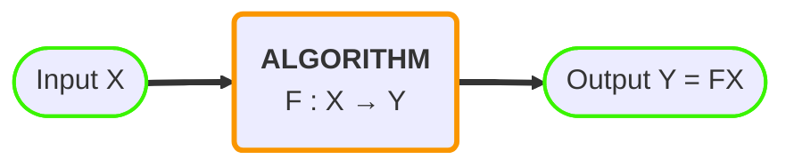
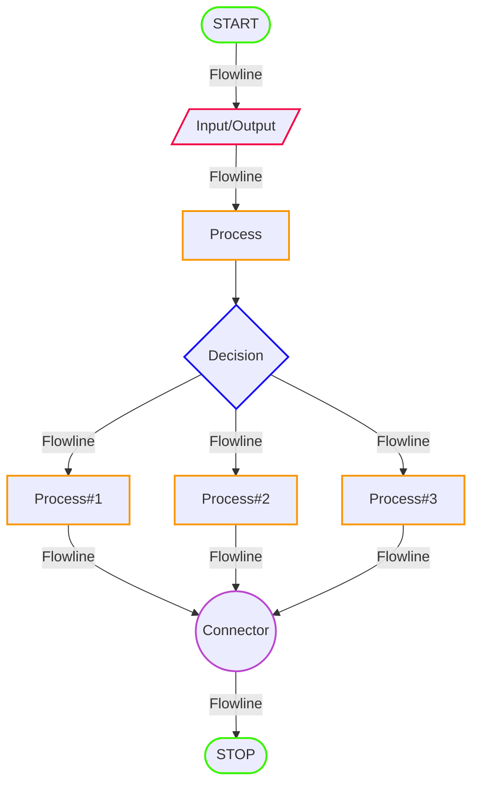
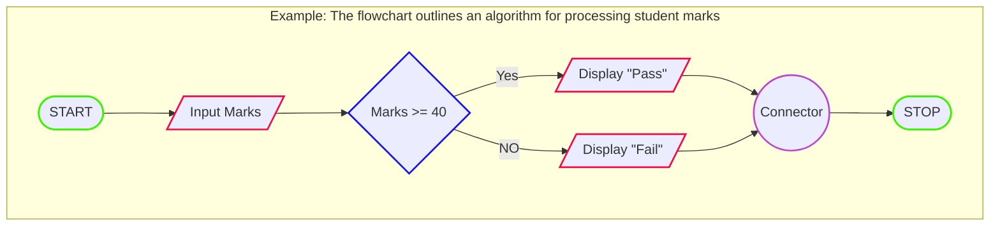

In the dim glow of a computer screen late at night, lines of code come to life, weaving the intricate tapestry of a digital world. Every programmer has a story, a moment when the seemingly cryptic symbols transformed into a solution, a creation, or even a moment of sheer frustration. Today, we delve into the realm of programming—a journey where logic meets creativity, and the possibilities are as vast as the digital landscape itself.

## Problem

In programming context, a _problem_ typically refers to a task or challenge that needs to be solved using computer programming. Problems can vary widely in complexity and nature, ranging from simple tasks to complex issues. 

### Types of problems

Here are some common aspects or types of problems encountered in programming:

#### Algorithmic Problems 

These involve designing efficient algorithms to solve a specific problem. It's about figuring out the steps and logic to perform a task.

- **Sorting and Searching Algorithms**: Programs are written to implement and optimize algorithms for sorting and searching data, essential in databases, information retrieval, and various applications.
- **Graph Algorithms**: Algorithms for solving problems on graphs, like finding the shortest path, are crucial in network optimization, transportation planning, and social network analysis.
- **Machine Learning and AI**: Programs are developed for training machine learning models to recognize patterns, make predictions, and automate decision-making in various domains, such as image recognition and natural language processing.

#### Engineering Problems 

These involve using software solutions to address challenges in various engineering disciplines.

- **Structural Analysis and Design**: Programs are written to analyze and design structures in civil engineering, such as bridges and buildings, ensuring they meet safety and performance standards.
- **Control Systems**: Engineering programs are used to design and implement control systems for various applications, from simple home automation to complex industrial processes.
- **Signal Processing**: Programs are essential in engineering for tasks like signal filtering, compression, and modulation in fields like telecommunications and audio processing.

#### Scientific Problems 

These involve using computational models and simulations to analyze and understand complex scientific phenomena.

- **Simulation of Physical Phenomena**: Programs are used to simulate and model complex scientific phenomena, such as climate patterns, fluid dynamics, or molecular interactions.
- **Data Analysis in Research**: Scientific research often involves handling large datasets. Programs are written for data analysis, statistical modeling, and visualization in fields like biology, physics, and astronomy.
- **Drug Discovery**: Computational programs play a crucial role in drug discovery by simulating the interactions between potential drug compounds and biological targets.

#### Simulation Problems

These involve replicating real-world processes or scenarios in a virtual environment to analyze, predict, or optimize outcomes.

- **Traffic Flow Simulation**: Programs simulate traffic patterns to optimize road design, traffic light timings, and overall transportation infrastructure.
- **Epidemiological Modeling**: Simulations are used to model the spread of diseases, helping public health officials plan interventions and allocate resources.
- **Eco-system Simulation**: Environmental scientists use simulations to model ecosystems, studying the impact of factors like climate change or habitat loss on biodiversity.

#### Optimization Problems 

These involve finding the best solution from a set of possible options by systematically maximizing or minimizing a specific objective or set of objectives.

- **Supply Chain Optimization**: Programs optimize supply chain logistics, determining the most efficient routes for transportation, minimizing costs, and maximizing delivery speed.
- **Financial Portfolio Optimization**: Algorithms are applied to optimize investment portfolios, considering risk, return, and other financial constraints.
- **Network Optimization**: Programs solve optimization problems in network design, ensuring efficient data routing and resource allocation in communication networks.

#### Data Management Problems

These involve challenges related to the efficient organization, storage, retrieval, and protection of data.

- **Database Management Systems (DBMS)**: Programs are written to manage and query databases, ensuring efficient storage, retrieval, and manipulation of data in applications ranging from e-commerce to healthcare.
- **Data Cleaning and Transformation**: Programs are developed to preprocess and clean raw data, transforming it into a usable format for analysis in fields like data science and business intelligence.
- **Data Security and Encryption**: Programs address the challenge of securing sensitive information through encryption algorithms, access controls, and other security measures in applications like online banking and communication.

#### Computer Graphics and Visualization 

These involve the creation, manipulation, and representation of visual images and data through the use of algorithms and software.

- **3D Rendering**: Programs are designed for rendering realistic images from 3D models, crucial in fields like animation, gaming, and virtual reality.
- **3D Printing**: Programs assist in creating and optimizing 3D models for printing, considering factors like structural integrity and material usage.
- **Medical Imaging Reconstruction**: In medical imaging, programs are employed to reconstruct 3D images from scans, aiding in diagnosis and treatment planning.
- **Architectural Design Software**: CAD programs are used in architecture for designing buildings, generating detailed blueprints, and assessing structural integrity.
- **Graphic Design Software**: Programs cater to graphic designers, providing tools for creating visual content, illustrations, and layouts for various media.

#### Automation and Process Control 

These involve developing programs to regulate and optimize processes in various domains, such as manufacturing, home systems, and chemical plants, ensuring precision, efficiency, and safety.

- **Industrial Automation**: Programs control and monitor manufacturing processes, ensuring precision and efficiency in tasks such as assembly line production.
- **Home Automation**: Programs automate tasks in smart homes, controlling lighting, temperature, and security systems for improved convenience and energy efficiency.
- **Process Control in Chemical Plants**: Programs regulate and optimize processes in chemical plants, ensuring safety and efficiency in the production of chemicals.

## Problem Solving

[Problem Solving](https://en.wikipedia.org/wiki/Problem_solving) is the systematic process of identifying and resolving issues, a skill honed through a well-organized approach. We encounter diverse problems daily, each possesses unique characteristics, with some being particularly challenging, demanding careful attention for effective solutions.

**Solutions to problems** can vary in terms of speed, cost, and reliability, emphasizing the importance of selecting the most suitable option. Various strategies, techniques, and tools, including the use of computers, contribute to problem resolution.

In [Computer Programming](https://en.wikipedia.org/wiki/Computer_programming) (coding), a programmer writes the instructions that a computer executes to address complex problems. Therefore, the ability to solve problems is integral to becoming a good programmer.

## Algorithm

An [algorithm](https://en.wikipedia.org/wiki/Algorithm) is a step-by-step procedure for solving a specific problem. It serves as a blueprint or a set of clear instructions that can be followed to accomplish a particular task. Algorithms are often independent of programming languages and are more focused on the logical sequence of steps needed for a solution. They provide a high-level view of the solution without specifying the exact syntax or structure required in a particular programming language. The process of solving a problem becomes simpler and easier with help of algorithm. lt is better to write an algorithm before writing the actual computer program.

<!-- 
Mermaid Syntax:
  https://mermaid.js.org/
  https://mermaid.js.org/config/Tutorials.html
  https://mermaid.live/

Color Tools: 
  https://color.adobe.com/create/color-wheel
  https://colordesigner.io/
  https://colorpicker.me/
-->



> The topic is covered in more detail in `Design and Analysis of Algorithms`.
{: .prompt-info }

### Example

```
// Problem: Given an array of numbers, the task is to arrange them in ascending order.

// Bubble Sort Algorithm

1. Start with the first element of the array.
2. Compare it with the next element.
3. If the first element is greater than the second element, swap them.
4. Move to the next pair of elements (second and third), and repeat the comparison and swap if necessary.
5. Continue this process until the end of the array.
6. After the first pass, the largest element will be at the end of the array.
7. Repeat the process for the remaining elements (excluding the last one) until the entire array is sorted.
```

### Representation

Algorithms can be represented in various ways depending on the context and the intended audience. Here are some common representations:

#### Structured English

Structured English is a way of representing algorithms using a combination of English language phrases and programming-like structures. It is often used in system design and documentation.

```
Algorithm: FindMaximum

Input: Two numbers, num1 and num2

1. Start
2. Set maxNum to num1      // Assume num1 is the maximum initially
3. If num2 > num1
    a. Set maxNum to num2  // Update maxNum if num2 is greater
4. Display maxNum as the maximum number
5. Stop
```

#### Pseudocode

[Pseudocode](https://en.wikipedia.org/wiki/Pseudocode) is a high-level description of an algorithm that combines elements of natural language with some programming language-like constructs. It's not tied to a specific programming language and provides a clear, readable representation of the algorithm's logic.

```
procedure BubbleSort(A: list of sortable items)
    n = length(A)
    for i from 0 to n - 1
        for j from 0 to n - i - 1
            // Compare adjacent elements
            if A[j] > A[j + 1] 
                // Swap if they are in the wrong order
                swap(A[j], A[j + 1])

// Example usage
array = [5, 2, 9, 1, 5]
BubbleSort(array)
print "Sorted array:", array
```

#### Flowchart

[Flowchart](https://en.wikipedia.org/wiki/Flowchart) is combination of two words "flow" and "chart". A _chart_ consists of different symbols or shapes to represent an action or decision. _Flow_ indicates the direction of processing that takes place in the program.

A flowchart is a visual or graphical representation of a process or algorithm. It uses different shapes and arrows to depict the flow of control in a system. Each shape represents a specific action or decision, and the arrows show the direction of flow. Flowcharts are useful for visualizing the overall structure of a solution, making it easier to understand and communicate. They are particularly valuable in planning the logic of a program before actual coding begins.




