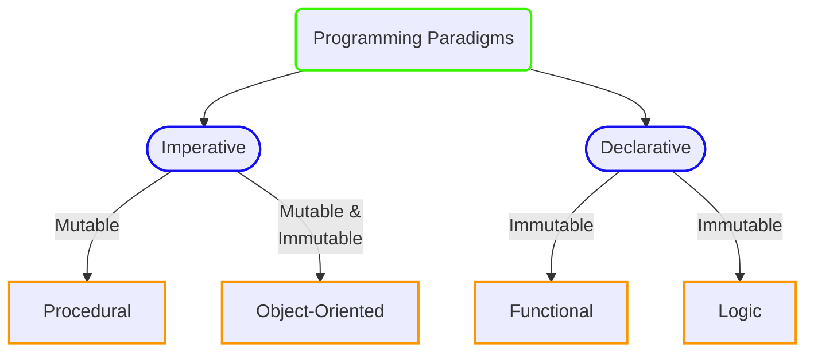

## Computer Programming

[Computer programming](https://en.wikipedia.org/wiki/Computer_programming) is the process of designing and building executable computer software to accomplish a specific task or set of tasks. It involves creating a set of instructions that a computer can understand and execute to perform a particular function. These instructions are typically written in a programming language, which serves as an intermediary between human-readable code and the machine code that computers can execute.

## History of Programming

The history of computer programming dates back to the **mid-19th century**, with the concept of algorithms developed by **Ada Lovelace**, often regarded as the _"world's first programmer"_. However, true programming began with the invention of the _"analytical engine"_ by **Charles Babbage** in the 1830s. Lovelace envisioned using this machine to create instructions for various tasks.

In the **mid-20th century**, the development of electronic computers marked a turning point. **Konrad Zuse** created the first _"electromechanical programmable computer"_ in the 1930s. During World War II, **Alan Turing's** work on "codebreaking machines" and **John Atanasoff's** electronic digital computer laid the groundwork for programmable computing devices.

The **1940s** saw the construction of the **Electronic Numerical Integrator and Computer (ENIAC)** at the University of Pennsylvania, the _"first general-purpose electronic computer"_. ENIAC's programming involved physically rewiring the machine. The development of _"assembly languages"_ and higher-level languages like _"Fortran"_ and _"LISP"_ in the 1950s and 1960s made programming more accessible.

The **1970s** witnessed the creation of _"C"_ and _"Pascal"_, influencing subsequent programming languages. The 1980s brought widespread adoption of "personal computers", leading to the popularity of languages like _"C++"_ and _"Java"_ in the 1990s. The **2000s** and beyond have seen the rise of languages such as _"Python"_ and _"JavaScript"_, emphasizing ease of use and versatility.

## Types of Programming Languages [+](https://en.wikipedia.org/wiki/List_of_programming_languages_by_type)

The two main types of programming languages are Low-level languages and High-level languages. These categories are based on the level of abstraction they provide to the programmer and their proximity to the hardware.

### 1. Low-level Languages

[Low-level languages](https://en.wikipedia.org/wiki/Low-level_programming_language) are close to the hardware and provide little abstraction from the computer's architecture. They are often referred to as "machine languages" or "assembly languages".

- **Characteristics**:
  * Direct correspondence to the computer's instruction set.
  * Requires a deep understanding of the computer's architecture.
  * Programs written in low-level languages are specific to a particular computer or processor.

- **Advantages**:
  * Efficient use of hardware resources.
  * Direct control over memory and hardware features.

- **Disadvantages**:
  * Steeper learning curve.
  * Lack of portability between different hardware architectures.
  * Prone to errors due to manual memory management.
  * Time-consuming (slow development) and requires a lot of instructions (lines of code) to do even simple operations.

#### Machine Language

[Machine language](https://en.wikipedia.org/wiki/Machine_code) is the lowest-level programming language that is directly understood and executed by a computer's central processing unit (CPU). It consists of binary code, which is a series of "0s" and "1s" that represent instructions and data that the CPU can process. Each instruction in machine language corresponds to a specific operation or command that the CPU can perform, such as arithmetic calculations, data movement, or control flow operations. 

Despite being efficient, machine language is challenging to comprehend, and the process of writing and modifying programs in this language is time-consuming. Machine Language is alternatively referred to as a _first-generation language (1GL)_.

Machine language is specific to the architecture (such as `x86`/`x64` family) of the computer's CPU. Different types of CPUs have their own unique machine languages, and a program written in machine language for one type of CPU will not run on a computer with a different type of CPU without modification.

Understanding and writing programs in machine language can be complex and error-prone due to its binary nature. As a result, assembly language and higher-level programming languages, were developed to make programming more accessible to humans while still providing a level of control over the computer's operations.

```
01101000 01100101 01101100 01101100 01101111 00100000 01110111
```

In this example, each group of eight digits represents a "byte", and the entire sequence represents a series of machine language instructions. To a human, it looks like a series of binary numbers, but to a CPU, it would be interpreted as specific instructions to perform a task.

#### Assembly Language

[Assembly language](https://en.wikipedia.org/wiki/Assembly_language) is a low-level programming language that is a step above machine language. It provides a human-readable representation of the instructions that a computer's central processing unit (CPU) can execute.  Each assembly language instruction directly corresponds to a machine language instruction, making it a more direct representation of the hardware instructions. 

Instead of employing binary code, assembly language utilizes symbols known as **mnemonics**. For instance, the `Sub` instruction is employed to execute subtraction operations. 

Often referred to as a symbolic language, assembly language programs offer greater ease in both initial writing and subsequent modifications compared to machine language. Assembly language programs are very fast, and it is still used today when speed is crucial. This programming language is predominantly utilized for developing system software and is alternatively termed a _second-generation language (2GL)_.

Assembly language syntax can vary based on the architecture and assembler used. The following example (which adds two numbers)  is for `x86` architecture using the **NASM (Netwide Assembler)** syntax.

```
section .data
    num1 dd 8       ; Define a variable num1 with initial value 8
    num2 dd 4       ; Define a variable num2 with initial value 4
    result dd 0     ; Define a variable result to store the sum

section .text
    global _start

_start:
    ; Load values from memory into registers
    mov eax, [num1]
    mov ebx, [num2]

    ; Add the values in registers
    add eax, ebx

    ; Store the result back in memory
    mov [result], eax

    ; Exit the program
    mov eax, 1       ; syscall number for exit
    xor ebx, ebx     ; exit code 0
    int 0x80         ; make system call
```

> The topic is covered in more detail in [`Assembly (asm)`](/categories/assembly-language).
{: .prompt-info }

### 2. High-level Languages

[High-level languages](https://en.wikipedia.org/wiki/High-level_programming_language) provide a higher level of abstraction, making it easier for programmers to write code without needing detailed knowledge of the underlying hardware. These languages are designed to be more human-readable and portable across different platforms.

- **Characteristics**:
  * Abstracted from the computer's hardware details.
  * More emphasis on readability and ease of use.
  * Programs written in high-level languages are generally platform-independent.

- **Advantages**:
  * Easier to learn and use.
  * Improved productivity and faster development.
  * Greater portability across different systems.
  * Automatic memory management (in many cases).
  * Programmers can express complex ideas with fewer lines of code.

- **Disadvantages**:
  * May sacrifice some level of performance (speed) compared to low-level languages.
  * Less control over hardware resources, which can be a limitation in certain performance-critical applications.
  * Often require an interpreter or compiler to run, adding an additional layer that might impact startup times and execution speed.
  * Developers working with high-level languages may have less understanding of the underlying hardware architecture, potentially limiting their ability to optimize for specific hardware features.

- **Examples**:
  * **Imperative**:  C, C++, Algol
  * **Functional**: Haskell, Lisp, Clojure
  * **Declarative**: SQL, HTML, CSS

## Programming Paradigms

[Programming paradigms](https://en.wikipedia.org/wiki/Programming_paradigm) refer to the fundamental styles or approaches to computer programming. They represent a set of principles, methods, and concepts that guide the structuring, design, and implementation of software. Different programming paradigms offer distinct ways of thinking about and solving problems. It is a way to classify programming languages based on their features. Languages can be classified into multiple paradigms. Some common programming paradigms are:



- The terms **"mutable"** and **"immutable"** refer to the ability or inability to change the state of an object after it has been created. 

### 1. Imperative Programming Paradigm

[Imperative programming paradigm](https://en.wikipedia.org/wiki/Imperative_programming) is a programming paradigm that focuses on describing how a program operates, mainly by providing a sequence of statements that change a program's state. In imperative programming, the emphasis is on giving the computer a sequence of tasks to perform, and these tasks are carried out in order. Control flow structures such as loops (for, while) and conditional statements (if-else) are fundamental.

The history of imperative programming dates back to the **mid-20th century**, coinciding with the development of early _electronic computers_. It is closely associated with the _von Neumann architecture_. The [von Neumann architecture](https://en.wikipedia.org/wiki/Von_Neumann_architecture), proposed by mathematician and physicist **John von Neumann** in the _1940s_, is a theoretical framework for the design of digital computers. It consists of a central processing unit (CPU), memory, input/output devices, and a control unit.

- "The focus is on describing how a program operates step by step".
- In imperative programming, Variables are typically mutable. This means that you can change the value of a variable after it has been assigned.
- Objects or data structures that are mutable can be modified, updated, or changed in place. For example, if you have a mutable list, you can add, remove, or modify elements within the list.

- **Examples**: FORTRAN, COBOL, ALGOL, BASIC, C, C++ 

#### Procedural Programming Paradigm

[Procedural programming paradigm](https://en.wikipedia.org/wiki/Procedural_programming) is a programming paradigm that emphasizes the use of **procedures** or **routines**, also known as **subroutines**, **methods**, or **functions**, to structure a program. In procedural programming, a program is divided into small, manageable, and reusable pieces of code called **procedures**. These procedures contain a series of steps or instructions to be executed in a specific order.

- "Emphasizes procedures or routines".

- **Examples**: FORTRAN, COBOL, ALGOL, BASIC, Pascal, C 

#### Object-Oriented Programming

[Object-oriented programming (OOP)](https://en.wikipedia.org/wiki/Object-oriented_programming) paradigm is a programming paradigm based on the concept of **objects**, which can contain data in the form of fields (often known as attributes or properties), and code, in the form of procedures (often known as **methods**). Objects are instances of classes, which are blueprints or templates for creating objects. The key principles of object-oriented programming include Encapsulation, Inheritance, Polymorphism, Abstraction.

- "Focuses on organizing code into objects that encapsulate data and behavior".

- **Examples**: Ada, C++, Objective-C, Common LISP, C#, Python, FORTRAN, JAVA, Javascript, Perl, PHP, Ruby, Swift, Visual Basic, ...

### 2. Declarative Programming Paradigm

[Declarative Paradigm](https://en.wikipedia.org/wiki/Declarative_programming) is a programming paradigm that expresses the logic of a computation without specifying its control flow. In other words, it focuses on describing "what the program should accomplish" rather than detailing how to achieve it. Declarative programming allows developers to declare the desired outcome or result, and the underlying system takes care of the implementation details.

Declarative paradigm traces back to **19th-century** _symbolic mathematics_, influencing early formal logic. It gained momentum in the **mid-20th century** with languages like "LISP" and "Prolog". The **1980s** saw its rise in "SQL" for databases and functional languages like "Haskell". Declarative approaches are now integral to various domains, from database management to web development and artificial intelligence.

- "Focuses on "what" needs to be achieved rather than "how" to achieve it".
- Immutability is often a key concept in the declarative paradigm, regardless of whether you're using a functional or logic programming language.

- **Examples**: LISP, ML, Prolog, Datalog, ASP, SQL, HTML, CSS

#### Functional Programming Paradigm

[Functional programming paradigm](https://en.wikipedia.org/wiki/Functional_programming) is a programming paradigm that treats computation as the evaluation of mathematical functions and avoids changing-state and mutable data. Functional programming is based on the principles of mathematical functions and emphasizes immutability, first-class and higher-order functions, and the avoidance of side effects.

- "Emphasis is on mathematical functions and immutable data".
- In functional programming languages within the declarative paradigm, immutability is emphasized. Data is treated as immutable, and instead of modifying existing data, new data structures are created.

- **Examples**: Common LISP, Scheme, Clojure, Erlang, Elixir, OCaml, Haskell, F#

#### Logic Programming Paradigm

[Logic programming paradigm](https://en.wikipedia.org/wiki/Logic_programming) is a programming paradigm that emphasizes logic-based reasoning and computation. In a logic paradigm, programs are constructed using formal logic, and the execution of a program involves logical inference. One of the most well-known logic programming languages is Prolog (Programming in Logic). It is particularly well-suited for tasks involving _symbolic reasoning_, _rule-based systems_, and _knowledge representation_.

- "Focuses on expressing relationships and constraints".

- **Example**: Prolog

> The topic is covered in more detail in `Knowledge Representation (Artificial Intelligence)`.
{: .prompt-info }
