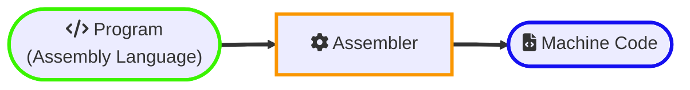

## Language Translator

Computers only understand machine language. A program written in a high-level or assembly language cannot be executed directly on a computer. It must be translated into machine language before execution. A [Language Translator](https://en.wikipedia.org/wiki/Translator_(computing)) or language processor is a software designed to convert these programs into machine language. Each computer language possesses its own set of translators.

## Types of Language Translators

Different types of language translators are as follows:

### 1. Compiler

[Compiler](https://en.wikipedia.org/wiki/Compiler) is a software tool that translates code written in a high-level language into machine code or an intermediate code that can be executed by a computer.

- It converts the instructions of a high-level language into machine language as a whole.
- The result of compilation is a binary file or an intermediate code file that can be executed by the computer.
- A program written in a high-level language is called a [source program](https://tis-starlight.github.io/posts/computer-programs/#source-code). The compiler transforms the source program into machine code, known as an [object program](https://tis-starlight.github.io/posts/computer-programs/#object-code).
- Compiler identifies syntax errors in the program at the time of compilation. A source program containing errors cannot be successfully compiled.
- A compiler can translate programs only in the language for which it is designed. For example, C compiler can translate only those programs that are written in the C language.
- **Compile time** refers to the time taken by the compiler to process the source code and generate the corresponding machine code or intermediate code. Errors detected during this phase are known as **compile-time errors**.
- [Compiled languages](https://en.wikipedia.org/wiki/Compiled_language) undergo a compilation process before execution. The compiled code is executed directly by the computer's hardware or a virtual machine. Generally, compiled languages offer better performance as the optimization phase allows for efficient machine code generation. C, C++, Rust, and Fortran are examples of compiled languages.

 

 

#### 1.1 - Types of Compilers

There are several types of compilers based on their functionality and target platform. Here are some common types:

- [**Single-Pass Compiler**](https://en.wikipedia.org/wiki/One-pass_compiler): Processes the source code in a single pass, generating the target code as it goes through the source code. It is generally faster but may have limitations in terms of optimization.
  * **One Pass Through Source Code**: Single-pass compilers go through the source code exactly once, from start to finish. They read the source code, perform lexical analysis, syntax analysis, semantic analysis, code generation, and code optimization in a single pass.
  *  **Memory Efficiency**: Single-pass compilers are generally more memory-efficient because they process the source code sequentially without the need to store the entire intermediate representation in memory.
  *  **Limited Global Optimization**: Limited opportunities for global optimization as the compiler may not have a complete understanding of the entire program during the initial pass.
  *  **Suitable for Early Computers**: Single-pass compilers were more common in the early days of computing when memory resources were limited, and optimizing compilers were not as sophisticated.
  *  **Example**: "Turbo Pascal compiler" is an example of a single-pass compiler. It processes the source code in a single pass, generating machine code as it goes through the code.
- [**Multi-Pass Compiler**](https://en.wikipedia.org/wiki/Multi-pass_compiler): Goes through the source code in multiple passes, with each pass performing a specific task, such as lexical analysis, syntax analysis, semantic analysis, and code generation. Multi-pass compilers often produce more optimized code.
  * **Multiple Passes Through Source Code**: Multi-pass compilers make multiple passes through the source code. Each pass focuses on a specific aspect of compilation, such as lexical analysis, syntax analysis, semantic analysis, optimization, and code generation.
  *  **Global Optimization**: Multi-pass compilers have a more extensive view of the entire program, allowing for better global optimization opportunities.
  *  **Intermediate Code Generation**: Intermediate code is often generated and optimized in one or more passes before the final code generation phase.
  *  **Memory Requirements**: Multi-pass compilers may require more memory compared to single-pass compilers since they need to store intermediate representations and symbols across multiple passes.
  *  **Example**: GCC (GNU Compiler Collection) is an example of a multi-pass compiler. It goes through multiple phases, including preprocessing, parsing, optimization, assembly, and linking.
- [**Cross-Compiler**](https://en.wikipedia.org/wiki/Cross_compiler): Generates code for a target machine architecture different from the one on which the compiler runs. This is useful for developing software for embedded systems or platforms with different architectures.
- [**Source-to-Source Compiler**](https://en.wikipedia.org/wiki/Source-to-source_compiler): Translates source code from one high-level programming language to another. The output code remains at a high level, making it suitable for languages with similar abstraction levels.
- **Just-In-Time (JIT) Compiler**: Translates the source code into machine code or an intermediate code at runtime, just before the program is executed. This allows for dynamic optimization and is often used in virtual machines like Java Virtual Machine (JVM) or .NET Common Language Runtime (CLR).
- **Ahead-of-Time (AOT) Compiler**: Translates the source code into machine code or an intermediate code before the program is executed. This is in contrast to JIT compilation, which occurs at runtime.

#### 1.2 - Compilation Strategies

##### **Just-In-Time (JIT) Compilation**

[JIT compilation](https://en.wikipedia.org/wiki/Just-in-time_compilation) (also dynamic translation or run-time compilation) is a technique in which the source code is compiled into machine code at runtime, just before the program is executed. It combines elements of interpretation and static compilation.

1. The source code is translated into an intermediate representation or bytecode. 
2. During runtime, the bytecode is translated into machine code by the JIT compiler just before it is executed by the CPU. 
3. The generated machine code is typically stored in memory and reused for subsequent executions, which can improve the overall performance of the program.
  

- **Runtime Translation**: JIT compilation involves translating high-level code (often bytecode) into machine code at runtime, just before the program is executed.
- **Interpretation vs. Compilation**: It is often associated with interpreted languages or bytecode-based platforms, providing a compromise between interpretation (which is slower) and pure AOT compilation (which lacks dynamic adaptability).
- **Dynamic Optimization**: JIT compilers can take advantage of runtime information to perform dynamic optimizations, such as inlining, loop unrolling, and dead code elimination.
- **Memory Usage**: While JIT compilation incurs a startup overhead due to the translation process, it can lead to more efficient memory usage over time as the generated machine code can be cached and reused.
- **Platform-Specific Optimization**: JIT compilation allows for platform-specific optimizations, tailoring the generated machine code to the characteristics of the underlying hardware.
- **Languages**: JIT compilation is often associated with languages that use bytecode, such as Java and C#.
- **Use Cases**: JIT compilation is suitable for scenarios where dynamic adaptation and optimization based on runtime information are important.

- **Advantages**:
  * Allows for dynamic optimization based on runtime information.
  * Can take advantage of specific hardware features or optimizations.
  * Enables the use of platform-specific optimizations.

- **Examples**: Java code (JVM) is initially compiled into bytecode and then JIT-compiled into machine code during execution.

##### **Ahead-Of-Time (AOT) Compilation**

[AOT compilation](https://en.wikipedia.org/wiki/Ahead-of-time_compilation) is a technique where the translation of high-level code into machine code occurs before the program is executed, typically during the build process or before deployment. It involves static compilation without elements of interpretation.

1. The source code is compiled directly into machine code ahead of the actual execution.
2. The resulting executable file contains machine code that can be directly executed by the target hardware.

- **Compile-Time Translation**: AOT compilation involves translating high-level code into machine code ahead of actual program execution, typically during the build process or before deployment.
- **Executable Generation**: The output of AOT compilation is an executable file containing machine code that can be directly executed by the target hardware without the need for an additional compilation step at runtime.
- **Startup Performance**: AOT compilation often results in faster startup times since there is no on-the-fly compilation required during program execution.
- **Predictable Performance**: The generated machine code is fixed during the compilation process, offering predictable performance characteristics, but without the dynamic adaptability of JIT compilation.
- **Optimization Opportunities**: AOT compilers may have more opportunities for global optimizations during the compilation process, as they can analyze the entire program at once.
- **Languages**: AOT compilation is common in languages like C and C++.
- **Use Cases**: AOT compilation is favored for applications where fast startup times and predictable performance are critical. 
  

- **Advantages**: 
  * Eliminates the need for a separate compilation step during program execution.
  * Can lead to faster startup times since there is no need for on-the-fly compilation.
  * May enable better optimization opportunities during the compilation process.

- **Examples**: Native applications written in languages like C or C++ are often compiled ahead of time into machine code specific to the target platform.

#### 1.3 - Phases of Compiler

1. [**Lexical Analysis**](https://en.wikipedia.org/wiki/Lexical_analysis): Breaks the source code into tokens (keywords, identifiers, operators). This stage eliminates whitespace and comments, reducing the source code to a form that is easier to process.
2. [**Syntax Analysis**](https://en.wikipedia.org/wiki/Parsing): The syntax analysis (also called parsing) checks the arrangement (structure) of tokens to ensure they form valid language constructs according to the grammar of the programming language.
3. [**Semantic Analysis**](https://en.wikipedia.org/wiki/Semantic_analysis_(compilers)): Semantic analysis checks for logical errors (semantic errors) and enforces language-specific rules. It ensures that the code makes sense in terms of its intended functionality.
4. [**Intermediate Code Generation**](https://en.wikipedia.org/wiki/Intermediate_representation): The compiler generates an intermediate code that serves as an abstraction between the high-level source code and the machine code. This intermediate code is often platform-independent.
5. [**Code Optimization**](https://en.wikipedia.org/wiki/Program_optimization): The compiler optimizes the intermediate code to improve the efficiency and performance of the resulting machine code. This may involve rearranging code, eliminating redundancies, or applying other optimizations.
6. [**Code Generation**](https://en.wikipedia.org/wiki/Code_generation_(compiler)): The compiler translates the optimized intermediate code into machine code specific to the target platform. This machine code is a low-level representation that can be executed by the computer's hardware.
7. **Code Linking/Assembly**: If the program consists of multiple files and libraries (external references), the compiler may link (Combine) them into a single executable (for compiled languages). In some cases, an assembler is used to convert the machine code into an executable file.

> The topic is covered in more detail in `Compiler Design/Construction`.
{: .prompt-info }

#### 1.4 - Pros & Cons of Compilers

Compilers offer improved performance, security, and portability but come with the cost of increased complexity, longer build times, and potential challenges in debugging and flexibility. The choice between compiled and interpreted languages depends on the specific requirements of a project and the trade-offs that best suit the development goals.

- **Pros**:
  * **Efficiency**: Compiled code generally runs faster than interpreted code because it is translated into machine code in advance. This eliminates the need for interpretation during execution.
  * **Optimization:** Compilers often perform various optimizations to enhance the performance of the generated code. These optimizations can include loop unrolling, inlining, and dead code elimination.
  * **Portability**: Once a program is compiled, the resulting machine code can be executed on any machine that has a compatible architecture, without the need for the source code or compiler.
  * **Error Checking**: Compilers perform extensive static analysis during the compilation process, catching many syntax and semantic errors before the program is run. This can lead to more robust and reliable code.
  * **Security**: Compiled code can be more secure than interpreted code, as the source code is not directly accessible. In a closed-source environment, this becomes crucial to safeguard (protect) intellectual property (IP) and sensitive algorithms.
  * **Resource Utilization**: Compiled programs often use system resources more efficiently because the compilation process can optimize the code for the target architecture.

- **Cons**:
  * **Complexity**: Compilers are complex software tools that require a deep understanding of programming languages, hardware architectures, and optimization techniques. Developing a compiler can be a challenging task.
  * **Build Time**: Compilation adds an extra step to the development process. Depending on the size of the project, compilation can take a significant amount of time, especially for large codebases.
  * **Debugging**: Debugging compiled code can be more challenging than debugging interpreted code. The correspondence between the source code and the generated machine code is not always straightforward.
  * **Platform Dependence**: While compiled code is generally portable, there can be platform-dependent issues, especially if the code relies on specific hardware features or if there are differences in the compilation process across platforms.
  * **Learning Curve**: Developing and optimizing code for compilation may have a steeper learning curve compared to interpreted languages, which often provide more immediate feedback during development.
  * **Flexibility**: Compiled languages often have less runtime flexibility compared to interpreted languages. Changes to the code may require recompilation, which can slow down the development process.

#### 1.5 - List of Compilers [+](https://en.wikipedia.org/wiki/List_of_compilers)

Determining the "best" compiler depends on various factors such as the programming language, platform, project requirements, and personal preferences. Different compilers excel in different areas, and the choice often depends on the specific needs of your development environment. Here are a few considerations for some popular languages:

1. **[GCC](https://en.wikipedia.org/wiki/GNU_Compiler_Collection) (GNU Compiler Collection)**: GCC is a collection of compilers for various programming languages, including `C`, `C++`, `Objective-C`, `Objective-C++`,`Fortran`, `Ada`, `Go` and others.
2. **[Clang](https://en.wikipedia.org/wiki/Clang)**: Clang is a compiler front end for the `C`, `C++`, `Objective-C` and `Objective-C++` programming languages. It is designed to be highly modular and extensible.
3. **[Microsoft Visual C++](https://en.wikipedia.org/wiki/Microsoft_Visual_C%2B%2B) (MSVC) Compiler**: The Visual C++ Compiler is part of Microsoft's Visual Studio suite and is used for compiling `C`, `C++`, `C++/CLI` and `C++/CX` code on the Windows platform.
4. **C# (for .NET)**: [**Roslyn**](https://en.wikipedia.org/wiki/Roslyn_(compiler)) compiler is the default compiler for C# in the .NET ecosystem. It's part of the open-source .NET Compiler Platform (Roslyn). Keep in mind that the compilers for C# are often bundled with the development environment or SDK rather than being standalone tools.
1. **Java Compiler ([javac](https://en.wikipedia.org/wiki/Javac))**: The Java Compiler (javac) is part of the Java Development Kit (JDK) and is used to compile Java source code into bytecode that can run on the Java Virtual Machine (JVM).
2. **Python Compiler ([CPython](https://en.wikipedia.org/wiki/CPython))**: CPython is the reference implementation of the Python programming language. While Python is often interpreted, CPython includes a compiler that translates Python source code into bytecode.
3. **Go Compiler (gc, gccgo)**: The Go programming language has two compilers, gc and gccgo. Gc is the original compiler, while Gccgo is a GCC frontend for Go.

| Language            | Compiler                              | 
|:--------------------|:--------------------------------------|
| **`C`**             | **GCC**, Clang, Visual C (MSVC)       |
| **`C++`**           | **GCC**, Clang, Visual C++ (MSVC)     |
| **`Objective-C`**   | **GCC**, Clang                        |
| **`Objective-C++`** | **GCC**, Clang                        |
| **`C#`**            | **Roslyn**, Mono, Visual C#           |
| **`Python`**        | **CPython**, PyPy, Jython, IronPython |
| **`Java`**          | **javac**, ECJ                        |
| **`Go`**            | Gc, Gccgo                             |       
| **`Ruby`**          | Ruby MRI, YARV, IronRuby, JRuby       |   

#### 1.6 - Compilers Vs Interpreters

##### **Compilers**

- **Strengths**: 
  * Analyze and optimize code before execution, leading to faster performance.
  * Generate low-level code, translating high-level concepts into efficient instructions.
  * Reduce memory usage by transforming code into a more compact representation.
- **Weaknesses**:
  * Encounter challenges with dynamic features, such as [Dynamic typing](https://en.wikipedia.org/wiki/Dynamic_programming_language).
  * Longer start-up time due to extensive analysis.
- **Challenges**:
  * Dynamic typing poses difficulties for efficient compilation.
  * Longer start-up times can be a drawback, particularly in scenarios where rapid code execution is crucial.

##### **Interpreters**:

- **Strengths**:
  * Quick start-up time as they read and execute code directly. Because they can read the code as written and don't have to do expensive operations to generate or optimize code.
  * Ability to dynamically optimize based on runtime behavior.
- **Weaknesses**:
  * Higher memory usage compared to compiled code.
  * Introduction of some CPU overhead during interpretation.
- **Challenges**:
  * Memory usage tends to be higher due to the need to keep more information available at runtime.
  * CPU overhead may impact the performance of the program being run.

##### **Combination in Modern Runtimes**:

- Many modern language runtimes integrate both compilation and interpretation for optimized performance.
- Examples include Java's JVM, which initially interprets code and later compiles frequently executed code to machine code.
- JavaScript engines often start with interpretation but transition to compilation for frequently executed code, balancing fast start-up and improved performance over time.

##### **Language Variations**:

- Languages are not strictly compiled or interpreted; variations exist.
- For instance, C is typically compiled, but C interpreters exist for debugging purposes.
- JavaScript, initially considered interpreted, is often compiled for optimization.
- Some Python implementations function as interpreters, while others employ compilers to generate native code.

##### **Flexibility and Theoretical Perspective**:

- The choice between compilation and interpretation depends on the language and its specific requirements.
- The [`Futamura projections`](https://en.wikipedia.org/wiki/Partial_evaluation#Futamura_projections) theoretically assert that anything interpretable can be compiled, emphasizing the flexibility in implementing either approach for a given programming language.

### 2. Interpreter

[Interpreter](https://en.wikipedia.org/wiki/Interpreter_(computing)) is a software or a program that reads and executes code (instructions) written in a high-level programming language directly without the need for a separate compilation step. It processes the source code line by line, converting it into machine code or an intermediate code and executing it immediately.

- An interpreter is a program that converts and executes one statement (line) of a program at a time.
- The result of interpretation is typically the immediate execution of the source code, without the generation of a separate binary or intermediate code file or a standalone executable.
- The errors are found immediately. This allows the programmer to correct errors during program development.
- Unlike compilers, interpreters can be designed to work with multiple programming languages.
  * **Single-language interpreters**: Some interpreters are designed to interpret and execute programs written in a specific programming language. For example, a Python interpreter can execute Python programs, and a JavaScript interpreter can execute JavaScript code. 
  * **Multi-language interpreters**: Some interpreters are more versatile and can handle multiple programming languages. These interpreters are often referred to as [polyglot](https://en.wikipedia.org/wiki/Polyglot_(computing)) interpreters. For example, Java Virtual Machine (JVM), which interprets bytecode generated by the Java compiler. The JVM supports multiple languages that can be compiled into Java bytecode, such as Java, Kotlin, and Scala.
- **Interpreted language** or scripting language is a programming language for which most of its implementations rely on an interpreter for execution. Examples of interpreted languages include Python, JavaScript, Ruby, PHP, and Perl.

 

 

#### 2.1 - Types (Variations) of Interpreters

- [**Bytecode Interpreters**](https://en.wikipedia.org/wiki/Interpreter_(computing)#Bytecode_interpreters): Bytecode is an intermediate representation of a program that is generated by a compiler. A bytecode interpreter executes this intermediate code directly.
  * Bytecode is usually platform-independent, making it possible to execute the same bytecode on different architectures.
  * It combines elements of both compilation and interpretation (compreters), as the source code is first compiled into bytecode, and then the bytecode is interpreted by the runtime environment.
  * Examples include the Java Virtual Machine (JVM) and the Common Language Runtime (CLR) for .NET languages.
- [**Threaded Code Interpreters**](https://en.wikipedia.org/wiki/Interpreter_(computing)#Threaded_code_interpreters): Threaded code is a form of intermediate code that consists of a sequence of instructions represented as addresses of operations in memory. The interpreter uses a table of such addresses to execute the program. Similar to bytecode interpreters but, they use pointers.
  * Threaded code aims to reduce the overhead of interpreting bytecode by directly referencing the operations to be executed.
  * It's more efficient than some other interpretation techniques because it eliminates the need for decoding and dispatching instructions.
  * Examples include Forth interpreters, which often use threaded code for execution.
- [**Abstract Syntax Tree (AST) Interpreters**](https://en.wikipedia.org/wiki/Interpreter_(computing)#Abstract_syntax_tree_interpreters): An Abstract Syntax Tree is a hierarchical tree structure that represents the abstract syntactic structure of a program. AST interpreters directly traverse and interpret this tree structure.
  * AST interpreters work with the parsed and structured representation of the source code.
  * The interpreter traverses the AST nodes and performs corresponding actions for each node type.
  * They are often used in scripting languages and interpreted languages like Python and JavaScript.
- [**Self Interpreters**](https://en.wikipedia.org/wiki/Interpreter_(computing)#Self-interpreter): A self-interpreter is an interpreter for a programming language that is written in the language it interprets. In other words, the interpreter is written in the same language that it interprets.
  * Self-interpreters are a form of metacircular interpreter where the interpreter is capable of interpreting its own source code.
  * They are often used for bootstrapping a language or for experimenting with language design.
  * Writing a self-interpreter can provide insights into the semantics of a programming language.

#### 2.2 - Phases of Interpreter

1. **Tokenizer/Lexical Analyzer**: The source code is analyzed and tokenized.
2. **Parser/Syntax Analyzer**: The syntax is parsed to create a representation of the code's structure.
3. **Intermediate Code Generaton**: An intermediate code may be generated on-the-fly or executed directly.
4. **Interpreter Engine**: The program's behavior is observed immediately as each line is interpreted.

#### 2.3 - Pros and Cons of Interpreters

Interpreters offer flexibility, quick development cycles, and easier debugging due to their immediate code execution without a separate compilation step. The choice between interpreters and compilers depends on project requirements, balancing factors like development speed, performance, and security.

- **Pros**:
  * **Ease of Debugging**: Interpreters often provide detailed error messages, making it easier to identify and fix issues in the code. Developers can debug and correct errors in real-time.
  * **Platform Independence**: Interpreters are generally more platform-independent than compilers. Code written in an interpreted language can often run on different platforms without the need for recompilation.
  * **Rapid Development**: Interpreted languages are often associated with faster development cycles. There is no need for a separate compilation step, which reduces the time it takes to see the effects of code changes.
  * **Dynamic Typing**: Many interpreted languages support dynamic typing, allowing variables to change types during runtime. This flexibility can be advantageous for certain programming tasks.
  * **Interactive Mode**: Interpreters often provide an interactive mode, allowing developers to execute code line by line. This is useful for testing small code snippets or exploring language features.
  * **Portability**: Interpreted code can be more portable because the interpreter itself can be ported to different platforms, allowing the same source code to run on various systems.

- **Cons**:
  * **Performance**: Generally, interpreted code tends to be slower than compiled code. Interpreters execute code line by line, and this can result in performance overhead, especially for computationally intensive tasks.
  * **Dependency on Interpreter**: To run interpreted code, the target system must have the appropriate interpreter installed. This dependency can be a limitation when distributing software or deploying applications.
  * **Lack of Optimization**: Interpreters may not perform advanced optimizations that compilers can, leading to potentially less efficient code execution.
  * **Security Concerns**: Since interpreters execute code on-the-fly, there may be security concerns if the interpreter doesn't have robust security features. Malicious code could be executed without the strict checks provided by a compiler.
  * **Limited Distribution**: Distributing software written in interpreted languages may require users to have the specific interpreter installed. This can be a barrier to widespread adoption.
  * **Difficulty in Hiding Source Code**: Interpreted code is often distributed in a form that is human-readable, making it more challenging to protect intellectual property (IP) or proprietary algorithms.

### 3. Assembler

[Assembler](https://en.wikipedia.org/wiki/Assembly_language#Assembler) is a software tool that translates code written in assembly language into machine code or an intermediate code. _Assembly language_ is a low-level programming language that is specific to a particular computer architecture. It uses _mnemonic_ codes and symbols to represent the machine-level instructions of a computer's central processing unit (CPU).

- The output of the assembler is typically a binary file containing the machine code instructions that can be executed by the computer's CPU.
- Assemblers identify syntax errors in the program during the assembly process. Common syntax errors in assembly language include issues such as incorrect mnemonics, missing operands, or improper use of directives.
- Assemblers are designed for specific instruction sets and architectures. An assembler for one type of processor may not be compatible with another.
  * For example, if you have an assembly language program written for an **x86 architecture**, you would use an **x86 assembler** to translate it into machine code that the **x86 processor** can execute. 
  * Similarly, if you have an assembly language program written for an **ARM architecture**, you would use an **ARM assembler** for translation.

 

 

#### 3.1 - Types of Assemblers

##### **One-Pass Assembler**:

- **Single Pass**: A one-pass assembler processes the source code in a single pass or scan. It reads the source code once and generates the machine code or intermediate code in the same pass.
- **Forward Referencing**: One-pass assemblers may face challenges with forward references (symbols used before they are defined) since they are processed only once.
- **Limited Optimization**: Due to the single-pass nature, there is limited scope for global optimization as the assembler has a limited view of the entire program.
- **Memory Efficiency**: One-pass assemblers are memory-efficient because they process the code sequentially without the need to store the entire intermediate representation.
- **Error Handling**: Errors are typically reported at the end of the pass, and the programmer must go back and correct the errors before rerunning the assembler.

##### **Two-Pass/Multipass Assembler**:

- **Multiple Passes**: A two-pass or multipass assembler processes the source code in multiple passes. In the first pass, it gathers information about all symbols and addresses. In the second pass, it generates the machine code or intermediate code.
- **Forward Referencing Resolution**: Two-pass assemblers effectively handle forward references by using the information collected in the first pass to resolve symbols in the second pass.
- **Global Optimization**: Since two-pass assemblers have a broader view of the entire program, they can perform more global optimization, leading to potentially better code generation.
- **Intermediate File**: Two-pass assemblers often generate an intermediate file or table during the first pass, which is then used in the second pass for code generation.
- **Error Detection**: Errors can be detected and reported during the first pass, providing an opportunity for the programmer to correct them before proceeding to the code generation phase.
- **Efficiency Trade-off**: Two-pass assemblers may use more memory due to the need to store intermediate information, but this trade-off allows for better error handling and optimization.

#### 3.2 - Pros & Cons of Assemblers

- **Pros**:
  * **Efficiency**:Assembled code is generally more efficient in terms of execution speed and memory usage compared to high-level languages. This is because assembly language provides a closer correspondence to machine code.
  * **Low-Level Control**: Assembly language allows programmers to have direct control over the hardware, enabling them to optimize code for specific architectures.
  * **Resource Optimization**: Assemblers enable fine-tuning of code for specific hardware, which can result in optimal utilization of system resources.
  * **System Programming**: Assemblers are commonly used in system programming, where low-level control over hardware and memory is crucial.
  * **Learning and Understanding Computer Architecture**: Working with assemblers helps programmers understand the underlying architecture of the computer, including registers, memory organization, and instruction set.

- **Cons**:
  * **Platform Dependence**: Code written in assembly language is often specific to a particular architecture or processor, making it less portable across different systems.
  * **Complexity**: Assembly language is more complex and less readable than high-level languages. It requires a deep understanding of the underlying hardware, which can make programming more challenging.
  * **Development Time**: Writing code in assembly language can be time-consuming compared to using high-level languages, as it involves more manual coding and attention to detail.
  * **Debugging Challenges**: Debugging assembly code can be challenging due to its low-level nature. There are fewer debugging tools and features compared to high-level languages.
  * **Limited Abstraction**: Assembly language lacks the abstraction found in high-level languages, making it more difficult to express complex algorithms and data structures.
  * **Maintenance Difficulty**: Assembler code tends to be more difficult to maintain and modify over time, especially as programs grow in size and complexity.
  * **Less Readability**: Assembly language is often less readable than high-level languages, which can hinder collaboration and code understanding among developers.

#### 3.3 - List of Assemblers [+](https://en.wikipedia.org/wiki/Comparison_of_assemblers)

- **[NASM](https://en.wikipedia.org/wiki/Netwide_Assembler) (Netwide Assembler)**: NASM is a popular x86 and x86-64 assembler designed for portability and modularity. It is often used on Unix-like systems.
- **[MASM](https://en.wikipedia.org/wiki/Microsoft_Macro_Assembler) (Microsoft Macro Assembler)**: MASM is an x86 assembler that is commonly used with Microsoft Visual Studio for Windows development.
- **[TASM](https://en.wikipedia.org/wiki/Turbo_Assembler) (Turbo Assembler)**: TASM was Borland's assembler for x86 architecture. It's older but may still be used for certain legacy projects.
- **[FASM](https://en.wikipedia.org/wiki/FASM) (Flat Assembler)**: FASM is a lightweight, fast, and portable x86 and x86-64 assembler.
- **[GAS](https://en.wikipedia.org/wiki/GNU_Assembler) (GNU Assembler)**: Also known as AS, GAS is the assembler used by the GNU Compiler Collection (GCC). It supports various architectures.

### 4. Disassembler

[Disassembler](https://en.wikipedia.org/wiki/Disassembler) is a software tool that translates machine code, which is the low-level binary representation of a program, into a (human-readable) assembly language. Disassemblers are commonly used for [reverse engineering](https://en.wikipedia.org/wiki/Reverse_engineering), debugging, and analyzing software.

- The <u>output of a disassembler</u> (disassembly) is a representation of the original program's assembly code or a higher-level language that provides insight into the instructions executed by the computer.
- Disassemblers analyze the binary code to identify individual machine instructions, their operands, and the flow of control within the program.
- They may encounter challenges in cases of obfuscated or encrypted code, leading to potential errors or difficulties in accurately representing the original source code.
- They are typically designed to work with a specific architecture or instruction set. For example, an x86 disassembler can analyze and translate machine code specific to the x86 architecture.
- They play a crucial role in debugging and reverse engineering activities. They help analysts (security experts) and developers understand the inner workings of a program, investigate vulnerabilities, or modify the behavior of an executable.
- They are often used with compiled languages, allowing analysts to inspect and understand the low-level details of programs written in languages such as C, C++, or assembly.
- IDA Pro, Radare2, and Ghidra are examples of popular disassemblers used in the field of reverse engineering and security analysis.

 

 

> The topic is covered in more detail in `Reverse-Engineering`.
{: .prompt-info }

#### 4.1 - Types of Disassemblers

- **Static Disassemblers**: These disassemblers analyze the binary code without executing the program. They generate a disassembly listing that represents the code structure.
- **Dynamic Disassemblers**: These disassemblers analyze the binary code while the program is running. They dynamically disassemble instructions as they are executed, allowing for real-time analysis.
- **Interactive Disassemblers**: These disassemblers provide an interactive environment where the user can navigate through the disassembled code, set breakpoints, and analyze the program step by step.
- **Batch Disassemblers**: These disassemblers are designed to process multiple files in a batch mode, making them suitable for large-scale analysis.

#### 4.2 - Pros & Cons of Disassemblers

- **Pros**:
  * **Reverse Engineering**: Disassemblers allow for the reverse engineering of compiled software, helping programmers understand the functionality and algorithms of a program when the original source code is not available.
  * **Debugging Assistance**: Disassemblers provide a human-readable representation of machine code, aiding in the debugging process by allowing programmers to analyze and troubleshoot issues in the compiled code.
  * **Security Analysis**: Security researchers use disassemblers to analyze software for vulnerabilities, identify potential exploits, and understand the inner workings of malware, contributing to better security practices.
  * **Legacy Code Understanding**: In cases where source code is lost or unavailable, disassemblers help in understanding and modifying legacy software, extending the lifespan of applications.
  * **Code Optimization**: Programmers can use disassemblers to analyze compiled code and identify opportunities for optimization, leading to improved performance.
  * **Interoperability**: Disassemblers can be used to analyze the binary code of software to ensure compatibility or to develop interoperable solutions.

- **Cons**:
  * **Legal and Ethical Concerns**: The use of disassemblers can raise legal and ethical concerns, particularly if used to reverse engineer proprietary software without permission, leading to potential copyright or intellectual property infringement.
  * **Code Obfuscation Challenges**: Some software developers use code obfuscation techniques to make the disassembly process more challenging, complicating the analysis and understanding of the code.
  * **Incomplete Information**: Disassemblers may not always provide a complete representation of the original source code, leading to challenges in fully understanding the program's logic and structure.
  * **Platform and Architecture Dependencies**: Disassemblers may be specific to certain platforms or architectures, limiting their applicability in cross-platform scenarios.
  * **Limited High-Level Abstraction**: Disassemblers primarily work with low-level assembly language, lacking the high-level abstractions present in the original source code. This can make the analysis more challenging, especially for complex programs.
  * **Dynamic Code Analysis Challenges**: Dynamic aspects of a program, such as runtime behavior, may not be fully captured by static disassemblers, requiring additional tools for dynamic analysis.

#### 4.3 - List of Disassemblers [+](https://en.wikipedia.org/wiki/Disassembler#Examples_of_disassemblers)

- [**IDA Pro**](https://en.wikipedia.org/wiki/Interactive_Disassembler): IDA Pro is a popular and widely used disassembler with advanced features. It supports a variety of processors and executable formats.
- [**Ghidra**](https://en.wikipedia.org/wiki/Ghidra): Developed by the National Security Agency (NSA), Ghidra is a powerful open-source software reverse engineering suite that includes a disassembler.
- [**Radare2**](https://en.wikipedia.org/wiki/Radare2): Radare2 is an open-source reverse engineering framework that includes a disassembler, debugger, and other analysis tools. It is designed for Unix-like systems.
- [**OllyDbg**](https://en.wikipedia.org/wiki/OllyDbg): OllyDbg is a Windows-based disassembler and debugger that is often used for software cracking and reverse engineering.
- [**Binary Ninja**](https://en.wikipedia.org/wiki/Binary_Ninja): Binary Ninja is a commercial disassembler and reverse engineering platform that offers a modern and customizable interface.
- [**Hopper Disassembler**](https://www.hopperapp.com/): Hopper is a commercial disassembler for macOS and Linux. It provides a user-friendly interface and supports various architectures.

### 5. Decompiler

[Decompiler](https://en.wikipedia.org/wiki/Decompiler) is a software tool that translates executable machine code or assembly language back into a higher-level programming language. Decompilers are commonly used in reverse engineering, software analysis, and understanding the behavior of compiled programs.

- It converts an executable file into high-level source code. 
- In contrast to a typical compiler, which transforms high-level language code into low-level language, a decompiler reverses this process. 
- While disassemblers convert executables into assembly language, decompilers take it a step further by translating the code into a more human-readable language like C or Java, employing advanced techniques. 
- It's important to note that decompilers often face challenges in accurately reconstructing the original source code, resulting in the generation of obfuscated code.
- Decompilers generate source code that represents the logic and structure of the original program, making it more human-readable and easier to analyze.

 

 

 

#### 5.1 - Disassembler Vs Decompiler [+](https://hex-rays.com/decompiler/decompilation_vs_disassembly/)

- **Disassembler**:
  * A disassembler is a tool that translates machine code (binary code) into human-readable assembly language or a similar low-level representation.
  * The output of a disassembler is often a listing of assembly instructions, with corresponding memory addresses and opcodes.
  * Disassemblers provide a view of the low-level code, making it easier for analysts to understand and work with the binary representation of a program.
  * They do not attempt to reconstruct the original high-level source code but focus on providing a readable representation of the executable.

- **Decompiler**:
  * A decompiler is a tool that translates machine code or assembly language back into a higher-level programming language.
  * The output of a decompiler is a representation of the original source code (or an approximation of it) in a high-level programming language like C or a similar language.
  * Decompilers aim to recover high-level abstractions, such as functions, loops, and variables, from the low-level binary code.
  * Unlike disassemblers, decompilers provide a more abstract and human-readable view of the code, closer to the original source.

#### 5.2 - List of Decompilers [+](https://en.wikipedia.org/wiki/Decompiler#See_also)

- **Hex-Rays IDA Pro (with Hex-Rays Decompiler)**: IDA Pro is a widely used disassembler, and with the additional Hex-Rays Decompiler plugin, it can decompile code for a better understanding of the original source. Note that this is a commercial tool.
- **Ghidra**: Ghidra, an open-source software reverse engineering suite developed by the National Security Agency (NSA), includes a decompiler. It can decompile various architectures and is free to use.
- **RetDec**: RetDec is an open-source decompiler that supports a wide range of architectures. It is part of the Avast Software project and can be used both online and as a standalone tool.
- **.NET Reflector**: .NET Reflector could decompile compiled .NET assemblies (DLLs or EXEs) into a high-level representation, presenting C# or other .NET languages that closely resembled the original source code.

## Program Execution Process

The program execution process involves several stages, from writing the code to the actual execution of the program. 

1. **Writing Code**: The process begins with writing the source code of the program using a programming language. This code is a set of instructions that the computer can understand and execute.
2. **Compilation (for compiled languages) or Interpretation (for interpreted languages)**:
  * In <u>compiled languages</u> like C or C++, the source code is translated into machine code or an intermediate code by a compiler. This process creates an executable file.
  * In <u>interpreted languages</u> like Python or JavaScript, the source code is not directly translated into machine code. Instead, an interpreter reads and executes the code line by line.
3. **[Linking](https://en.wikipedia.org/wiki/Linker_(computing)) (for compiled languages)**: In compiled languages, the compiled code might need to be linked with external libraries or modules to create the final executable. This process resolves references to functions or variables that are defined outside the main program.
4. [**Loading**](https://en.wikipedia.org/wiki/Loader_(computing)): The operating system loads the executable file into memory. This involves allocating memory space for the program and its variables.
5. **Execution**: The CPU begins executing the instructions in the program. The program counter keeps track of the current instruction being executed.
6. **Runtime Stack and Heap**: During execution, memory is allocated for variables and data structures. The runtime stack is used for function calls, local variables, and control flow, while the heap is used for dynamic memory allocation.
7. **Input and Output**: The program may interact with the user or other external systems through input and output operations. This includes reading from and writing to files, receiving user input, and displaying output on the screen.
8. **Error Handling**: The program may encounter errors during execution. Error handling mechanisms, such as exception handling in some languages, help manage and recover from unexpected situations.
9. **Termination**: The program terminates when it completes its execution or encounters an exit statement. Resources allocated by the program are released, and control is returned to the operating system.
10. **Cleanup**: Any remaining resources, such as open files or network connections, are closed or released. Memory allocated during runtime is deallocated.

 

### 1. Linker

[Linker](https://en.wikipedia.org/wiki/Linker_(computing)) is a utility program in software development that plays a crucial role in the process of turning source code into executable code or a binary executable. It is a critical component in the compilation process that combines object files and resolves references, creating a coherent and executable program. Without a linker, the process of turning source code into a running program would be more complex, with developers having to manage dependencies and addresses manually.

- **Compilation**: The source code written by a programmer is first processed by a compiler. The compiler translates the high-level source code into an intermediate form known as object code or machine code.
- **Object Files**: The output of the compilation step is often in the form of object files. These files contain the translated code but may also have unresolved references to functions or variables.
- **Linking**: The linker comes into play during the linking phase. Its primary task is to combine multiple object files and libraries into a single executable program. During this process, it resolves references between files and ensures that everything needed for the program to run is available.
- **Symbol Resolution**: The linker resolves symbolic references between different object files. When a function or variable is declared in one file and used in another, the linker makes sure that the addresses are correctly connected.
- **Address Binding**: The linker assigns final memory addresses to variables and functions. This is crucial for the operating system to load the program into memory correctly.
- **Library Linking**: In many cases, programs use external libraries. The linker resolves references to functions or variables in these libraries, making sure that the executable knows where to find the required code during runtime.
- **Executable Output**: The final output of the linking process is an executable file that can be run on a computer.

#### 1.1 - Types of Linkers

Linkers can be broadly classified into two main types: Static Linkers and Dynamic Linkers. Each type serves a distinct purpose in the linking process, and they are used under different circumstances.

- **Static Linkers**:
  * **Functionality**: [Static linkers](https://en.wikipedia.org/wiki/Linker_(computing)#Static_linking) perform the linking process at compile time, combining all necessary code and libraries into a single executable file.
  * **Result**: The output of a static linker is a standalone executable file that contains all the code and libraries needed to run the program.
  * **Advantages**:
    * **Portability**: The resulting executable can be moved to other systems without requiring the installation of additional libraries.
    * **Performance**: Since everything is linked at compile time, there is no runtime overhead for resolving external dependencies.
  
- **Dynamic Linkers**:
  * **Functionality**: [Dynamic linkers](https://en.wikipedia.org/wiki/Linker_(computing)#Dynamic_linking) perform linking at runtime, allowing executable files to share and use code libraries (shared libraries or DLLs) dynamically.
  * **Result**: The output of a dynamic linker is typically an executable file that relies on external shared libraries. These libraries are loaded into memory when the program is run.
  * **Advantages**:
    * **Efficient Memory Usage**: Shared libraries can be shared among multiple processes, reducing memory usage.
    * **Updates**: If a shared library is updated, all programs using that library can benefit without requiring recompilation.
    * **Flexibility**: Dynamic linking allows for more flexible and modular software design.
  * **Variations**:
    * **Load-Time Dynamic Linking**: The dynamic linking occurs when the program is loaded into memory. The operating system loader resolves and links references to shared libraries.
    * **Run-Time Dynamic Linking**: The dynamic linking occurs during the execution of the program. The application explicitly makes calls to a dynamic linker or loader to load and resolve shared libraries.
    * **Just-In-Time (JIT) Compilation**: In some cases, dynamic linking is associated with JIT compilation, where certain parts of the code are compiled and linked at runtime for optimization purposes.

### 2. Loader

[Loader](https://en.wikipedia.org/wiki/Loader_(computing)) is a program or part of an operating system that loads executable files into memory so that they can be run by a computer's hardware. The loading process involves taking an executable file, which may be in the form of an executable binary or an object file produced by a compiler, and placing its contents into the computer's memory for execution.

- **Loading into Memory**: The primary function of a loader is to read the contents of an executable file and load them into the computer's memory. This includes both code (instructions) and data sections of the program.
- **Address Binding**: The loader is responsible for resolving or binding memory addresses in the executable file to actual addresses in the computer's memory. This involves adjusting the addresses of variables and instructions to reflect the actual locations where the program will be loaded.
- **Symbol Resolution**:
If the executable file contains references to symbols (such as function names or external variables) that are defined in other files or libraries, the loader resolves these references. It ensures that the addresses of these symbols point to the correct locations in memory.
- [**Relocation**](https://en.wikipedia.org/wiki/Relocation_(computing)): Relocation is the process of adjusting the addresses in the program so that it can run independently of where it is loaded in memory. The loader performs relocation to make sure that the program can run correctly regardless of its absolute memory location.
- **Dynamic Linking**: In the context of dynamic linking, a loader may be involved in the process of loading shared libraries or dynamic link libraries (DLLs) into memory at runtime. This allows multiple programs to share the same code in memory, reducing redundancy.
- **Initialization**: The loader may perform additional tasks such as initializing variables, setting up the program's initial state, and preparing the execution environment before transferring control to the loaded program.

#### 2.1 - Types of Loaders

Loaders can be categorized into different types based on when they perform the loading and linking tasks in the program execution process. The main types of loaders include:

- **Compile-Time Loaders**:
  * **Functionality**: These loaders perform all the loading and linking tasks at compile time.
  * **Result**: The output is a fully linked and executable file that is ready to be run.
  * **Advantages**:
    * The executable file is independent and can be run without further linking.
    * No runtime overhead for loading and linking.
- **Load-Time Loaders**:
  * **Functionality**: Load-time loaders perform loading and linking when the program is loaded into memory, but before it starts execution.
  * **Result**: The executable file contains some unresolved addresses, and the loader resolves these addresses during the loading phase.
  * **Advantages**:
    * Some flexibility is retained since the final addresses are determined at load time.
    * Allows for dynamic linking, where shared libraries can be loaded at runtime.
- **Run-Time Loaders**:
  * **Functionality**: Run-time loaders perform loading and linking during the execution of the program.
  * **Result**: The executable file may contain references to external symbols that are resolved dynamically during program execution.
  * **Advantages**:
    * Maximum flexibility as loading and linking can occur on-demand during program execution.
    * Suitable for systems that support dynamic linking.
- **Dynamic Linkers**:
  * **Functionality**: Dynamic linkers are a specific type of loader that deals with the dynamic linking of shared libraries or DLLs at runtime.
  * **Result**: Shared libraries are loaded into memory as needed, and references to their functions are resolved dynamically during execution.
  * **Advantages**:
    * Shared libraries can be updated without recompiling the entire program.
    * Memory efficiency as multiple programs can share the same code in memory.

These categories are not mutually exclusive, and modern systems often use a combination of these techniques. For example, an operating system may use compile-time loading for system executables and load-time or run-time loading for user applications that use shared libraries.
