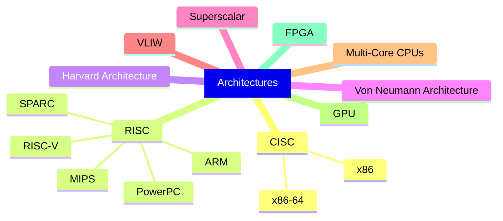

   <!-- var(--site-title-color) -->
<a href="https://en.wikipedia.org/wiki/Assembly_language" target="_blank" rel="noopener noreferrer"><strong>Assembly language</strong></a> (ASM) is a low-level programming language that is a step above machine language. It provides a human-readable representation of the instructions (mnemonics) that a computer’s central processing unit (CPU) can execute. Each assembly language instruction directly corresponds to a machine language instruction, making it a more direct representation of the hardware instructions.

> A foundational understanding of `Computer Organization and Architecture` (COA) and `Digital Logic Design` (DLD) is highly recommended as prerequisites for [`Assembly Language`](/categories/assembly-language), as these subjects provide critical insights into the underlying principles of computer systems.
{: .prompt-tip }

## 📜 History and Evolution of Assembly Language

Assembly language was pioneered by **Kathleen Booth** in the late 1940s while collaborating with her husband, **Andrew Donald Booth**, on the **ARC** (Automatic Relay Computer) at Birkbeck College, University of London. Their 1947 work, *Coding for A.R.C.*, introduced the first instance of symbolic language used to represent machine code instructions, simplifying programming through the use of *mnemonics*. 

The tool that translates assembly language into machine code, known as an *assembler*, was conceptually refined over the years. While **Nathaniel Rochester** contributed to the term’s adoption during his work on the IBM 701, it is often attributed to **Wilkes**, **Wheeler**, and **Gill**, who described it in their 1951 book --- "The Preparation of Programs for an Electronic Digital Computer" as a program that combines multiple sections into a single executable.

  
History of Assembly Language

  <ol>
    <li><strong>Early Computing Machines (1940s) | (1GL)</strong>
      <ul>
        <li><strong>Machine Code Only</strong>: Early computers like the <a href="https://en.wikipedia.org/wiki/ENIAC" target="_blank" rel="noopener noreferrer">ENIAC</a> (1945) and the <a href="https://en.wikipedia.org/wiki/Manchester_Baby" target="_blank" rel="noopener noreferrer">Manchester Baby</a> (1948) required programmers to input instructions in binary (machine code) or through physical means like switches and punch cards.</li>
        <li><strong>Need for Abstraction</strong>: As machines became more complex, writing programs in raw binary became tedious and error-prone. This drove the need for a human-readable language that could represent machine instructions.</li>
      </ul>
    </li>
    <li><strong>Introduction of Assembly Language (1950s) | (2GL)</strong>
      <ul>
        <li>Assembly language was developed as a symbolic representation of machine code.</li>
        <li>Tools called <strong>assemblers</strong> were created to translate assembly language into machine language.</li>
        <li><strong>Mnemonics</strong> like <code class="language-plaintext highlighter-rouge">ADD</code>, <code class="language-plaintext highlighter-rouge">SUB</code>, and <code class="language-plaintext highlighter-rouge">MOV</code> were introduced to replace binary opcodes, making it easier to write and debug code.</li>
      </ul>
    </li>
    <li><strong>Early Commercial Computers</strong>
      <ul>
        <li>Assembly languages were tailored for specific machines, such as <a href="https://en.wikipedia.org/wiki/IBM_701" target="_blank" rel="noopener noreferrer">IBM 701</a> (1952) and <a href="https://en.wikipedia.org/wiki/UNIVAC" target="_blank" rel="noopener noreferrer">UNIVAC</a>.</li>
        <li>These early systems established the foundation of architecture-specific assembly languages, with each processor requiring a unique instruction set.</li>
      </ul>
    </li>
    <li><strong>Widespread Use of Assembly (1960s–1970s)</strong>
      <ul>
        <li>During this period, assembly language became the primary method for programming due to its efficiency and direct control over hardware.</li>
        <li><strong>Macro Assemblers</strong>: Introduced features like macros, which allowed repetitive code sequences to be simplified.</li>
        <li><strong>Structured Assembly</strong>: Began adopting features to improve readability and maintainability, such as labels for loops and conditionals.</li>
        <li>Popular systems, such as <a href="https://en.wikipedia.org/wiki/IBM_System/360" target="_blank" rel="noopener noreferrer">IBM's System/360</a> (1964), used assembly extensively.</li>
      </ul>
    </li>
    <li><strong>Rise of High-Level Languages (1970s–1980s)</strong>
      <ul>
        <li>High-level languages like <strong>C</strong> and <strong>FORTRAN</strong> emerged, reducing the need for assembly programming for general-purpose tasks.</li>
        <li>Assembly language became more specialized for performance-critical applications, hardware-level programming, and embedded systems.</li>
      </ul>
    </li>
    <li><strong>Modern Processor Architectures (1980s–1990s)</strong>
      <ul>
        <li><strong>Complex Instruction Set Computing</strong> (<a href="https://en.wikipedia.org/wiki/Complex_instruction_set_computer" target="_blank" rel="noopener noreferrer">CISC</a>): Processors like <strong>Intel x86</strong> introduced complex instruction sets, making assembly language more intricate.</li>
        <li><strong>Reduced Instruction Set Computing</strong> (<a href="https://en.wikipedia.org/wiki/Reduced_instruction_set_computer" target="_blank" rel="noopener noreferrer">RISC</a>): Simplified instruction sets (e.g., <strong>ARM</strong>, <strong>MIPS</strong>) made assembly programming more streamlined for certain architectures.</li>
        <li><strong>Inline Assembly</strong>: High-level languages (or mid-level languages) like <strong>C</strong> introduced features to incorporate assembly directly within their syntax, blending performance and usability.</li>
      </ul>
    </li>
    <li><strong>Assembly in the 21st Century</strong>
      <ul>
        <li><strong>Specialized Use</strong>:
          <ul>
            <li>Debugging and reverse engineering.</li>
            <li>Writing firmware and device drivers.</li>
            <li>High-performance or resource-constrained environments, such as embedded systems and gaming consoles.</li>
          </ul>
        </li>
        <li><strong>Advanced Assemblers</strong>: Modern assemblers like <strong>NASM</strong> (Netwide Assembler) and <strong>MASM</strong> (Microsoft Assembler) support enhanced features like macros, debugging, and optimized code generation.</li>
        <li><strong>Decline in Prevalence</strong>: With the advent of high-level languages and optimizing compilers, assembly is now used sparingly for specific tasks.</li>
      </ul>
    </li>
    <li><strong>Assembly in Modern Context</strong>
      <ul>
        <li>While its use is declining for application-level programming, assembly remains crucial for:
          <ul>
            <li><strong>Performance Optimization</strong>: Writing highly efficient routines.</li>
            <li><strong>Security</strong>: Reverse engineering and vulnerability analysis.</li>
            <li><strong>System-Level Programming</strong>: Creating operating systems and managing hardware interfaces.</li>
            <li><strong>Learning</strong>: Understanding the inner workings of computer architecture and compilers.</li>
          </ul>
        </li>
      </ul>
    </li>
  </ol>

## 🎯 Purpose and Use of Assembly

Assembly language serves the purpose of bridging the gap between machine code and human-readable programming, enabling direct communication with a computer's hardware while offering a more manageable syntax than raw binary. 

It is used primarily for performance-critical applications, where efficient execution and minimal resource usage (small memory footprint) are essential. Common uses include writing operating system kernels, device drivers, and firmware, as well as programming for embedded systems and micro-controllers. 

Assembly is also vital in reverse engineering, debugging, and optimizing code, as it provides insights into low-level system operations and allows fine-grained control over hardware.

## 🧬 Characteristics of Assembly Language

Assembly language has distinct features that set it apart from high-level programming languages and machine language. Below are its key characteristics:

- **Low-Level Language**: Assembly language is close to machine language, providing a direct way to communicate with a computer's hardware. It is hardware-specific and tailored to the architecture of the CPU (e.g., x86, ARM).
- **Use of Mnemonics**: It uses symbolic codes (mnemonics) for instructions, such as `MOV`, `ADD`, and `SUB`, which are easier to remember compared to binary or hexadecimal machine code. Each mnemonic typically corresponds to a single machine-level instruction.
- **Platform Dependency**: Assembly code is not portable. Programs written for one processor architecture (e.g., Intel x86) cannot run on another (e.g., ARM) without significant modifications.
- **Direct Hardware Interaction**: It allows programmers to directly manipulate hardware resources such as CPU registers, memory, and I/O ports. This makes it ideal for tasks like developing device drivers, embedded systems, and real-time applications.
- **One-to-One Correspondence**: Assembly language instructions generally have a one-to-one mapping with machine instructions, making it easier to understand the hardware's behavior.
- **Requires an Assembler**: Code written in assembly language must be translated into machine code using a software tool called an *Assembler*.
- **Efficient and Fast**: Assembly language programs are highly optimized and can execute faster than those written in high-level languages because they operate close to the hardware.
- **Memory and CPU Register Management**: Provides fine control over memory usage and CPU registers, allowing programmers to write highly efficient programs. However, it requires explicit management of stack operations, data storage, and retrieval.
- **Lacks Abstraction**: Unlike high-level languages, assembly does not provide features like loops, conditionals, or functions directly. Instead, these need to be implemented using basic jump and branch instructions.
- **Difficult to Write and Debug**: Assembly programming is complex and error-prone because of its detailed nature. Debugging assembly programs requires a deep understanding of both the code and the underlying hardware.
- **Application-Specific Use**: Commonly used in systems programming, such as creating operating systems, embedded systems, and performance-critical applications.

## ⚙️ Working of Assembly Language

Assembly language uses **mnemonic codes** to instruct the processor on what actions to perform. These mnemonics are written by the programmer and must be converted into machine language (binary code) for execution. This conversion is done using an **assembler**, which translates the assembly code into machine language and stores it in an executable file for execution.

- **Steps to Execute Assembly Code**:
  1. **Write Assembly Code**: Use an IDE (or text editor) to write assembly code using mnemonic instructions. Save the file with an appropriate extension, such as `.asm`, `.s`, or `.asmx`, depending on your assembler.
  2. **Assemble the Code**: Use an assembler to convert the assembly code into machine language.
  3. **Generate an Object File**: The assembler creates an object file corresponding to your assembly code. This file typically has a `.obj` extension.
  4. **Link and Create an Executable**: If the program consists of multiple source files, they must be linked together, along with required libraries, to create an executable file. A linker, such as `ld`, is used for this purpose.
  5. **Run the Program**: After generating the executable file, run it using the appropriate software or environment. The method of execution will depend on the tools and operating system being used.

## ⚖️ Advantages and Disadvantages of Assembly

- **Advantages**:
  * **Efficiency**: Assembly produces highly optimized code, making it ideal for performance-critical tasks.
  * **Direct Hardware Control**: It provides access to CPU registers, memory, and hardware interfaces, offering unmatched control over the system.
  * **Small Memory Footprint**: Assembly programs are compact, making them suitable for memory-constrained environments like embedded systems.
  * **Deterministic Behavior**: The low-level nature ensures predictable execution, crucial for real-time systems.
  * **Learning Tool**: It helps developers understand CPU architecture, machine code, and the inner workings of a computer.
- **Disadvantages**:
  * **Complexity**: Assembly is difficult to write, read, and debug due to its low-level nature.
  * **Hardware Dependency**: It is architecture-specific, requiring rewrites to work on different CPUs.
  * **Time-Consuming**: Writing programs in assembly takes significantly longer compared to high-level languages.
  * **Limited Abstraction**: Assembly lacks advanced features like loops or conditionals, requiring manual implementation.
  * **Error-Prone**: Its complexity increases the risk of coding errors, which can be challenging to trace and fix.

Despite these drawbacks, assembly remains essential for specialized tasks requiring high performance or low-level hardware access.

## 🖥️ Processor (CPU) Architectures

CPU architectures define the design and functionality of a CPU, influencing how it processes instructions, manages memory, and communicates with other components.

There are many CPU architectures, each designed to meet different computational needs and use cases. Some of the most important and widely-used architectures are discussed below, including `x86`, `ARM`, `MIPS`, and `RISC-V`.

> The topic is covered in more detail in `Computer Organization and Architecture`.
{: .prompt-info }

### ⭕ x86 Architecture

[x86](https://en.wikipedia.org/wiki/X86){: target="_blank" rel="noopener noreferrer"}, also known as **80x86** or the **8086 family**, is a family of complex instruction set computer (CISC) instruction set architectures originally developed by **Intel**. It is based on the 8086 microprocessor and its 8-bit-external-bus variant, the 8088. The 8086 was introduced in 1978 as a fully 16-bit extension of Intel's earlier 8-bit 8080 microprocessor. To address more memory than a plain 16-bit address could, it utilized memory segmentation.

| Property | Details |
|----------|---------|
| Designer | [Intel][intel-hl]{: target="_blank" rel="noopener noreferrer"}, [AMD][amd-hl]{: target="_blank" rel="noopener noreferrer"} |
| Bits | [16-bit][16bit-hl]{: target="_blank" rel="noopener noreferrer"}, [32-bit][32bit-hl]{: target="_blank" rel="noopener noreferrer"}, [64-bit][64bit-hl]{: target="_blank" rel="noopener noreferrer"} |
| Introduced | 1978 (16-bit), 1985 (32-bit), 2003 (64-bit) |
| [Design][design-hl]{: target="_blank" rel="noopener noreferrer"} | [CISC][cisc-hl]{: target="_blank" rel="noopener noreferrer"} (Complex Instruction Set Computer) |
| Type | [Register–memory][regmem-hl]{: target="_blank" rel="noopener noreferrer"} |
| [Encoding][encoding-hl]{: target="_blank" rel="noopener noreferrer"} | Variable (1 to 15 bytes) |
| [Branching][branching-hl]{: target="_blank" rel="noopener noreferrer"} | [Condition code][condcode-hl]{: target="_blank" rel="noopener noreferrer"} |
| [Endianness][endianness-hl]{: target="_blank" rel="noopener noreferrer"} | Little |
| Open | Partly open: Advanced x86 features require an Intel license;   x86-64 requires an AMD license. The i686 subset is fully open after 21 years. |
| Registers | [General-purpose][gpr-hl]{: target="_blank" rel="noopener noreferrer"} : 16-bit: 6 registers (BP, SP not general-purpose);   32-bit: 8 GPRs (incl. EBP, ESP); 64-bit: 16 GPRs (incl. RBP, RSP). |

[intel-hl]: https://en.wikipedia.org/wiki/Intel
[amd-hl]: https://en.wikipedia.org/wiki/Advanced_Micro_Devices
[16bit-hl]: https://en.wikipedia.org/wiki/16-bit_computing
[32bit-hl]: https://en.wikipedia.org/wiki/32-bit_computing
[64bit-hl]: https://en.wikipedia.org/wiki/64-bit_computing
[design-hl]: https://en.wikipedia.org/wiki/Computer_architecture
[cisc-hl]: https://en.wikipedia.org/wiki/Complex_instruction_set_computer
[regmem-hl]: https://en.wikipedia.org/wiki/Register%E2%80%93memory_architecture
[encoding-hl]: https://en.wikipedia.org/wiki/Instruction_set
[branching-hl]: https://en.wikipedia.org/wiki/Branch_(computer_science)
[condcode-hl]: https://en.wikipedia.org/wiki/Status_register
[endianness-hl]: https://en.wikipedia.org/wiki/Endianness
[gpr-hl]: https://en.wikipedia.org/wiki/General-purpose_register

- **Key Features**:
  * **CISC Design**: x86 uses CISC design, allowing complex instructions that can execute multiple low-level operations.
  * **Backward Compatibility**: Supports older software and operating systems, ensuring legacy applications run without modification.
  * **Variable Instruction Length**: Instructions range from 1 to 15 bytes, optimizing memory usage for complex operations.
  * **Memory Management**: Segmentation and paging enable effective memory addressing, supporting virtual memory and protected modes.
  * **Multi-core Processors**: Modern x86 CPUs incorporate multi-core technology, improving multitasking and parallelism.
  * **Advanced Features**: **SSE** (Streaming SIMD Extensions), **AVX** (Advanced Vector Extensions) for enhanced multimedia, scientific, AI performance, and hardware virtualization support (**VT-x**).
- **Use Cases**:
  * **Personal Computing**: Desktops and laptops predominantly use x86 CPUs (Intel Core, AMD Ryzen).
  * **Servers and Data Centers**: Widely used in cloud computing, virtualization, and enterprise workloads due to robust multitasking capabilities.
  * **Embedded Systems**: x86 is found in specialized embedded systems like point-of-sale devices and medical equipment.
  * **Gaming and Multimedia**: High-performance x86 CPUs are crucial for gaming PCs and workstations.
  * **Workstations and Content Creation**: CAD, video editing, and 3D modeling leverage x86 CPUs for high compute power.
  * **Legacy Applications**: Businesses still rely on older applications that require x86 compatibility.
- **Variants**:
  * **32-bit** ([x86](https://en.wikipedia.org/wiki/X86){: target="_blank" rel="noopener noreferrer"}): Introduced with the 80386 processor, supports up to 4 GB RAM and is widely used in older systems.
  * **64-bit** ([x86-64](https://en.wikipedia.org/wiki/X86-64){: target="_blank" rel="noopener noreferrer"} / AMD64): Introduced by AMD; supports larger memory addressing (up to 16 exabytes) and improved performance. Allows execution of both 32-bit and 64-bit code.
- **Advantages**:
  * x86 architecture powers the majority of consumer and enterprise systems, ensuring widespread software support.
  * Seamless support for older software, enhancing longevity and reducing software redevelopment costs.
  * Continuous advancements in clock speeds, multi-core technology, and instruction sets optimize performance.
  * Vast libraries of software, operating systems (Windows, Linux), and tools are optimized for x86.
  * Hardware virtualization features make it ideal for cloud infrastructure and virtual machines.
- **Challenges**:
  * Compared to ARM architecture, x86 consumes more power, making it less suitable for mobile devices and IoT.
  * CISC design leads to increased hardware complexity and higher manufacturing costs.
  * High-performance x86 processors generate significant heat, requiring advanced cooling solutions.
  * ARM architecture is gaining ground in low-power and high-performance markets (e.g., Apple M-series chips).
  * x86 may face limitations in scaling to extremely low-power devices or specialized processors compared to ARM and RISC-V.

### ⭕ ARM Architecture

[ARM](https://en.wikipedia.org/wiki/ARM_architecture_family){: target="_blank" rel="noopener noreferrer"} is a family of RISC (Reduced Instruction Set Computing) instruction set architectures ([ISA](https://en.wikipedia.org/wiki/Instruction_set_architecture){: target="_blank" rel="noopener noreferrer"}) for computer processors. Developed by Arm Holdings, these ISAs are licensed to other companies that manufacture the physical devices incorporating the instruction set. Additionally, Arm Holdings designs and licenses the cores that implement these ISAs.

| Property | Details |
|----------|---------|
| Designer | Sophie Wilson, Steve Furber, Acorn Computers/Arm Holdings |
| Bits | [32-bit][32bit-hl]{: target="_blank" rel="noopener noreferrer"}, [64-bit][64bit-hl]{: target="_blank" rel="noopener noreferrer"} |
| Introduced | 1985 |
| [Design][design-hl]{: target="_blank" rel="noopener noreferrer"} | [RISC][risc-hl]{: target="_blank" rel="noopener noreferrer"} (Reduced Instruction Set Computer) |
| Type | [Load–store][loadstore-hl]{: target="_blank" rel="noopener noreferrer"} |
| [Branching][branching-hl]{: target="_blank" rel="noopener noreferrer"} | [Condition code][condcode-hl]{: target="_blank" rel="noopener noreferrer"}, compare and branch |
| [Endianness][endianness-hl]{: target="_blank" rel="noopener noreferrer"} | [Bi][biend-hl]{: target="_blank" rel="noopener noreferrer"} (little as default) |
| Open | Proprietary |

[risc-hl]: https://en.wikipedia.org/wiki/Reduced_instruction_set_computer
[loadstore-hl]: https://en.wikipedia.org/wiki/Load%E2%80%93store_architecture
[biend-hl]: https://en.wikipedia.org/wiki/Endianness#Bi-endianness

- **Key Features**:
  * **RISC Design**: ARM architecture follows the principles of RISC, simplifying the instructions to increase performance and efficiency.
  * **Low Power Consumption**: Designed for mobile devices, ARM processors are known for their power efficiency, making them suitable for battery-operated devices.
  * **Scalability**: ARM processors are highly scalable, ranging from small microcontrollers to high-performance CPUs used in servers.
  * **Code Compatibility**: ARM processors support a variety of operating systems and software environments, including Linux, Android, iOS, and more.
  * **Thumb Instruction Set**: ARM processors use a mixed 16-bit and 32-bit instruction set (Thumb) to balance performance and power consumption.
  * **Embedded Systems**: ARM is widely used in embedded systems due to its compact size, cost-effectiveness, and suitability for applications with limited processing power.
- **Use Cases**:
  * **Mobile Devices**: Smartphones, tablets, and wearables use ARM processors for their low power consumption and performance.
  * **Embedded Systems**: ARM is commonly found in devices like smart TVs, routers, IoT devices, and automotive electronics.
  * **Server and Desktop Computers**: ARM processors are also used in high-performance computing platforms, including some server and desktop systems.
  * **Medical Devices**: ARM processors are used in medical devices due to their reliability and low power requirements.
  * **Gaming Consoles**: ARM CPUs are employed in gaming consoles like Nintendo Switch and portable game devices.
- **Variants**:
  * **ARM Cortex-A**: High-performance CPUs for smartphones, tablets, and servers.
  * **ARM Cortex-M**: Microcontrollers with a focus on low power, used in smart homes, automotive, and IoT devices.
  * **ARM Cortex-R**: Real-time CPUs, ideal for automotive, networking, and industrial applications requiring high reliability.
  * **ARM Cortex-S**: Safety-critical microcontrollers, used in automotive and medical applications.
- **Advantages**:
  * ARM processors consume significantly less power compared to other architectures, extending battery life.
  * The design simplicity and scalability of ARM processors make them cost-effective for a wide range of applications.
  * ARM CPUs offer good performance-per-watt efficiency, making them suitable for mobile and embedded devices.
  * ARM provides a range of cores, from high-performance to power-efficient, allowing designers to choose the best fit for their application.
  * A large developer community supports ARM architecture, with a wealth of software, tools, and documentation available.
- **Challenges**:
  * Ensuring compatibility with older software and operating systems can be challenging, especially for legacy applications.
  * While ARM offers flexibility, customization of ARM cores can be complex and requires deep technical expertise.
  * As ARM processors become more widely used, security challenges such as vulnerabilities and attacks on mobile and embedded systems become more critical.
  * With multiple ARM licensees, there is a lack of uniformity in ARM implementations, potentially complicating software development and hardware integration.
  * Balancing performance and power consumption remains a challenge, particularly for high-performance applications.

### ⭕ MIPS Architecture

[MIPS](https://en.wikipedia.org/wiki/MIPS_architecture){: target="_blank" rel="noopener noreferrer"} (Microprocessor without Interlocked Pipelined Stages) is a family of reduced instruction set computer (RISC) instruction set architectures (ISA) originally developed by MIPS Computer Systems, now known as MIPS Technologies, headquartered in the United States.

The MIPS architecture has evolved through various iterations, including MIPS I, II, III, IV, and V, as well as five versions of MIPS32/64 for 32-bit and 64-bit implementations. While the early MIPS architectures were designed as 32-bit systems, 64-bit versions were introduced later.

| Property | Details |
|----------|---------|
| Designer | 	MIPS Technologies, Imagination Technologies |
| Bits | [64-bit][64bit-hl]{: target="_blank" rel="noopener noreferrer"} (32 → 64) |
| Introduced | 1985 |
| [Design][design-hl]{: target="_blank" rel="noopener noreferrer"} | [RISC][risc-hl]{: target="_blank" rel="noopener noreferrer"} (Reduced Instruction Set Computer) |
| Type | [Load–store][loadstore-hl]{: target="_blank" rel="noopener noreferrer"} |
| [Encoding][encoding-hl]{: target="_blank" rel="noopener noreferrer"} | Fixed |
| [Branching][branching-hl]{: target="_blank" rel="noopener noreferrer"} | Compare and branch, with a 1 instruction delay after the branching condition check |
| [Endianness][endianness-hl]{: target="_blank" rel="noopener noreferrer"} | [Bi][biend-hl]{: target="_blank" rel="noopener noreferrer"} |
| Open | Partly |
| Registers | [General-purpose][gpr-hl]{: target="_blank" rel="noopener noreferrer"} : 32-bit: 32 registers |

- **Key Features**:
  * **RISC Design**: Focuses on a small, simple, and highly optimized instruction set for high-speed execution.
  * **Fixed Instruction Length**: Instructions are uniformly 32 bits, simplifying instruction decoding and pipeline implementation.
  * **Pipelining**: Extensively used to improve performance, with stages like fetch, decode, execute, memory access, and write-back.
  * **Reduced Addressing Modes**: Supports basic addressing modes like immediate, register, and base/displacement.
- **Use Cases**:
  * **Embedded Systems**: Widely used in devices like routers, automotive systems, and IoT devices.
  * **Education and Research**: Popular in academic settings for teaching computer architecture.
  * **Gaming Consoles**: Found in older systems like PlayStation 1 and 2.
  * **Networking Devices**: Utilized in processors for network switches and routers
- **Variants**:
  * **MIPS32 and MIPS64**: 32-bit and 64-bit versions, respectively.
  * **microMIPS**: Optimized for embedded systems, with reduced instruction size.
  * **MIPS Warrior Series**: Modern implementations with enhanced security and performance features.
- **Advantages**:
  * Easy to implement and optimize due to RISC principles.
  * Variants support both 32-bit and 64-bit processing needs.
  * Ideal for low-power devices.
  * Well-suited for pipeline optimization.
  * Established architecture with a robust ecosystem.
- **Challenges**:
  * ARM and x86 architectures dominate the market.
  * Smaller software base compared to ARM and x86.
  * Commercial licensing may deter adoption in open-source or cost-sensitive projects.
  * Lags behind advanced architectures in performance for high-end applications.
  * Declining use in modern consumer devices due to competition from other architectures.

### ⭕ RISC-V Architecture

[RISC-V](https://en.wikipedia.org/wiki/RISC-V){: target="_blank" rel="noopener noreferrer"} (pronounced "risk-five") is an open-standard instruction set architecture (ISA) rooted in established reduced instruction set computer (RISC) principles. It originated in 2010 at the University of California, Berkeley, transitioned to the RISC-V Foundation in 2015, and later to RISC-V International, a Swiss non-profit organization, in November 2019.

| Property | Details |
|----------|---------|
| Designer | 	University of California (Berkeley) |
| Bits | [32-bit][32bit-hl]{: target="_blank" rel="noopener noreferrer"}, [64-bit][64bit-hl]{: target="_blank" rel="noopener noreferrer"}, [128-bit][128bit-hl]{: target="_blank" rel="noopener noreferrer"} |
| Introduced | 2014 |
| [Design][design-hl]{: target="_blank" rel="noopener noreferrer"} | [RISC][risc-hl]{: target="_blank" rel="noopener noreferrer"} (Reduced Instruction Set Computer) |
| Type | [Load–store][loadstore-hl]{: target="_blank" rel="noopener noreferrer"} |
| [Encoding][encoding-hl]{: target="_blank" rel="noopener noreferrer"} | Variable |
| [Branching][branching-hl]{: target="_blank" rel="noopener noreferrer"} | Compare and branch |
| [Endianness][endianness-hl]{: target="_blank" rel="noopener noreferrer"} | Little |
| Open | Royalty free |

[128bit-hl]: https://en.wikipedia.org/wiki/128-bit_computing

- **Key Features**:
  * **Open-Source ISA**: Free and open instruction set architecture (ISA) for customization and innovation.
  * **Modular Design**: Base ISA with optional extensions (e.g., integer, floating-point, atomic, vector processing).
  * **Simplicity**: Follows RISC principles with a clean and simple instruction set.
  * **Scalability**: Supports designs from embedded systems to high-performance computing.
- **Use Cases**:
  * **Embedded Systems**: Microcontrollers, IoT devices, and low-power applications.
  * **High-Performance Computing**: Servers and accelerators with customized ISA extensions.
  * **Education**: Teaching computer architecture and processor design.
  * **Research and Innovation**: Exploring new computing paradigms due to open ISA.
  * **Custom Hardware Development**: Tailored designs for specific applications like AI, ML, or networking.
- **Variants**:
  * **RV32I, RV64I, RV128I**: Base integer ISAs for 32-bit, 64-bit, and 128-bit architectures.
  * **Extensions**: M (integer arithmetic), A (atomic operations), F/D (floating-point), C (compressed instructions), and V (vector processing for AI and graphics).
  * **Custom Extensions**: Developers can create proprietary extensions for specific needs.
- **Advantages**:
  * No licensing fees, enabling broader adoption and innovation.
  * Tailored for specific applications, reducing unnecessary overhead.
  * Applicable across a wide range of devices and performance needs.
  * Rapidly growing toolchains, compilers, and software support.
  * Competitive for low-power designs.
- **Challenges**:
  * Still catching up to established architectures like ARM and x86.
  * Limited legacy software and fewer pre-optimized libraries.
  * Lack of off-the-shelf hardware compared to ARM.
  * Competing against well-entrenched players like ARM and Intel.
  * Potential fragmentation due to customization and extensions.

## 📊 Comparison of CPU Architectures

| Feature              | x86               | ARM                  | MIPS     | RISC-V             |
| -------------------- | ----------------- | -------------------- | -------- | ------------------ |
| **Instruction Set**  | CISC              | RISC                 | RISC     | RISC               |
| **Power Efficiency** | Low               | High                 | Medium   | High               |
| **Scalability**      | Moderate          | Very High            | Moderate | Very High          |
| **Ecosystem**        | Mature, Extensive | Mature, Extensive    | Limited  | Growing Rapidly    |
| **Cost**             | High (Licensing)  | Moderate (Licensing) | Moderate | Free (Open-source) |

## 🧩 Making Sense of Architectures and Compatibility

Understanding CPU architectures, bit widths, and software compatibility can often lead to confusion due to overlapping terms and conventions.

The term x86 historically refers to Intel's 8086 processor family, which originally supported 16-bit operations and later evolved into 32-bit architecture. Over time, "x86" became synonymous with 32-bit processors and their software. However, when we talk about 64-bit architecture, we use the term "x64", which is an extension of x86 introduced by AMD as AMD64. This extension added 64-bit capabilities while maintaining backward compatibility with 32-bit software. Thus, x64 denotes 64-bit systems, whereas x86 typically denotes 32-bit systems in modern usage, even though this shorthand can be unintuitive.

The term x32, though not officially standardized, is sometimes used informally to denote 32-bit systems, similar to how x64 is used for 64-bit systems. This distinction helps clarify discussions, but it can add to the confusion for newcomers. Applications like x64dbg utilize the "x96" convention to represent a hybrid executable (x96dbg.exe) that automatically detects the architecture of a program and launches the correct debugger—x32dbg.exe for 32-bit or x64dbg.exe for 64-bit—streamlining the debugging process.

The difference between 32-bit and 64-bit software lies in how the CPU processes data and addresses memory. A 32-bit processor can address up to 4 GB of RAM, while a 64-bit processor can address vastly larger memory, supporting modern applications that require significant computational power and memory usage. Most modern systems are 64-bit, and 64-bit operating systems can run both 32-bit and 64-bit software through compatibility layers, such as WOW64 on Windows. However, a 32-bit operating system can only run 32-bit software due to hardware limitations.

For end users, the choice of software depends on their hardware and operating system. If you have a 64-bit system, it’s best to use 64-bit software to fully utilize the system's capabilities. However, legacy systems or specialized applications may still require 32-bit software.

Lastly, ARM, unlike x86 and x64, is a different architecture family focusing on efficiency and simplicity, commonly found in mobile devices and embedded systems. ARM processors support both 32-bit (ARM32) and 64-bit (ARM64, also known as AArch64) software, with the latter being the modern standard.

## 🔢 32-bit assembly Vs 64-bit assembly

"**x86 assembly** vs **x64 assembly**" or "**x86** vs **x86-64**" essentially refer to the same concept, with x86 commonly referring to 32-bit assembly and x86-64 (also known as x64) extending the x86 architecture to include 64-bit capabilities.

| Aspect                  | x86 (32-bit) Assembly            | x64 (64-bit) Assembly                |
|-------------------------|----------------------------------|--------------------------------------|
| **Registers**           | 8 general-purpose registers   (e.g., `EAX`, `EBX`)  | 16 general-purpose registers   (e.g., `RAX`, `RBX`) |
| **Register Size**       | 32 bits                          | 64 bits                              |
| **Memory Addressing**   | Up to 4 GB                       | Up to 16 exabytes                    |
| **Stack Pointer**       | Uses `ESP`                       | Uses `RSP`                           |
| **Calling Conventions** | Arguments passed on stack        | Arguments passed in registers (e.g., `RCX`, `RDX`) |
| **Instruction Set**     | Focused on 32-bit instructions   | Expanded instruction set with 64-bit and   SIMD support |
| **Use Cases**           | Used in older systems or   legacy applications | Standard for modern systems and   high-performance applications |
| **Performance**         | Limited for large data sets      | Optimized for modern computing tasks |

## 🗂️ Types of Assembly Languages

Assembly languages are tied to specific processor (CPU) architectures because they provide low-level instructions that correspond directly to the hardware's instruction set. There are many types of assembly languages; some popular ones include `x86`, `ARM`, `MIPS`, and `RISC-V`.

| **Assembly** | **Architecture** | **Usage Domain**          | **Applications**                         |
| ------------ | ---------------- | ------------------------- | ---------------------------------------- |
| `x86`        | CISC             | PCs, servers              | OS kernels, reverse engineering          |
| `ARM`        | RISC             | Mobile, embedded          | Smartphones, IoT, consumer electronics   |
| `MIPS`       | RISC             | Embedded, gaming          | Routers, PlayStation, academic use       |
| `RISC-V`     | RISC             | Open-source, custom       | Academia, custom chips, IoT              |
| `SPARC`      | RISC             | High-performance servers  | Scientific computing, enterprise systems |
| `PowerPC`    | RISC             | Legacy, gaming            | Old Apple computers, gaming consoles     |
| `Z80`        | CISC             | Early computing, embedded | Retrocomputing, embedded systems         |

Below is a mapping of some common assembly languages to their corresponding processors (architectures) and bit-width support:

- x86 Assembly ➡ x86 Processor [16-bit (e.g., 8086), 32-bit (e.g., i386), 64-bit (e.g., x86-64)]
- ARM Assembly ➡ ARM Processor [32-bit (ARMv7), 64-bit (ARMv8-A)]
- MIPS Assembly ➡ MIPS Processor [32-bit (MIPS I), 64-bit (MIPS64)]
- RISC-V Assembly ➡ RISC-V Processor [32-bit (RV32), 64-bit (RV64), 128-bit (RV128)]
- SPARC Assembly ➡ SPARC Processor [32-bit (SPARC V8), 64-bit (SPARC V9)]
- PowerPC Assembly ➡ PowerPC Processor (32-bit, 64-bit)
- Z80 Assembly ➡ Z80 Processor (8-bit)

### ⭕ x86 Assembly

[x86 assembly](https://en.wikipedia.org/wiki/X86_assembly_language){: target="_blank" rel="noopener noreferrer"} is used for processors designed by [Intel](https://en.wikipedia.org/wiki/Intel){: target="_blank" rel="noopener noreferrer"} and [AMD](https://en.wikipedia.org/wiki/AMD){: target="_blank" rel="noopener noreferrer"}. It has been a cornerstone for personal computers and servers since the 1980s. It is also known as 32-bit assembly.

- **Key Features**:
  * Supports complex instruction sets (CISC architecture).
  * Instructions can be variable in size, ranging from one to several bytes.
  * Supports a rich set of instructions for arithmetic, control flow, and system-level programming.
  * Backward compatibility: Programs written for older processors typically run on newer ones.
  * Register set includes general-purpose registers (e.g., `EAX`, `EBX`), segment registers, and special-purpose registers.
- **Applications**:
  * Operating system kernels and low-level device drivers.
  * High-performance applications requiring optimization.
  * Reverse engineering and malware analysis.
- **Challenges**: Complexity due to its long history and large instruction set.

> In future posts in the [`Assembly Language`](/categories/assembly-language) category, the focus will be on both x86 (32-bit) and x64 (64-bit) assembly.
{: .gh-alert.important }

### ⭕ x64 Assembly

[x86-64 assembly](https://en.wikipedia.org/wiki/X86-64){: target="_blank" rel="noopener noreferrer"} (also known as x64) is an extension of x86 assembly developed by [AMD](https://en.wikipedia.org/wiki/AMD){: target="_blank" rel="noopener noreferrer"} and later adopted by [Intel](https://en.wikipedia.org/wiki/Intel){: target="_blank" rel="noopener noreferrer"}. It introduces 64-bit computing while maintaining backward compatibility with 32-bit (x86) applications.  

- **Key Features**:  
  * Extends the general-purpose registers to 64 bits (e.g., `RAX`, `RBX`).  
  * Adds eight additional general-purpose registers (`R8`–`R15`).  
  * Uses a more streamlined calling convention with registers for function arguments.  
  * Supports larger memory addressing and improved performance for 64-bit applications.  
  * Includes new instruction sets like SSE and AVX for enhanced vector processing.  
- **Applications**:  
  * Modern operating systems and high-performance computing.  
  * Large-scale applications requiring more memory and processing power.  
  * System programming, including OS kernels and hypervisors.  
- **Challenges**:  
  * Transitioning legacy x86 code to x64 may require adjustments.  
  * Larger pointer sizes can lead to increased memory usage in certain applications.  

### ⭕ ARM Assembly

**ARM** assembly is widely used in mobile devices, embedded systems, and IoT devices. ARM processors dominate these markets due to their power efficiency.

- **Key Features**:
  * Based on RISC (Reduced Instruction Set Computing) architecture, focusing on simplicity and efficiency.
  * Fixed-length instructions (mostly 32-bit or 16-bit for ARM Thumb).
  * Load-store architecture: Data must be loaded into registers for processing.
  * Rich support for conditional execution and barrel shifter operations.
- **Applications**:
  * Mobile devices (smartphones, tablets).
  * Embedded systems (automotive, industrial, and consumer electronics).
  * Real-time systems requiring low power and high performance.
- **Advantages**: Simpler instruction set, energy-efficient, highly portable across devices.

### ⭕ MIPS Assembly

**MIPS** (Microprocessor without Interlocked Pipeline Stages) is used in embedded systems, gaming consoles (e.g., early PlayStation models), and networking equipment like routers.

- **Key Features**:
  * RISC-based architecture with a clean and simple instruction set.
  * Strong emphasis on pipeline performance and predictable execution.
  * Consistent, fixed-length instructions (32-bit for classic MIPS).
  * A small set of general-purpose registers, making it easier to learn.
- **Applications**:
  * Embedded systems (networking, automotive systems).
  * Academic settings for teaching computer architecture.
- **Advantages**: Easy to learn and implement; well-documented.

### ⭕ RISC-V Assembly

An open-source instruction set architecture (ISA) gaining traction in academia, startups, and industries aiming to develop custom processors.

- **Key Features**:
  * Open and free: No licensing fees, encouraging innovation.
  * Modular design: A minimal base instruction set can be extended with optional features (e.g., floating-point, vector instructions).
  * Simple and clean RISC-based design, ideal for both high-performance systems and low-power devices.
- **Applications**:
  * Academia: Teaching and research in computer architecture.
  * Industry: Custom chips for AI, IoT, and edge computing.
- **Advantages**: Flexibility, low-cost entry, and a growing ecosystem.
- **Challenges**: Relatively new compared to x86 and ARM; smaller software ecosystem.

### ⭕ SPARC Assembly

Developed by Sun Microsystems, used primarily in their workstations and servers.

- **Key Features**:
  * RISC-based architecture.
  * Scalable and well-suited for multiprocessing systems.
  * Register windowing: A unique feature where only a subset of registers is visible, improving function call efficiency.
- **Applications**:
  * High-performance computing (HPC) and scientific applications.
  * Legacy enterprise systems.
- **Advantages**: Optimized for scalability and performance.
- **Challenges**: Declining popularity due to the rise of x86 and ARM in servers.

### ⭕ PowerPC Assembly

Once popular in Apple computers (before the Intel transition in 2006), gaming consoles (like early Xbox and PlayStation models), and embedded systems.

- **Key Features**:
  * RISC-based architecture.
  * Emphasis on parallelism and performance.
  * Supports multiple instruction sets, including 32-bit and 64-bit.
- **Applications**:
  * Legacy Apple computers (e.g., Power Mac G5).
  * Embedded systems in automotive and industrial applications.
  * Gaming consoles.
- **Advantages**: High performance, support for both big-endian and little-endian modes.
- **Challenges**: Limited adoption in modern systems.

### ⭕ Z80 Assembly

Popular in early personal computers (e.g., Sinclair ZX Spectrum, TRS-80) and still used in some embedded systems.

- **Key Features**:
  * CISC-based design with a relatively small and efficient instruction set.
  * Backward compatibility with Intel 8080 assembly.
  * Uses a limited number of general-purpose registers and special-purpose registers.
  * Simple addressing modes and operations.
- **Applications**:
  * Early home computers.
  * Embedded systems (e.g., controllers in consumer electronics).
  * Retrocomputing and hobbyist projects.
- **Advantages**: Easy to understand, with a rich history and substantial documentation.
- **Challenges**: Limited modern use outside of retrocomputing.

## 📄 File Extension for Assembly Code

Assembly code files commonly use extensions like `.asm`, `.s`, and `.a`, each suited to specific platforms or tools. **.asm** is popular with assemblers such as NASM, MASM, and TASM, while **.s** is standard on Unix/Linux and recognized by GCC and Clang. **.a** often denotes ARM assembly files on Unix-like systems but may also refer to static libraries. Check your toolchain's documentation for preferred extensions; non-standard ones may require a `-x` flag to specify the file type.

## 🛠️ Tools to get started with Assembly

Getting started with assembly language requires having the right tools at your disposal. From assemblers to debuggers and emulators, each tool plays an important role in writing, compiling, and understanding low-level code. Here’s a list of tools to get started with assembly language:

1. **Integrated Development Environment** ([IDE](https://en.wikipedia.org/wiki/Integrated_development_environment){: target="_blank" rel="noopener noreferrer"} \| [Comparison](https://en.wikipedia.org/wiki/Comparison_of_integrated_development_environments){: target="_blank" rel="noopener noreferrer"}):
  - While you can write assembly code in any *text editor*, using an IDE can provide features like syntax highlighting, debugging tools, easy compilation, and many more.
  - Some popular IDEs are: Visual Studio Code ([VS Code](https://code.visualstudio.com){: target="_blank" rel="noopener noreferrer"}), [Visual Studio](https://visualstudio.microsoft.com){: target="_blank" rel="noopener noreferrer"}, [Rider](https://www.jetbrains.com/rider){: target="_blank" rel="noopener noreferrer"}, [CLion](https://www.jetbrains.com/clion){: target="_blank" rel="noopener noreferrer"}, and [IntelliJ IDEA](https://www.jetbrains.com/idea){: target="_blank" rel="noopener noreferrer"} —there are plenty more to choose from. And if none of these suit you, there’s always the trusty Windows Notepad… because who needs features when you have determination? 😂📄
2. **Assembler**:
  - [Assembler](/posts/language-translators/#3-assembler) is a program that translates assembly language code (human-readable) into machine code (binary-code/machine-readable) so the CPU can understand and execute it.
  - Some popular assemblers are: [NASM](https://www.nasm.us){: target="_blank" rel="noopener noreferrer"} (Netwide Assembler), [MASM](https://docs.microsoft.com/en-us/cpp/assembler/masm/microsoft-macro-assembler-reference){: target="_blank" rel="noopener noreferrer"} (Microsoft Macro Assembler), [FASM](https://flatassembler.net){: target="_blank" rel="noopener noreferrer"} (Flat Assembler), [GAS](https://www.gnu.org/software/binutils){: target="_blank" rel="noopener noreferrer"} (GNU Assembler), [YASM](https://github.com/yasm/yasm){: target="_blank" rel="noopener noreferrer"}, [TASM](https://en.wikipedia.org/wiki/Turbo_Assembler){: target="_blank" rel="noopener noreferrer"} (Turbo Assembler), [HLA](https://www.plantation-productions.com/Webster/HighLevelAsm/dnld.html){: target="_blank" rel="noopener noreferrer"} (High Level Assembler), [SPIM](https://spimsimulator.sourceforge.net/){: target="_blank" rel="noopener noreferrer"}, and [Keil Assembler](https://www.keil.com/){: target="_blank" rel="noopener noreferrer"}.
3. **Debugger**:
  - [Debugger](/posts/errors-bugs-debugging/#debugging) is a tool that tracks the behavior of code, allowing for step-by-step execution, monitoring of variables, and identification of issues. It is especially useful for debugging complex assembly programs.
  - Some popular debuggers are: [x64dbg](https://x64dbg.com){: target="_blank" rel="noopener noreferrer"}, [Windbg](https://learn.microsoft.com/en-us/windows-hardware/drivers/debugger){: target="_blank" rel="noopener noreferrer"} (Windows Debugger), [gdb](https://sourceware.org/gdb){: target="_blank" rel="noopener noreferrer"} (GNU Debugger), and AFD (Advanced Fullscreen Debug).
4. **Emulator/Simulator/Sandbox/Virtual Machine**:
  - [Emulator](https://en.wikipedia.org/wiki/Emulator){: target="_blank" rel="noopener noreferrer"} is a software tool that mimics the behavior of a specific hardware or operating system environment, allowing programs designed for one platform to run on another. It replicates the original system's architecture and functionality, enabling testing, debugging, and running software in a controlled and flexible virtual environment.
  - Some popular emulators are: [QEMU](https://www.qemu.org/){: target="_blank" rel="noopener noreferrer"}, [Bochs](https://bochs.sourceforge.io){: target="_blank" rel="noopener noreferrer"}, [VirtualBox](https://www.virtualbox.org){: target="_blank" rel="noopener noreferrer"}, [VMware](https://www.vmware.com/products/desktop-hypervisor/workstation-and-fusion){: target="_blank" rel="noopener noreferrer"}, [DOSBox-X](https://dosbox-x.com){: target="_blank" rel="noopener noreferrer"}, and [DOSBox](https://www.dosbox.com){: target="_blank" rel="noopener noreferrer"}.
5. **Disassembler**:
  - [Disassembler](/posts/language-translators/#4-disassembler) is a software tool that converts binary machine code back into assembly language for analysis. It is widely used in **reverse engineering** to understand the functionality of compiled programs, debug issues, or analyze software without access to the original source code.
  - Some popular disassemblers are: [x64dbg](https://x64dbg.com){: target="_blank" rel="noopener noreferrer"} (both debugger and disassembler), [IDA Pro](https://hex-rays.com/ida-pro){: target="_blank" rel="noopener noreferrer"}, [Ghidra](https://ghidra-sre.org){: target="_blank" rel="noopener noreferrer"}, [Radare2](https://www.radare.org/n/){: target="_blank" rel="noopener noreferrer"} (CLI), [iaito](https://www.radare.org/n/iaito.html){: target="_blank" rel="noopener noreferrer"} (GUI), and [Binary Ninja](https://binary.ninja){: target="_blank" rel="noopener noreferrer"}.
6. **Online Tools**:
  - Online tools exist that allow writing, running, debugging, and analyzing small programs directly in a browser. These tools are convenient for quick tests and learning but often have limited features and may not support complex or large-scale programs.
  - Some popular online tools include: [Godbolt](https://godbolt.org){: target="_blank" rel="noopener noreferrer"} (Compiler Explorer), [Dogbolt](https://dogbolt.org){: target="_blank" rel="noopener noreferrer"} (Decompiler Explorer), [Ideone](https://ideone.com){: target="_blank" rel="noopener noreferrer"}, [OneCompiler](https://onecompiler.com){: target="_blank" rel="noopener noreferrer"}, and [Replit](https://replit.com){: target="_blank" rel="noopener noreferrer"}.

> Assembly Development Environment setup is discussed [here](/posts/asm-environment-setup/#setting-up-the-development-environment).
{: .gh-alert.note }

## 📖 Learning Resources

- 📚 **Books**:
  * **Computer Organization & Architecture** --- William Stalling  ([Amazon](https://www.amazon.com/dp/0134101618){: target="_blank" rel="noopener noreferrer"})
  * **Computer Organization And Design: The Hardware/Software Interface** --- David A. Patterson, John L. Hennessy  ([Amazon](https://www.amazon.com/dp/8131222748){: target="_blank" rel="noopener noreferrer"})
  * **Assembly Language for Intel-Based Computers** --- Kip R. Irvine  ([Amazon](https://www.amazon.com/dp/0132383101){: target="_blank" rel="noopener noreferrer"})
  * **Assembly Language for X86 Processors** --- Kip R. Irvine  ([Amazon](https://www.amazon.com/dp/013602212X){: target="_blank" rel="noopener noreferrer"}) \| ([Official Website](https://asmirvine.com/){: target="_blank" rel="noopener noreferrer"})
  * **The Art of Assembly Language** --- Randall Hyde ([Amazon](https://www.amazon.com/dp/1593272073){: target="_blank" rel="noopener noreferrer"})
  * **The Art of 64-Bit Assembly** --- Randall Hyde ([Amazon](https://www.amazon.com/dp/1718501080){: target="_blank" rel="noopener noreferrer"})
  * **Assembly Language Programming** --- Belal Hashmi

> If you find learning through books difficult, you can explore **YouTube** or **Udemy** courses, but keep in mind that they may offer limited depth and scope.
{: .gh-alert.tip }

- 🌐 **Websites**:
  * [Introduction to x86 Assembly Language](https://www.cs.virginia.edu/~evans/cs216/guides/x86.html){: target="_blank" rel="noopener noreferrer"}
  * [x86 Assembly Guide by WikiBooks](https://en.wikibooks.org/wiki/X86_Assembly){: target="_blank" rel="noopener noreferrer"}
  * [Intel 64 and IA-32 Architectures Software Developer Manuals](https://www.intel.com/content/www/us/en/developer/articles/technical/intel-sdm.html){: target="_blank" rel="noopener noreferrer"}
  * [Intel x86 Instruction Set Reference](https://www.felixcloutier.com/x86/){: target="_blank" rel="noopener noreferrer"}
  * [The x86 Processor](https://learn.microsoft.com/en-us/windows-hardware/drivers/debugger/the-x86-processor){: target="_blank" rel="noopener noreferrer"}
  * [The x64 Processor](https://learn.microsoft.com/en-us/windows-hardware/drivers/debugger/the-x64-processor){: target="_blank" rel="noopener noreferrer"}
  * [Overview of x64 ABI conventions](https://learn.microsoft.com/en-us/cpp/build/x64-software-conventions?view=msvc-170){: target="_blank" rel="noopener noreferrer"}
  * [NASM - The Netwide Assembler](https://www.nasm.us/doc){: target="_blank" rel="noopener noreferrer"} ([PDF Version](https://www.nasm.us/xdoc/2.16.03/nasmdoc.pdf){: target="_blank" rel="noopener noreferrer"})
  * [Understanding Windows x64 Assembly](https://sonictk.github.io/asm_tutorial){: target="_blank" rel="noopener noreferrer"}
  * [Getting Started with MASM and Visual Studio 2022](https://asmirvine.com/gettingStartedVS2022/index.htm){: target="_blank" rel="noopener noreferrer"}
  * [NASM examples by David Grantham](https://www.davidgrantham.com/){: target="_blank" rel="noopener noreferrer"}
  * [NASM Assembly Language Tutorials](https://asmtutor.com/){: target="_blank" rel="noopener noreferrer"}
  * [Reverse Engineering For Everyone](https://0xinfection.github.io/reversing/){: target="_blank" rel="noopener noreferrer"}
  * [Dive Into Systems](https://diveintosystems.org/book/introduction.html){: target="_blank" rel="noopener noreferrer"}
  * [Assembly Tutorials by Pixelclear](https://pixelclear.github.io/){: target="_blank" rel="noopener noreferrer"}
  * [NASM Tutorial](https://cs.lmu.edu/~ray/notes/nasmtutorial/){: target="_blank" rel="noopener noreferrer"} by [Ray Toal](https://cs.lmu.edu/~ray/){: target="_blank" rel="noopener noreferrer"}
  * [NASM Assembly Code](https://labs.bilimedtech.com/nasm/index.html){: target="_blank" rel="noopener noreferrer"}
- 🎥 **Videos**:
  * [Assembly Language in 100 Seconds](https://youtu.be/4gwYkEK0gOk){: target="_blank" rel="noopener noreferrer"}
  * [What Is Assembly Language?](https://youtu.be/1FXhjErUz58){: target="_blank" rel="noopener noreferrer"}
  * [Comparing C to machine language](https://youtu.be/yOyaJXpAYZQ){: target="_blank" rel="noopener noreferrer"}
  * [Machine Code Explained](https://youtu.be/8VsiYWW9r48){: target="_blank" rel="noopener noreferrer"}
  * [Retrocoding the World's Smallest Windows App in x86 ASM](https://youtu.be/b0zxIfJJLAY){: target="_blank" rel="noopener noreferrer"}
  * [Assembly Language & Computer Architecture](https://youtu.be/L1ung0wil9Y){: target="_blank" rel="noopener noreferrer"}
  * [Modern x64 Assembly](https://youtu.be/rxsBghsrvpI){: target="_blank" rel="noopener noreferrer"}
  * [Learning x86 With NASM ](https://youtu.be/UUTpCd-nPSg){: target="_blank" rel="noopener noreferrer"}
- 👥💬**Community and Forums**:
  * [Stack Overflow](https://stackoverflow.com/questions/tagged/assembly){: target="_blank" rel="noopener noreferrer"}
  * [Reddit](https://www.reddit.com/r/asm/){: target="_blank" rel="noopener noreferrer"}
